# 🗺️ เฉลยละเอียด — การลดรูป K-Map 5 ตัวแปร (Exam 1)

> **วิชา:** 305241 Digital Logic and Circuit Design  
> **หัวข้อ:** การลดรูปฟังก์ชันตรรกศาสตร์บูลีนด้วยแผนผังคาร์โน 5 ตัวแปร (5-Variable Karnaugh Map)  
> **แหล่งที่มา:** คลังข้อสอบวิศวกรรมศาสตร์ บทที่ 2 (Logic Functions & Combinational Logic)

เอกสารฉบับนี้จัดทำขึ้นเพื่อเฉลยขั้นตอนการหาผลลัพธ์ **อย่างละเอียดครบทุกขั้นตอน ไม่ข้าม ไม่ลัด** พร้อมอธิบายหลักการทางคณิตศาสตร์ตรรกศาสตร์ การจัดกลุ่มบนรหัส Gray Code 8 แถว × 4 คอลัมน์ และการพิสูจน์ความจำเป็นของแต่ละกลุ่ม

> 🖥️ **ชอบอ่านและทดลองแบบ Interactive?** เปิด [`solution.html`](solution.html) —
> มี **K-Map Live Studio** ที่สามารถคลิกเปิด/ปิดกลุ่ม ดูการตัดตัวแปรแบบแอนิเมชัน มีมุมมอง 3D Superposition
> และ **Live Circuit Simulator** ที่กดสวิตช์อินพุต `A, B, C, D, E` เพื่อดูหลอดไฟ LED ติดดับแบบเรียลไทม์!
> (ทำงานได้ในตัวคนเดียวแบบ 100% Offline ไม่ต้องติดตั้งโปรแกรมเสริมใดๆ)

🔍 **หลักฐานการตรวจสอบความถูกต้อง (100% Match):** [`VERIFICATION.md`](VERIFICATION.md)  
🐍 **สคริปต์สร้างแผนภาพทั้งหมด:** [`generate_all_diagrams.py`](generate_all_diagrams.py)  
🧪 **สคริปต์ตรวจความถูกต้อง 32 ชุดค่าความจริง:** [`verify_solution.py`](verify_solution.py)

---

## 📑 สารบัญ

| # | หัวข้อ | สาระสำคัญ |
| :-: | :--- | :--- |
| [0](#0-สรุปคำตอบทันที-สำหรับคนรีบ) | สรุปคำตอบทันที | เห็นสมการ Minimal SOP / POS ทันที |
| [1](#1-โครงสร้าง-k-map-5-ตัวแปร-84-layout) | โครงสร้าง K-Map 5 ตัวแปร | ทำความเข้าใจรหัส Gray Code 8 แถว |
| [2](#2-ตารางแจกแจงมินเทอมทั้ง-32-ช่อง-minterm-index-map) | ตารางแจกแจงมินเทอม | ผังพิกัด `m₀` ถึง `m₃₁` ทั้ง 32 ช่อง |
| [3](#3-เจาะลึกการจัดกลุ่ม-essential-prime-implicants-ทั้ง-5-กลุ่ม) | เจาะลึกการจัดกลุ่ม 5 กลุ่ม | ขั้นตอนการรวมกลุ่มและตัดทอนตัวแปร |
| [4](#4-ตารางพิสูจน์ความจำเป็น-essential-prime-implicant-chart) | ตารางพิสูจน์ความจำเป็น | พิสูจน์ว่าไม่มีกลุ่มซ้ำซ้อน (Unique Minterms) |
| [5](#5-การหาสมการผลคูณของผลบวกขั้นต่ำ-minimal-pos) | การหาสมการ Minimal POS | การจัดกลุ่มเลข 0 ทั้ง 8 ช่อง |
| [6](#6-การออกแบบวงจรลอจิกเกต-logic-circuit-diagram) | วงจรลอจิกเกต | ผังวงจร AND-OR และ Gate Count |
| [7](#7-จุดที่ข้อสอบตั้งใจดักและข้อผิดพลาดที่พบบ่อย) | จุดที่ข้อสอบตั้งใจดัก | 4 กับดักสำคัญที่ห้ามพลาดในห้องสอบ |
| [8](#8-ตารางความจริงตรวจสอบ-truth-table-verification) | ตารางความจริงตรวจสอบ | ตารางเทียบค่าครบทั้ง 32 กรณี |

---

## 0. สรุปคำตอบทันที (สำหรับคนรีบ)

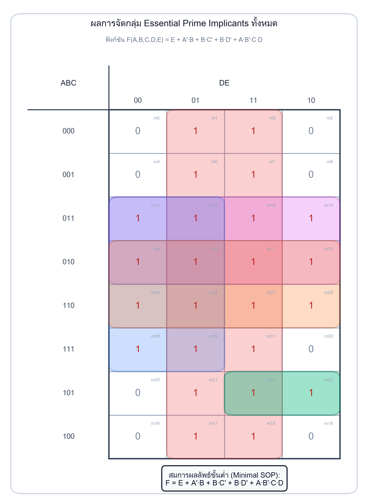

### 0.1 สมการผลบวกของผลคูณขั้นต่ำ (Minimal Sum-of-Products: SOP)

```text
F(A, B, C, D, E) = E + A'·B + B·C' + B·D' + A·B'·C·D
```

*(หรือเขียนแบบจัดรูปดึงตัวร่วม: `F = E + B·(A' + C' + D') + A·B'·C·D`)*

### 0.2 สมการผลคูณของผลบวกขั้นต่ำ (Minimal Product-of-Sums: POS)

```text
F(A, B, C, D, E) = (A + B + E) · (B + C + E) · (B + D + E) · (A' + B' + C' + D' + E)
```

### 0.3 สรุปเทอม Prime Implicants ทั้ง 5 กลุ่ม:
1. **กลุ่มที่ 1 (สีแดง, 16 ช่อง):** คอลัมน์ `01` และ `11` ทุกแถว ⇒ **`E`** *(จำเป็นต่อ `m₁, m₃, m₅, m₇, m₁₇, m₁₉, m₂₁, m₃₁`)*
2. **กลุ่มที่ 2 (สีชมพู/ม่วง, 8 ช่อง):** แถว `011` และ `010` ทุกคอลัมน์ ⇒ **`A'·B`** *(จำเป็นต่อ `m₁₄`)*
3. **กลุ่มที่ 3 (สีน้ำเงิน, 8 ช่อง):** แถวที่มี `B=1` ในคอลัมน์ `00, 01` (`D=0`) ⇒ **`B·D'`** *(จำเป็นต่อ `m₂₈`)*
4. **กลุ่มที่ 4 (สีส้ม, 8 ช่อง):** แถว `010` และ `110` (`B=1, C=0`) ทุกคอลัมน์ ⇒ **`B·C'`** *(จำเป็นต่อ `m₂₆`)*
5. **กลุ่มที่ 5 (สีเขียว, 2 ช่อง):** แถว `101` คอลัมน์ `11` และ `10` (`D=1`) ⇒ **`A·B'·C·D`** *(จำเป็นต่อ `m₂₂`)*

> ⚠️ **ข้อควรทราบ:** กลุ่มทั้ง 5 กลุ่มนี้เป็น **Essential Prime Implicant ทั้งหมด** ไม่มีกลุ่มใดเป็นกลุ่มฟุ่มเฟือย (Redundant) จึงได้ผลลัพธ์เป็นเอกลักษณ์เพียงชุดเดียว

---

## 1. โครงสร้าง K-Map 5 ตัวแปร (8×4 Layout)

ฟังก์ชันที่มี 5 ตัวแปร (`A, B, C, D, E`) มีจำนวนสถานะทั้งหมด `2⁵ = 32 ช่อง` (ตั้งแต่ `m₀` ถึง `m₃₁`)

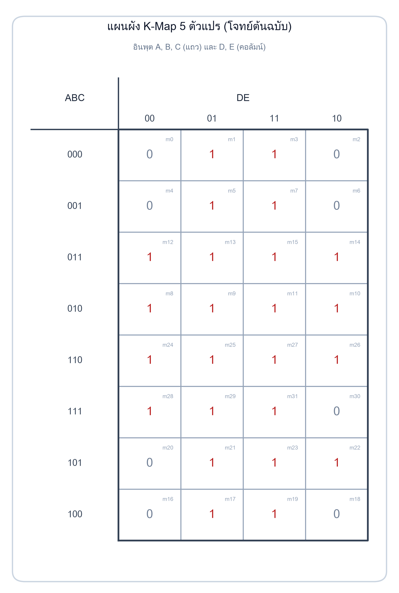

### 1.1 การจัดลำดับแถวและคอลัมน์ตามรหัสเกรย์ (Gray Code)
เพื่อให้เซลล์ที่อยู่ติดกันมีค่าบิตต่างกันเพียง 1 บิตเสมอ (Hamming Distance = 1):

- **แนวคอลัมน์ (ตัวแปร D, E):** เรียง 4 คอลัมน์ตามลำดับ:
  ```text
  00 → 01 → 11 → 10
  ```
- **แนวแถว (ตัวแปร A, B, C):** เรียง 8 แถวตามลำดับ:
  ```text
  000 → 001 → 011 → 010 → 110 → 111 → 101 → 100
  ```

### 1.2 การมองแบบ 3 มิติ (3D Superposition View)
เราสามารถมองตาราง 8×4 นี้เทียบเท่ากับ **ตารางขนาด 4×4 สองตารางซ้อนทับกันในมิติที่ 3** โดยตารางซ้ายคือ `A = 0` (มินเทอม `m₀..m₁₅`) และตารางขวาคือ `A = 1` (มินเทอม `m₁₆..m₃₁`):

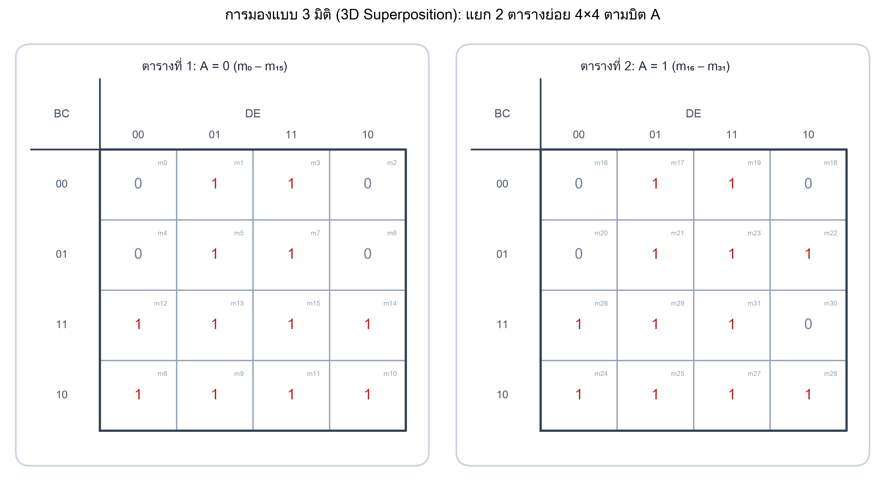

---

## 2. ตารางแจกแจงมินเทอมทั้ง 32 ช่อง (Minterm Index Map)

การคำนวณเลขมินเทอมฐานสิบจากพิกัดไบนารี `(A, B, C, D, E)`:
```text
m = 16A + 8B + 4C + 2D + E
```

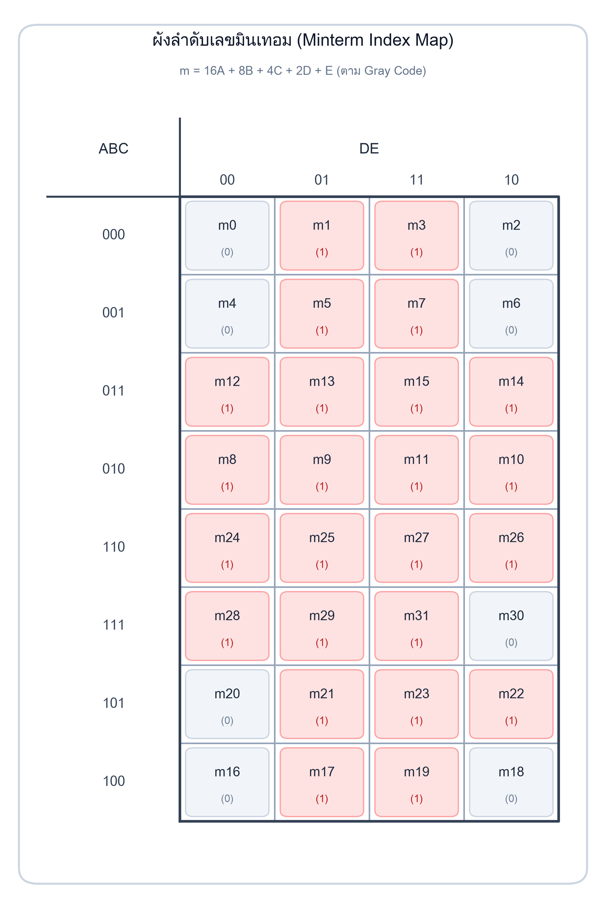

### 2.1 ตารางพิกัดมินเทอมและค่าลอจิกจากโจทย์

| ลำดับแถว | รหัส ABC | คอลัมน์ 00 (`D'·E'`) | คอลัมน์ 01 (`D'·E`) | คอลัมน์ 11 (`D·E`) | คอลัมน์ 10 (`D·E'`) |
| :---: | :---: | :---: | :---: | :---: | :---: |
| แถว 0 | **000** | `m₀ = 0` | **`m₁ = 1`** | **`m₃ = 1`** | `m₂ = 0` |
| แถว 1 | **001** | `m₄ = 0` | **`m₅ = 1`** | **`m₇ = 1`** | `m₆ = 0` |
| แถว 2 | **011** | **`m₁₂ = 1`** | **`m₁₃ = 1`** | **`m₁₅ = 1`** | **`m₁₄ = 1`** |
| แถว 3 | **010** | **`m₈ = 1`** | **`m₉ = 1`** | **`m₁₁ = 1`** | **`m₁₀ = 1`** |
| แถว 4 | **110** | **`m₂₄ = 1`** | **`m₂₅ = 1`** | **`m₂₇ = 1`** | **`m₂₆ = 1`** |
| แถว 5 | **111** | **`m₂₈ = 1`** | **`m₂₉ = 1`** | **`m₃₁ = 1`** | `m₃₀ = 0` |
| แถว 6 | **101** | `m₂₀ = 0` | **`m₂₁ = 1`** | **`m₂₃ = 1`** | **`m₂₂ = 1`** |
| แถว 7 | **100** | `m₁₆ = 0` | **`m₁₇ = 1`** | **`m₁₉ = 1`** | `m₁₈ = 0` |

- **มินเทอมที่มีค่าเป็น 1 (Ones = 24 มินเทอม):**  
  `Σm(1, 3, 5, 7, 8, 9, 10, 11, 12, 13, 14, 15, 17, 19, 21, 22, 23, 24, 25, 26, 27, 28, 29, 31)`
- **แมกซ์เทอมที่มีค่าเป็น 0 (Zeros = 8 แมกซ์เทอม):**  
  `ΠM(0, 2, 4, 6, 16, 18, 20, 30)`

---

## 3. เจาะลึกการจัดกลุ่ม Essential Prime Implicants ทั้ง 5 กลุ่ม

### 3.1 กลุ่มที่ 1: ขนาด 16 ช่อง (สีแดงแนวตั้ง) ⇒ เทอม `E`

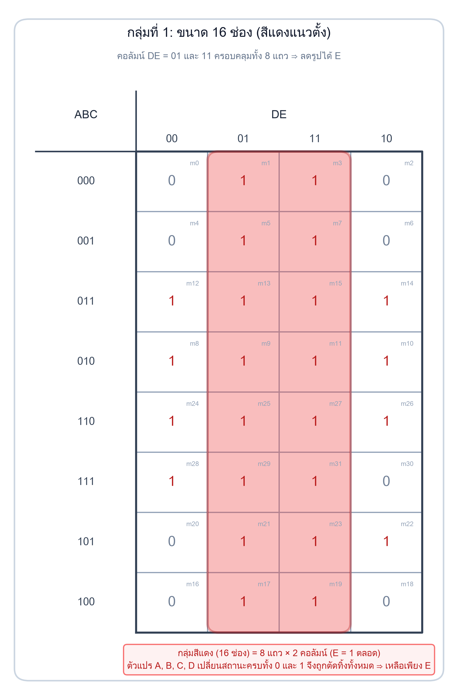

- **ตำแหน่ง:** คอลัมน์ `DE = 01` และ `11` ครอบคลุมทั้ง 8 แถว
- **การตัดตัวแปร:**
  - ตัวแปร `A, B, C` ในแนวแถวเปลี่ยนสถานะครบทุกคู่ทั้ง 0 และ 1 ⇒ **ตัด A, B, C ทิ้งทั้งหมด**
  - ตัวแปร `D` เปลี่ยนจาก 0 (ในคอลัมน์ 01) เป็น 1 (ในคอลัมน์ 11) ⇒ **ตัด D ทิ้ง**
  - ตัวแปร `E = 1` คงที่ตลอดทั้ง 16 ช่อง ⇒ **เหลือ `E`**
- **ผลลัพธ์:** เทอม **`E`**

---

### 3.2 กลุ่มที่ 2: ขนาด 8 ช่อง (สีชมพู/ม่วงแนวนอน) ⇒ เทอม `A'·B`

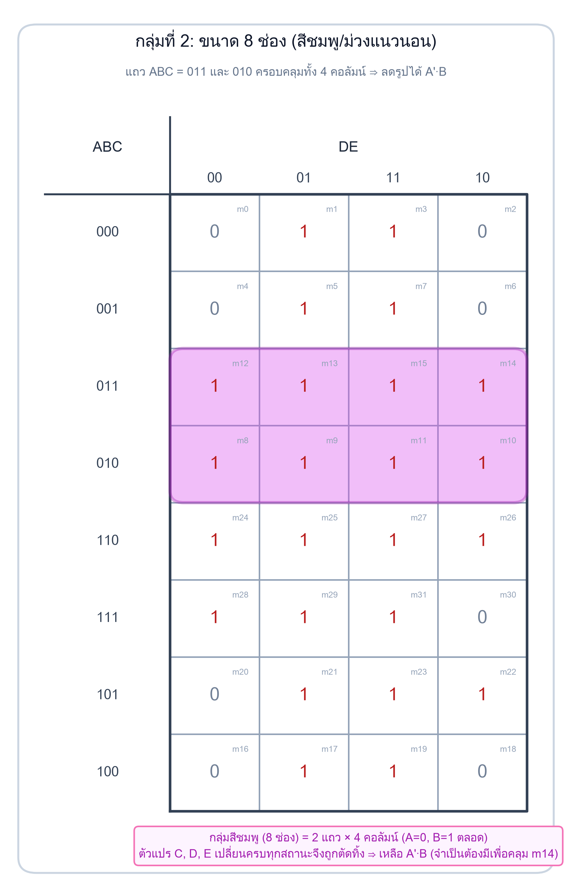

- **ตำแหน่ง:** แถว `ABC = 011` และ `010` ครอบคลุมทั้ง 4 คอลัมน์
- **การตัดตัวแปร:**
  - ตัวแปร `A = 0` คงที่ ⇒ ได้ **`A'`**
  - ตัวแปร `B = 1` คงที่ ⇒ ได้ **`B`**
  - ตัวแปร `C` เปลี่ยนจาก 1 เป็น 0 ⇒ **ตัด C ทิ้ง**
  - คอลัมน์ครอบคลุมทั้ง 4 ช่อง (`00, 01, 11, 10`) ⇒ **ตัด D, E ทิ้งทั้งหมด**
- **ผลลัพธ์:** เทอม **`A'·B`**
- **เหตุผลที่จำเป็น:** มินเทอม **`m₁₄`** (แถว 011 คอลัมน์ 10) ถูกคลุมโดยกลุ่มนี้เพียงกลุ่มเดียวเท่านั้น!

---

### 3.3 กลุ่มที่ 3: ขนาด 8 ช่อง (สีน้ำเงินบล็อกซ้าย) ⇒ เทอม `B·D'`

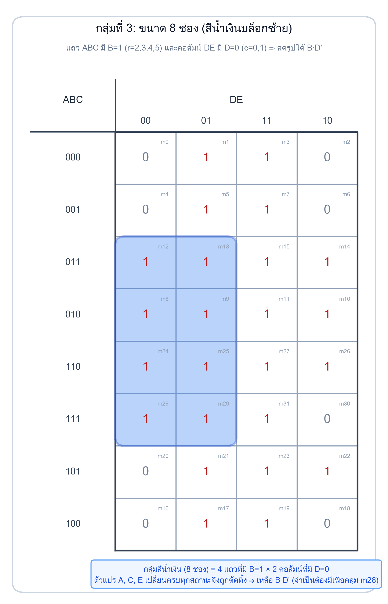

- **ตำแหน่ง:** แถว `011, 010, 110, 111` ในคอลัมน์ `DE = 00, 01`
- **การตัดตัวแปร:**
  - แถวทั้งสี่มี `B = 1` คงที่ ส่วน `A` และ `C` มีทั้ง 0 และ 1 ครบ ⇒ **เหลือ `B`**
  - คอลัมน์ `00` และ `01` มี `D = 0` คงที่ ส่วน `E` เปลี่ยนสถานะ ⇒ **เหลือ `D'`**
- **ผลลัพธ์:** เทอม **`B·D'`**
- **เหตุผลที่จำเป็น:** มินเทอม **`m₂₈`** (แถว 111 คอลัมน์ 00) ถูกคลุมโดยกลุ่มนี้เพียงกลุ่มเดียวเท่านั้น!

---

### 3.4 กลุ่มที่ 4: ขนาด 8 ช่อง (สีส้มแนวนอนกลางตาราง) ⇒ เทอม `B·C'`

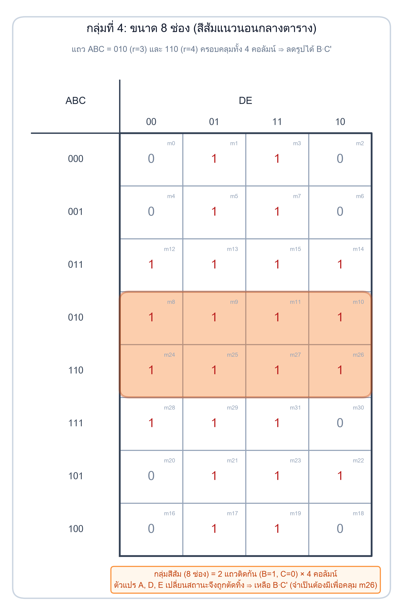

- **ตำแหน่ง:** แถว `ABC = 010` และ `110` ครอบคลุมทั้ง 4 คอลัมน์
- **การตัดตัวแปร:**
  - `A` เปลี่ยนจาก 0 เป็น 1 ⇒ **ตัด A ทิ้ง**
  - `B = 1` คงที่ ⇒ ได้ **`B`**
  - `C = 0` คงที่ ⇒ ได้ **`C'`**
  - คอลัมน์ครอบคลุมทั้ง 4 ช่อง ⇒ **ตัด D, E ทิ้งทั้งหมด**
- **ผลลัพธ์:** เทอม **`B·C'`**
- **เหตุผลที่จำเป็น:** มินเทอม **`m₂₆`** (แถว 110 คอลัมน์ 10) ถูกคลุมโดยกลุ่มนี้เพียงกลุ่มเดียวเท่านั้น!

---

### 3.5 กลุ่มที่ 5: ขนาด 2 ช่อง (สีเขียวแถวล่าง) ⇒ เทอม `A·B'·C·D`

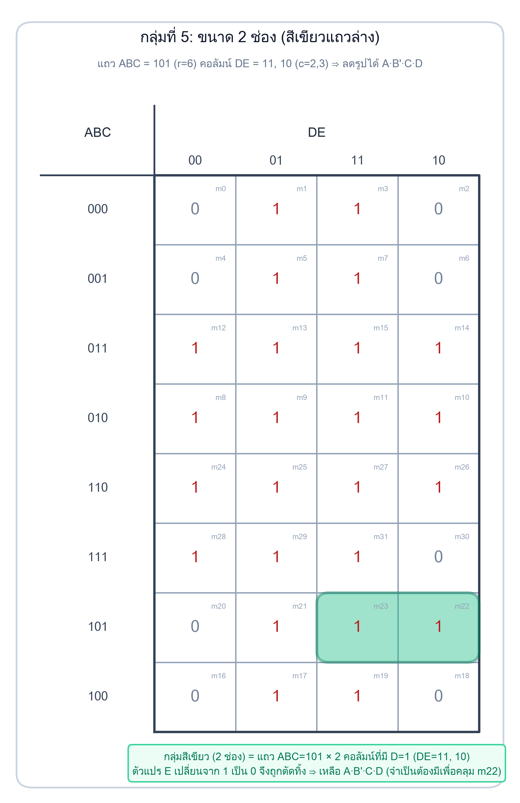

- **ตำแหน่ง:** แถว `ABC = 101` คอลัมน์ `DE = 11, 10`
- **การตัดตัวแปร:**
  - แถวเดี่ยว `ABC = 101` ⇒ ได้ **`A·B'·C`**
  - คอลัมน์ `11` และ `10` มี `D = 1` คงที่ ส่วน `E` เปลี่ยนสถานะ ⇒ ได้ **`D`**
- **ผลลัพธ์:** เทอม **`A·B'·C·D`**
- **เหตุผลที่จำเป็น:** มินเทอม **`m₂₂`** (แถว 101 คอลัมน์ 10) ถูกคลุมโดยกลุ่มนี้เพียงกลุ่มเดียวเท่านั้น!

---

## 4. ตารางพิสูจน์ความจำเป็น (Essential Prime Implicant Chart)

เพื่อพิสูจน์ว่าไม่มีกลุ่มใดเป็นกลุ่มซ้ำซ้อน (Redundant Group) เราตรวจสอบมินเทอมจำเป็นเฉพาะตัว (Unique Minterms):

| Prime Implicant | ขนาด | มินเทอมที่ครอบคลุม | มินเทอมที่จำเป็นเฉพาะกลุ่ม (Unique) | สถานะความจำเป็น |
| :---: | :---: | :--- | :--- | :---: |
| **`E`** | 16 | 1, 3, 5, 7, 9, 11, 13, 15, 17, 19, 21, 23, 25, 27, 29, 31 | `m₁, m₃, m₅, m₇, m₁₇, m₁₉, m₂₁, m₃₁` | **Essential PI** |
| **`A'·B`** | 8 | 8, 9, 10, 11, 12, 13, 14, 15 | `m₁₄` | **Essential PI** |
| **`B·D'`** | 8 | 8, 9, 12, 13, 24, 25, 28, 29 | `m₂₈` | **Essential PI** |
| **`B·C'`** | 8 | 8, 9, 10, 11, 24, 25, 26, 27 | `m₂₆` | **Essential PI** |
| **`A·B'·C·D`** | 2 | 22, 23 | `m₂₂` | **Essential PI** |

```text
ข้อสรุป: เนื่องจากทุกกลุ่มล้วนมี Unique Minterm อย่างน้อย 1 ช่อง 
ดังนั้น ทั้ง 5 กลุ่มจึงต้องคงอยู่ทั้งหมด ไม่มีกลุ่มใดถูกตัดออกได้
```

---

## 5. การหาสมการผลคูณของผลบวกขั้นต่ำ (Minimal POS)

การหา Minimal POS ทำได้โดยการรวมกลุ่ม **เลข 0 ทั้ง 8 ช่อง** (`m₀, m₂, m₄, m₆, m₁₆, m₁₈, m₂₀, m₃₀`):

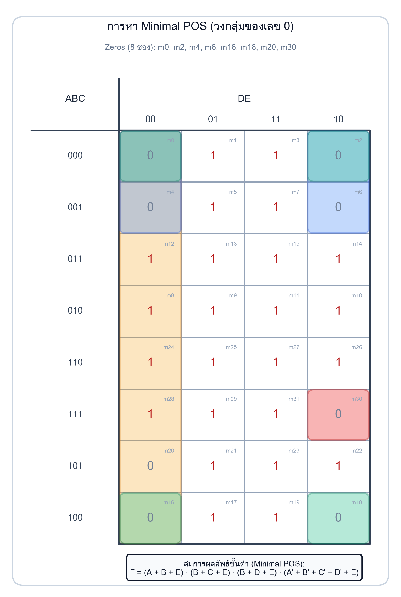

1. **กลุ่ม 4 ช่องที่ 1 (พับขอบซ้ายขวาแถว 0, 1):** `m₀, m₂, m₄, m₆` ⇒ `A'·B'·E'` ⇒ Maxterm Term: **`(A + B + E)`**
2. **กลุ่ม 4 ช่องที่ 2 (มุม 4 มุมพับขอบบนล่าง):** `m₀, m₂, m₁₆, m₁₈` ⇒ `B'·C'·E'` ⇒ Maxterm Term: **`(B + C + E)`**
3. **กลุ่ม 4 ช่องที่ 3 (แถว 0,1,6,7 คอลัมน์ 00):** `m₀, m₄, m₁₆, m₂₀` ⇒ `B'·D'·E'` ⇒ Maxterm Term: **`(B + D + E)`**
4. **กลุ่ม 1 ช่องที่ 4 (ช่องเดี่ยว m30):** `m₃₀` (`11110`) ⇒ `A·B·C·D·E'` ⇒ Maxterm Term: **`(A' + B' + C' + D' + E)`**

### สมการ Minimal POS สมบูรณ์:
```text
F(A, B, C, D, E) = (A + B + E) · (B + C + E) · (B + D + E) · (A' + B' + C' + D' + E)
```

---

## 6. การออกแบบวงจรลอจิกเกต (Logic Circuit Diagram)

จากการแปลงสมการ Minimal SOP สู่โครงสร้างวงจร AND-OR (Two-Level Logic):

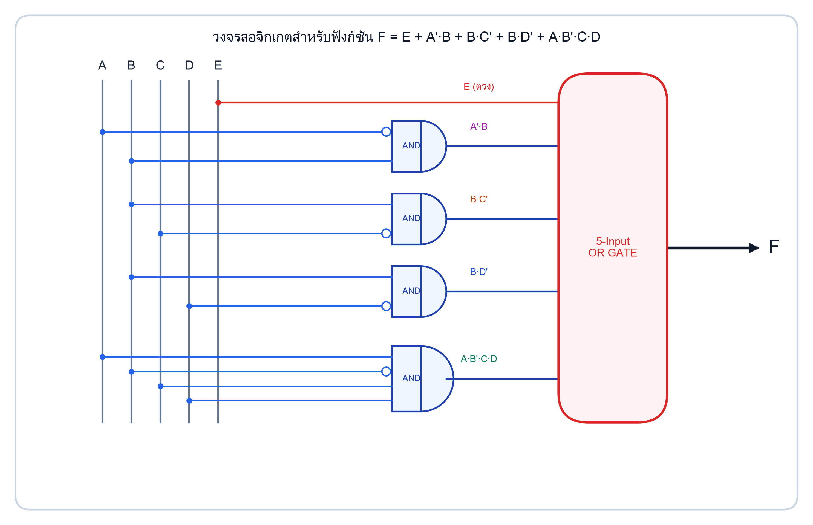

### รายการอุปกรณ์และจำนวนเกต (Gate Count Analysis):
- **NOT Gates / Inverters:** 4 ตัว (สำหรับกลับค่าสัญญาณ `A', B', C', D'`)
- **2-Input AND Gates:** 3 ตัว (สำหรับเทอม `A'·B`, `B·C'`, `B·D'`)
- **4-Input AND Gate:** 1 ตัว (สำหรับเทอม `A·B'·C·D`)
- **5-Input OR Gate:** 1 ตัว (สำหรับรวมสัญญาณ 5 เทอมเข้าด้วยกัน)
- **อินพุตตรง (Direct Line):** สัญญาณ `E` ต่อตรงเข้า OR Gate โดยไม่ต้องผ่าน AND Gate

---

## 7. จุดที่ข้อสอบตั้งใจดักและข้อผิดพลาดที่พบบ่อย

> [!WARNING]
> **กับดักที่ 1: การเขียนลำดับ Gray Code 8 แถวผิด**  
> หลายคนคุ้นเคยกับ K-Map 4 ตัวแปร (4 แถว: `00, 01, 11, 10`) เมื่อต้องเขียน 8 แถว มักเผลอเรียงตามเลขฐานสองปกติ เช่น `000, 001, 010, 011, 100, ...` ซึ่งจะผิดหลักการ Hamming Distance ทันที!  
> **ลำดับที่ถูกต้องคือ:** `000, 001, 011, 010, 110, 111, 101, 100`

> [!WARNING]
> **กับดักที่ 2: วงกลุ่มซ้ำซ้อนในบล็อกกลาง (Redundant Over-grouping)**  
> บริเวณแถว `010` ที่มี 1 เต็มแถว นักศึกษามักเผลอใส่วง 4 ช่อง `m8, m9, m10, m11` เพิ่มเข้ามาอีกวง ซึ่งจริงๆ แล้วทุกช่องในแถวนี้ถูกกลุ่มอื่นคลุมครบหมดแล้ว การใส่เพิ่มจะทำให้สมการไม่เป็น Minimal Form

> [!IMPORTANT]
> **กับดักที่ 3: ลืมตรวจสอบการขยายกลุ่มสีเขียว (m22, m23)**  
> ที่แถว `101` คอลัมน์ `11, 10` มีเลข 1 อยู่ 2 ช่อง ต้องตรวจสอบช่องข้างเคียงแนวตั้ง:
> - ช่องบน: แถว `111` คอลัมน์ `10` คือ `m₃₀ = 0` (ขยายขึ้นไม่ได้)
> - ช่องล่าง: แถว `100` คอลัมน์ `10` คือ `m₁₈ = 0` (ขยายลงไม่ได้)  
> ทำให้กลุ่มนี้ได้ขนาดเพียง 2 ช่อง (เทอม 4 ตัวแปร `A·B'·C·D`)

---

## 8. ตารางความจริงตรวจสอบ (Truth Table Verification)

ผลการคำนวณเปรียบเทียบระหว่างโจทย์ต้นฉบับกับสมการ Minimal SOP และ Minimal POS:

| m | A | B | C | D | E | ค่าโจทย์ | Minimal SOP | Minimal POS | ผลการตรวจสอบ |
| :-: | :-: | :-: | :-: | :-: | :-: | :-: | :-: | :-: | :-: |
| **0** | 0 | 0 | 0 | 0 | 0 | **0** | 0 | 0 | ✅ ตรงกัน |
| **1** | 0 | 0 | 0 | 0 | 1 | **1** | 1 | 1 | ✅ ตรงกัน |
| **2** | 0 | 0 | 0 | 1 | 0 | **0** | 0 | 0 | ✅ ตรงกัน |
| **3** | 0 | 0 | 0 | 1 | 1 | **1** | 1 | 1 | ✅ ตรงกัน |
| **4** | 0 | 0 | 1 | 0 | 0 | **0** | 0 | 0 | ✅ ตรงกัน |
| **5** | 0 | 0 | 1 | 0 | 1 | **1** | 1 | 1 | ✅ ตรงกัน |
| **6** | 0 | 0 | 1 | 1 | 0 | **0** | 0 | 0 | ✅ ตรงกัน |
| **7** | 0 | 0 | 1 | 1 | 1 | **1** | 1 | 1 | ✅ ตรงกัน |
| **8** | 0 | 1 | 0 | 0 | 0 | **1** | 1 | 1 | ✅ ตรงกัน |
| **9** | 0 | 1 | 0 | 0 | 1 | **1** | 1 | 1 | ✅ ตรงกัน |
| **10** | 0 | 1 | 0 | 1 | 0 | **1** | 1 | 1 | ✅ ตรงกัน |
| **11** | 0 | 1 | 0 | 1 | 1 | **1** | 1 | 1 | ✅ ตรงกัน |
| **12** | 0 | 1 | 1 | 0 | 0 | **1** | 1 | 1 | ✅ ตรงกัน |
| **13** | 0 | 1 | 1 | 0 | 1 | **1** | 1 | 1 | ✅ ตรงกัน |
| **14** | 0 | 1 | 1 | 1 | 0 | **1** | 1 | 1 | ✅ ตรงกัน |
| **15** | 0 | 1 | 1 | 1 | 1 | **1** | 1 | 1 | ✅ ตรงกัน |
| **16** | 1 | 0 | 0 | 0 | 0 | **0** | 0 | 0 | ✅ ตรงกัน |
| **17** | 1 | 0 | 0 | 0 | 1 | **1** | 1 | 1 | ✅ ตรงกัน |
| **18** | 1 | 0 | 0 | 1 | 0 | **0** | 0 | 0 | ✅ ตรงกัน |
| **19** | 1 | 0 | 0 | 1 | 1 | **1** | 1 | 1 | ✅ ตรงกัน |
| **20** | 1 | 0 | 1 | 0 | 0 | **0** | 0 | 0 | ✅ ตรงกัน |
| **21** | 1 | 0 | 1 | 0 | 1 | **1** | 1 | 1 | ✅ ตรงกัน |
| **22** | 1 | 0 | 1 | 1 | 0 | **1** | 1 | 1 | ✅ ตรงกัน |
| **23** | 1 | 0 | 1 | 1 | 1 | **1** | 1 | 1 | ✅ ตรงกัน |
| **24** | 1 | 1 | 0 | 0 | 0 | **1** | 1 | 1 | ✅ ตรงกัน |
| **25** | 1 | 1 | 0 | 0 | 1 | **1** | 1 | 1 | ✅ ตรงกัน |
| **26** | 1 | 1 | 0 | 1 | 0 | **1** | 1 | 1 | ✅ ตรงกัน |
| **27** | 1 | 1 | 0 | 1 | 1 | **1** | 1 | 1 | ✅ ตรงกัน |
| **28** | 1 | 1 | 1 | 0 | 0 | **1** | 1 | 1 | ✅ ตรงกัน |
| **29** | 1 | 1 | 1 | 0 | 1 | **1** | 1 | 1 | ✅ ตรงกัน |
| **30** | 1 | 1 | 1 | 1 | 0 | **0** | 0 | 0 | ✅ ตรงกัน |
| **31** | 1 | 1 | 1 | 1 | 1 | **1** | 1 | 1 | ✅ ตรงกัน |

---

## 9. สรุปรายการไฟล์ในชุดเฉลย

- 📄 **เว็บเฉลยแบบโต้ตอบได้:** [`solution.html`](solution.html)
- 📝 **คู่มือฉบับอ่านเอกสาร:** [`README.md`](README.md)
- 🔍 **รายงานผลการพิสูจน์ทางตรรกศาสตร์:** [`VERIFICATION.md`](VERIFICATION.md)
- 🐍 **สคริปต์วาดแผนภาพ:** [`generate_all_diagrams.py`](generate_all_diagrams.py)
- 🧪 **สคริปต์ตรวจคำตอบ:** [`verify_solution.py`](verify_solution.py)
- 🎨 **คลังภาพแผนภาพทั้งหมด (11 รูป):** [`assets/`](assets/)
