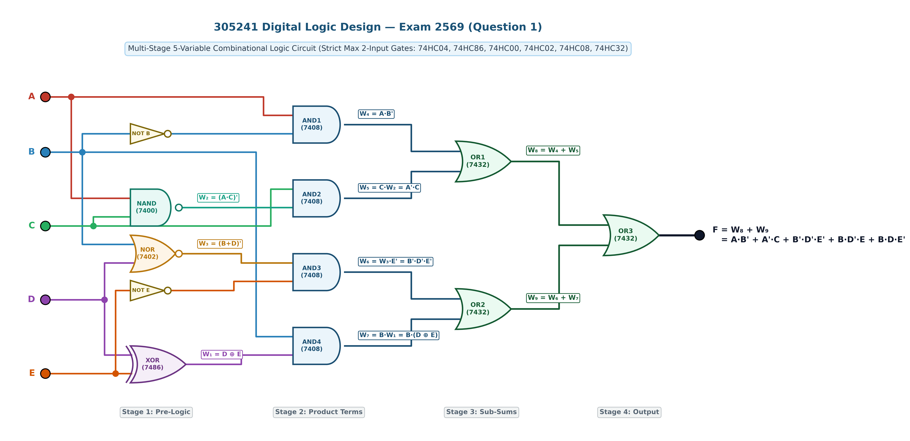
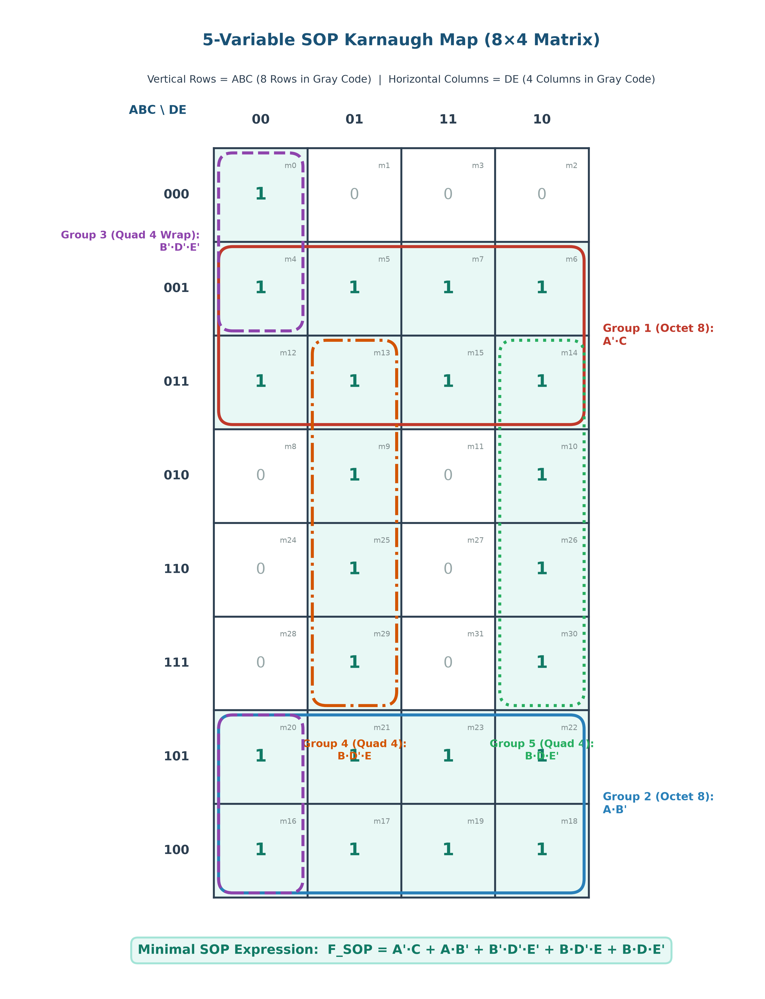
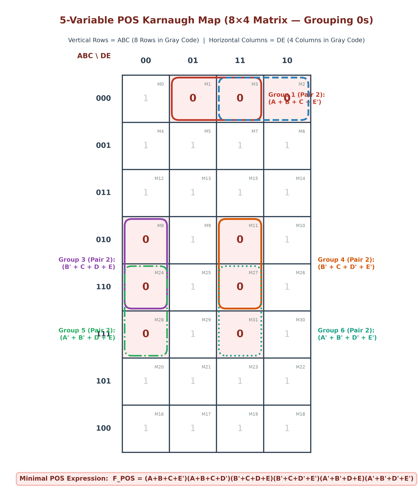
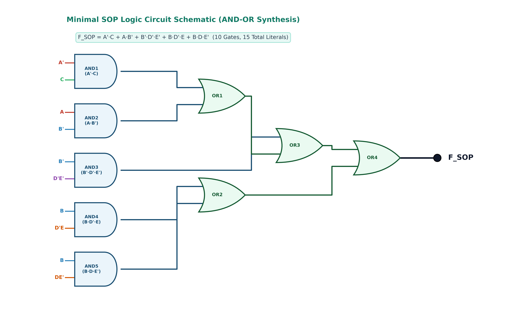
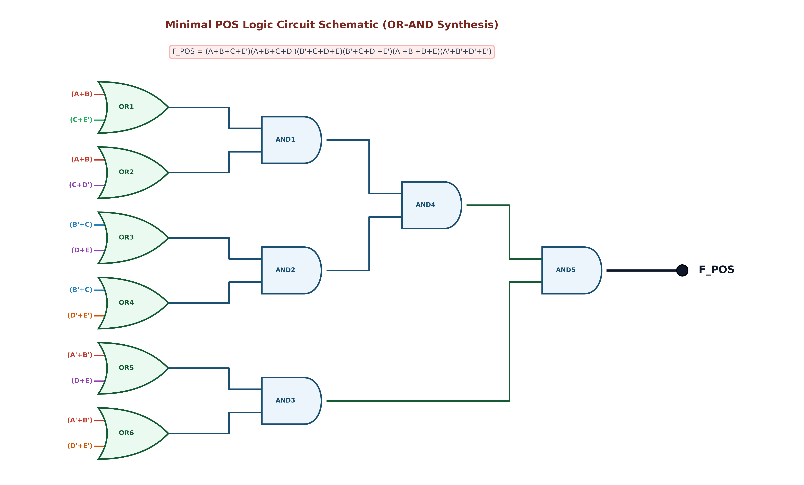
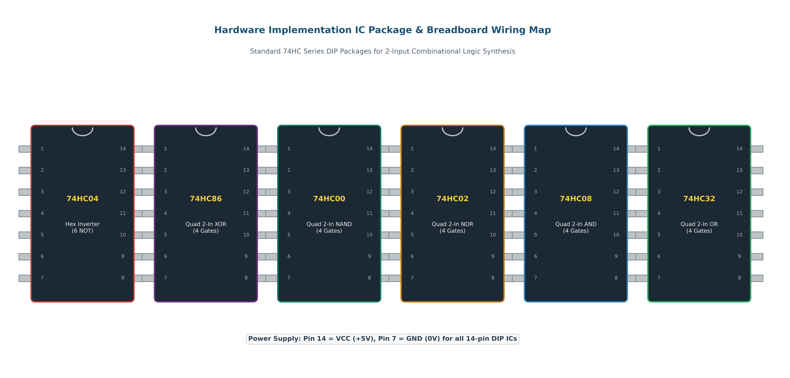

# ข้อสอบข้อที่ 1: การวิเคราะห์ วาดวงจรเกตผสมแบบ 2 อินพุต และลดรูปด้วย K-Map 8x4 (Exam 2569 - Problem 01)

**วิชา:** 305241 การออกแบบวงจรดิจิตอล (Digital Logic Circuit Design) · มหาวิทยาลัยนเรศวร  
**บทที่ 2:** ฟังก์ชันตรรกศาสตร์และเกตเชิงผสม (Logic Functions and Combinational Circuits)  
**สถานที่จัดเก็บ:** `02-logic-functions-combinational/exam/2569/1/`

---

## 📌 โจทย์ปัญหา (Problem Statement)

กำหนดวงจรตรรกศาสตร์ดิจิทัลแบบ 5 ตัวแปรอินพุต (`A, B, C, D, E`) ซึ่งออกแบบตามมาตรฐานการสร้างวงจรในข้อสอบจริง โดย**จำกัดให้ลอจิกเกตแต่ละตัวมีอินพุตไม่เกิน 2 อินพุต (Strict Max 2-Input per Gate)** และต่อเรียงกันเป็นโครงข่าย 4 ภาคสัญญาณ (4-Stage Combinational Network) ประกอบด้วยไอซีมาตรฐาน ได้แก่:
- อินเวอร์เตอร์ 74HC04 (NOT Gate)
- เอ็กซ์คลูซีฟออร์ 2 อินพุต 74HC86 (XOR Gate)
- แนนด์เกต 2 อินพุต 74HC00 (NAND Gate)
- นอร์เกต 2 อินพุต 74HC02 (NOR Gate)
- แอนด์เกต 2 อินพุต 74HC08 (AND Gate)
- ออร์เกต 2 อินพุต 74HC32 (OR Gate)

โดยมีสมการประจำจุดทดสอบสัญญาณ (Test Points) ในแต่ละภาคดังนี้:

### 1. ภาคที่ 1: Pre-Logic Stage (Universal & Exclusive Gates)
- `W₁ = D ⊕ E = D'·E + D·E'` (สัญญาณจากไอซี 74HC86: 2-Input XOR)
- `W₂ = (A · C)' = A' + C'` (สัญญาณจากไอซี 74HC00: 2-Input NAND)
- `W₃ = (B + D)' = B' · D'` (สัญญาณจากไอซี 74HC02: 2-Input NOR)

### 2. ภาคที่ 2: Product Term Stage (2-Input AND Gates)
- `W₄ = A · B'` (สัญญาณจากไอซี 74HC08 ตัวที่ 1)
- `W₅ = C · W₂ = C · (A · C)' = A' · C` (สัญญาณจากไอซี 74HC08 ตัวที่ 2)
- `W₆ = W₃ · E' = (B + D)' · E' = B' · D' · E'` (สัญญาณจากไอซี 74HC08 ตัวที่ 3)
- `W₇ = B · W₁ = B · (D ⊕ E) = B·D'·E + B·D·E'` (สัญญาณจากไอซี 74HC08 ตัวที่ 4)

### 3. ภาคที่ 3: Sub-Sum Stage (2-Input OR Gates)
- `W₈ = W₄ + W₅ = A·B' + A'·C` (สัญญาณจากไอซี 74HC32 ตัวที่ 1)
- `W₉ = W₆ + W₇ = B'·D'·E' + B·(D ⊕ E)` (สัญญาณจากไอซี 74HC32 ตัวที่ 2)

### 4. ภาคที่ 4: Output Stage (Final 2-Input OR Gate)
- `F = W₈ + W₉ = A·B' + A'·C + B'·D'·E' + B·D'·E + B·D·E'` (สัญญาณจากไอซี 74HC32 ตัวที่ 3)

---

### 🎯 คำสั่งข้อสอบ (Instructions):
1. **วิเคราะห์วงจรและสร้างตารางความจริง (Truth Table):** คำนวณค่าลอจิกที่จุดทดสอบ `W₁, W₂, W₃, W₄, W₅, W₆, W₇, W₈, W₉` และหาเอาต์พุต `F` ให้ครบทั้ง 32 กรณี (`m₀ ... m₃₁`) พร้อมระบุ Minterms (`F=1`) และ Maxterms (`F=0`)
2. **การลดรูปด้วย K-Map 8×4 แบบ SOP (Sum of Products):** วาดตารางคาร์โนต์แบบ **8 แถวในแนวตั้ง (ABC) และ 4 คอลัมน์ในแนวนอน (DE)** จับกลุ่มเฉพาะเลข **1** ขนาด `2ⁿ` (1, 2, 4, 8) โดยใช้การวนขอบ (Wraparound) และหา Minimal SOP
3. **การลดรูปด้วย K-Map 8×4 แบบ POS (Product of Sums):** ใช้ตารางคาร์โนต์ 8×4 เดียวกัน จับกลุ่มเฉพาะเลข **0** และหา Minimal POS
4. **พิสูจน์ลดรูปด้วยพีชคณิตบูลีน (Boolean Algebra Proof):** แสดงขั้นตอนการลดรูปสมการตามทฤษฎีบททางพีชคณิตบูลีน (De Morgan, Distribution, Absorption, Consensus) ทีละบรรทัด
5. **สังเคราะห์วงจรและเปรียบเทียบประสิทธิภาพทางฮาร์ดแวร์:** วาดวงจรลดรูป Minimal SOP และ Minimal POS พร้อมเปรียบเทียบจำนวนเกต, จำนวนไอซี (IC Packages), ทรานซิสเตอร์ CMOS และเวลาหน่วงสัญญาณ (Propagation Delay)

---

## 1. วงจรต้นฉบับแบบมาตรฐาน 2 อินพุต (Original Circuit Schematic)

โครงสร้างวงจรจัดวางแบบ 4 ภาคสัญญาณอย่างสมมาตร จากซ้ายไปขวา (Left-to-Right Signal Flow) โดยใช้ระบบบัสสัญญาณแยกช่องทาง ทำให้ไม่มีเส้นสัญญาณทับซ้อนกัน



### ตารางแจกแจงเกตและไอซี (Gate Breakdown Table)

| รหัสเกต | ประเภท Gate | ไอซีมาตรฐาน | ขาอินพุต (Inputs) | สมการเอาต์พุตประจำจุดทด (Output Expression) |
| :--- | :--- | :--- | :--- | :--- |
| **NOT 1-2** | Hex Inverter (x2) | **74HC04** | B, E | `B', E'` |
| **XOR** | 2-Input XOR | **74HC86** | `D, E` | `W₁ = D ⊕ E = D'·E + D·E'` |
| **NAND** | 2-Input NAND | **74HC00** | `A, C` | `W₂ = (A · C)' = A' + C'` |
| **NOR** | 2-Input NOR | **74HC02** | `B, D` | `W₃ = (B + D)' = B' · D'` |
| **AND1** | 2-Input AND | **74HC08** | `A, B'` | `W₄ = A · B'` |
| **AND2** | 2-Input AND | **74HC08** | `C, W₂` | `W₅ = C · (A·C)' = A' · C` |
| **AND3** | 2-Input AND | **74HC08** | `W₃, E'` | `W₆ = (B+D)' · E' = B' · D' · E'` |
| **AND4** | 2-Input AND | **74HC08** | `B, W₁` | `W₇ = B · (D ⊕ E) = B·D'·E + B·D·E'` |
| **OR1** | 2-Input OR | **74HC32** | `W₄, W₅` | `W₈ = W₄ + W₅ = A·B' + A'·C` |
| **OR2** | 2-Input OR | **74HC32** | `W₆, W₇` | `W₉ = W₆ + W₇ = B'·D'·E' + B·(D ⊕ E)` |
| **OR3** | 2-Input OR | **74HC32** | `W₈, W₉` | `F = W₈ + W₉` |

---

## 2. ตารางความจริง 32 กรณี (Truth Table 32 Cases)

คำนวณเอาต์พุต `F` พร้อมค่าประจำจุดทดสอบทั้ง 32 รูปแบบ (`2⁵ = 32` แถว):

| Index | A | B | C | D | E | `W₁=(D⊕E)` | `W₂=(AC)'` | `W₃=(B+D)'` | `W₄=AB'` | `W₅=A'C` | `W₆=B'D'E'` | `W₇=BW₁` | `W₈=W₄+W₅` | `W₉=W₆+W₇` | **Output (F)** | เทอมที่เกิดขึ้น |
| :-: | :-: | :-: | :-: | :-: | :-: | :-: | :-: | :-: | :-: | :-: | :-: | :-: | :-: | :-: | :-: | :--- |
| **0** | 0 | 0 | 0 | 0 | 0 | 0 | 1 | 1 | 0 | 0 | 1 | 0 | 0 | 1 | **1** | **`m₀ = A'B'C'D'E'`** |
| 1 | 0 | 0 | 0 | 0 | 1 | 1 | 1 | 1 | 0 | 0 | 0 | 0 | 0 | 0 | **0** | `M₁ = (A+B+C+D+E')` |
| 2 | 0 | 0 | 0 | 1 | 0 | 1 | 1 | 0 | 0 | 0 | 0 | 0 | 0 | 0 | **0** | `M₂ = (A+B+C+D'+E)` |
| 3 | 0 | 0 | 0 | 1 | 1 | 0 | 1 | 0 | 0 | 0 | 0 | 0 | 0 | 0 | **0** | `M₃ = (A+B+C+D'+E')` |
| **4** | 0 | 0 | 1 | 0 | 0 | 0 | 1 | 1 | 0 | 1 | 1 | 0 | 1 | 1 | **1** | **`m₄ = A'B'CD'E'`** |
| **5** | 0 | 0 | 1 | 0 | 1 | 1 | 1 | 1 | 0 | 1 | 0 | 0 | 1 | 0 | **1** | **`m₅ = A'B'CD'E`** |
| **6** | 0 | 0 | 1 | 1 | 0 | 1 | 1 | 0 | 0 | 1 | 0 | 0 | 1 | 0 | **1** | **`m₆ = A'B'CDE'`** |
| **7** | 0 | 0 | 1 | 1 | 1 | 0 | 1 | 0 | 0 | 1 | 0 | 0 | 1 | 0 | **1** | **`m₇ = A'B'CDE`** |
| 8 | 0 | 1 | 0 | 0 | 0 | 0 | 1 | 0 | 0 | 0 | 0 | 0 | 0 | 0 | **0** | `M₈ = (A+B'+C+D+E)` |
| **9** | 0 | 1 | 0 | 0 | 1 | 1 | 1 | 0 | 0 | 0 | 0 | 1 | 0 | 1 | **1** | **`m₉ = A'BC'D'E`** |
| **10** | 0 | 1 | 0 | 1 | 0 | 1 | 1 | 0 | 0 | 0 | 0 | 1 | 0 | 1 | **1** | **`m₁₀ = A'BC'DE'`** |
| 11 | 0 | 1 | 0 | 1 | 1 | 0 | 1 | 0 | 0 | 0 | 0 | 0 | 0 | 0 | **0** | `M₁₁ = (A+B'+C+D'+E')` |
| **12** | 0 | 1 | 1 | 0 | 0 | 0 | 1 | 0 | 0 | 1 | 0 | 0 | 1 | 0 | **1** | **`m₁₂ = A'BCD'E'`** |
| **13** | 0 | 1 | 1 | 0 | 1 | 1 | 1 | 0 | 0 | 1 | 0 | 1 | 1 | 1 | **1** | **`m₁₃ = A'BCD'E`** |
| **14** | 0 | 1 | 1 | 1 | 0 | 1 | 1 | 0 | 0 | 1 | 0 | 1 | 1 | 1 | **1** | **`m₁₄ = A'BCDE'`** |
| **15** | 0 | 1 | 1 | 1 | 1 | 0 | 1 | 0 | 0 | 1 | 0 | 0 | 1 | 0 | **1** | **`m₁₅ = A'BCDE`** |
| **16** | 1 | 0 | 0 | 0 | 0 | 0 | 1 | 1 | 1 | 0 | 1 | 0 | 1 | 1 | **1** | **`m₁₆ = AB'C'D'E'`** |
| **17** | 1 | 0 | 0 | 0 | 1 | 1 | 1 | 1 | 1 | 0 | 0 | 0 | 1 | 0 | **1** | **`m₁₇ = AB'C'D'E`** |
| **18** | 1 | 0 | 0 | 1 | 0 | 1 | 1 | 0 | 1 | 0 | 0 | 0 | 1 | 0 | **1** | **`m₁₈ = AB'C'DE'`** |
| **19** | 1 | 0 | 0 | 1 | 1 | 0 | 1 | 0 | 1 | 0 | 0 | 0 | 1 | 0 | **1** | **`m₁₉ = AB'C'DE`** |
| **20** | 1 | 0 | 1 | 0 | 0 | 0 | 0 | 1 | 1 | 0 | 1 | 0 | 1 | 1 | **1** | **`m₂₀ = AB'CD'E'`** |
| **21** | 1 | 0 | 1 | 0 | 1 | 1 | 0 | 1 | 1 | 0 | 0 | 0 | 1 | 0 | **1** | **`m₂₁ = AB'CD'E`** |
| **22** | 1 | 0 | 1 | 1 | 0 | 1 | 0 | 0 | 1 | 0 | 0 | 0 | 1 | 0 | **1** | **`m₂₂ = AB'CDE'`** |
| **23** | 1 | 0 | 1 | 1 | 1 | 0 | 0 | 0 | 1 | 0 | 0 | 0 | 1 | 0 | **1** | **`m₂₃ = AB'CDE`** |
| 24 | 1 | 1 | 0 | 0 | 0 | 0 | 1 | 0 | 0 | 0 | 0 | 0 | 0 | 0 | **0** | `M₂₄ = (A'+B'+C+D+E)` |
| **25** | 1 | 1 | 0 | 0 | 1 | 1 | 1 | 0 | 0 | 0 | 0 | 1 | 0 | 1 | **1** | **`m₂₅ = ABC'D'E`** |
| **26** | 1 | 1 | 0 | 1 | 0 | 1 | 1 | 0 | 0 | 0 | 0 | 1 | 0 | 1 | **1** | **`m₂₆ = ABC'DE'`** |
| 27 | 1 | 1 | 0 | 1 | 1 | 0 | 1 | 0 | 0 | 0 | 0 | 0 | 0 | 0 | **0** | `M₂₇ = (A'+B'+C+D'+E')` |
| 28 | 1 | 1 | 1 | 0 | 0 | 0 | 0 | 0 | 0 | 0 | 0 | 0 | 0 | 0 | **0** | `M₂₈ = (A'+B'+C'+D+E)` |
| **29** | 1 | 1 | 1 | 0 | 1 | 1 | 0 | 0 | 0 | 0 | 0 | 1 | 0 | 1 | **1** | **`m₂₉ = ABC'D'E`** |
| **30** | 1 | 1 | 1 | 1 | 0 | 1 | 0 | 0 | 0 | 0 | 0 | 1 | 0 | 1 | **1** | **`m₃₀ = ABC'DE'`** |
| 31 | 1 | 1 | 1 | 1 | 1 | 0 | 0 | 0 | 0 | 0 | 0 | 0 | 0 | 0 | **0** | `M₃₁ = (A'+B'+C'+D'+E')` |

### สรุปสาระสำคัญจากตารางความจริง:
- **จำนวน Minterms (`F = 1`):** มีทั้งหมด **23 กรณี** ได้แก่  
  `Σm(0, 4, 5, 6, 7, 9, 10, 12, 13, 14, 15, 16, 17, 18, 19, 20, 21, 22, 23, 25, 26, 29, 30)`
- **จำนวน Maxterms (`F = 0`):** มีทั้งหมด **9 กรณี** ได้แก่  
  `ΠM(1, 2, 3, 8, 11, 24, 27, 28, 31)`

---

## 3. การลดรูปด้วยวิธี SOP (Sum of Products) & K-Map 8x4

### 3.1 ผัง K-Map 8x4 (แนวตั้ง ABC 8 แถว, แนวนอน DE 4 คอลัมน์)

จัดเรียงแถวและคอลัมน์ตามรหัส Gray Code ดังนี้:
- **แถว (ABC):** `000, 001, 011, 010, 110, 111, 101, 100`
- **คอลัมน์ (DE):** `00, 01, 11, 10`



### 3.2 รายละเอียดการจับกลุ่มทั้ง 5 กลุ่ม (SOP Grouping Breakdown)

1. **กลุ่มที่ 1 (Octet ขนาด 8 เซลล์ = 2³): `A' · C`**
   - ครอบคลุมแถว `ABC = 001, 011` ทั้ง 4 คอลัมน์ (`m₄, m₅, m₆, m₇, m₁₂, m₁₃, m₁₄, m₁₅`)
   - ตัวแปร B, D, E มีค่าเปลี่ยนแปลงทั้ง 0 และ 1 จึงถูกตัดออก เหลือพจน์: **`A' · C`**

2. **กลุ่มที่ 2 (Octet ขนาด 8 เซลล์ = 2³): `A · B'`**
   - ครอบคลุมแถว `ABC = 101, 100` ทั้ง 4 คอลัมน์ (`m₁₆, m₁₇, m₁₈, m₁₉, m₂₀, m₂₁, m₂₂, m₂₃`)
   - ตัวแปร C, D, E มีค่าเปลี่ยนแปลงทั้ง 0 และ 1 จึงถูกตัดออก เหลือพจน์: **`A · B'`**

3. **กลุ่มที่ 3 (Quad ขนาด 4 เซลล์ = 2² แบบวนขอบบน-ล่าง): `B' · D' · E'`**
   - ครอบคลุมคอลัมน์ `DE = 00` ในแถวด้านบนสุด `ABC = 000, 001` และแถวล่างสุด `ABC = 101, 100` (B=0, D=0, E=0)
   - เซลล์ที่ครอบคลุม: `m₀, m₄, m₁₆, m₂₀`
   - ตัวแปร A, C ถูกตัดออก เหลือพจน์: **`B' · D' · E'`**

4. **กลุ่มที่ 4 (Quad ขนาด 4 เซลล์ = 2²): `B · D' · E`**
   - ครอบคลุมคอลัมน์ `DE = 01` (D=0, E=1) ในแถวที่มี `B=1` ได้แก่ `ABC = 011, 010, 110, 111`
   - เซลล์ที่ครอบคลุม: `m₉, m₁₃, m₂₅, m₂₉`
   - ตัวแปร A, C ถูกตัดออก เหลือพจน์: **`B · D' · E`**

5. **กลุ่มที่ 5 (Quad ขนาด 4 เซลล์ = 2²): `B · D · E'`**
   - ครอบคลุมคอลัมน์ `DE = 10` (D=1, E=0) ในแถวที่มี `B=1` ได้แก่ `ABC = 011, 010, 110, 111`
   - เซลล์ที่ครอบคลุม: `m₁₀, m₁₄, m₂₆, m₃₀`
   - ตัวแปร A, C ถูกตัดออก เหลือพจน์: **`B · D · E'`**

### 3.3 สรุปสมการ Minimal SOP

```text
F_SOP = A'·C + A·B' + B'·D'·E' + B·D'·E + B·D·E'
```
*(หรือจัดรูปพจน์ร่วม: `F = A'·C + A·B' + B'·D'·E' + B·(D ⊕ E)`)*

---

## 4. การลดรูปด้วยวิธี POS (Product of Sums) & K-Map 8x4

### 4.1 ผัง K-Map 8x4 (จับกลุ่มเลข 0 จำนวน 9 เซลล์)



### 4.2 รายละเอียดการจับกลุ่มทั้ง 6 กลุ่ม (POS Grouping Breakdown)

1. **กลุ่มที่ 1 (Pair ขนาด 2 เซลล์): `(A + B + C + E')`**
   - ครอบคลุมแถว `ABC = 000` และคอลัมน์ `DE = 01, 11` (Maxterms: `M₁, M₃`)
   - ได้พจน์ผลรวม: **`(A + B + C + E')`**

2. **กลุ่มที่ 2 (Pair ขนาด 2 เซลล์): `(A + B + C + D')`**
   - ครอบคลุมแถว `ABC = 000` และคอลัมน์ `DE = 11, 10` (Maxterms: `M₂, M₃`)
   - ได้พจน์ผลรวม: **`(A + B + C + D')`**

3. **กลุ่มที่ 3 (Pair ขนาด 2 เซลล์): `(B' + C + D + E)`**
   - ครอบคลุมแถว `ABC = 010, 110` และคอลัมน์ `DE = 00` (Maxterms: `M₈, M₂₄`)
   - ได้พจน์ผลรวม: **`(B' + C + D + E)`**

4. **กลุ่มที่ 4 (Pair ขนาด 2 เซลล์): `(B' + C + D' + E')`**
   - ครอบคลุมแถว `ABC = 010, 110` และคอลัมน์ `DE = 11` (Maxterms: `M₁₁, M₂₇`)
   - ได้พจน์ผลรวม: **`(B' + C + D' + E')`**

5. **กลุ่มที่ 5 (Pair ขนาด 2 เซลล์): `(A' + B' + D + E)`**
   - ครอบคลุมแถว `ABC = 110, 111` และคอลัมน์ `DE = 00` (Maxterms: `M₂₄, M₂₈`)
   - ได้พจน์ผลรวม: **`(A' + B' + D + E)`**

6. **กลุ่มที่ 6 (Pair ขนาด 2 เซลล์): `(A' + B' + D' + E')`**
   - ครอบคลุมแถว `ABC = 110, 111` และคอลัมน์ `DE = 11` (Maxterms: `M₂₇, M₃₁`)
   - ได้พจน์ผลรวม: **`(A' + B' + D' + E')`**

### 4.3 สรุปสมการ Minimal POS

```text
F_POS = (A + B + C + E') · (A + B + C + D') · (B' + C + D + E) · (B' + C + D' + E') · (A' + B' + D + E) · (A' + B' + D' + E')
```

---

## 5. การพิสูจน์ลดรูปด้วยพีชคณิตบูลีน (Boolean Algebra Step-by-Step Proof)

### 5.1 การแปลงสัญญาณจุดทดสอบจากวงจรเกตผสม 2 อินพุต
1. จาก 2-Input NAND Gate: `W₂ = (A · C)' = A' + C'`
   - คำนวณ `W₅ = C · W₂ = C · (A' + C') = A'·C + C·C' = A'·C + 0 = A'·C`
2. จาก 2-Input NOR Gate: `W₃ = (B + D)' = B' · D'`
   - คำนวณ `W₆ = W₃ · E' = (B' · D') · E' = B' · D' · E'`
3. จาก 2-Input XOR Gate: `W₁ = D ⊕ E = D'·E + D·E'`
   - คำนวณ `W₇ = B · W₁ = B · (D'·E + D·E') = B·D'·E + B·D·E'`
4. รวมภาค Sub-Sums:
   - `W₈ = W₄ + W₅ = A·B' + A'·C`
   - `W₉ = W₆ + W₇ = B'·D'·E' + B·D'·E + B·D·E'`
5. ฟังก์ชันเอาต์พุตรวม:
   - `F = W₈ + W₉ = A·B' + A'·C + B'·D'·E' + B·D'·E + B·D·E'`

---

## 6. แผนภาพวงจรลดรูป (Reduced Circuit Schematics)

### 6.1 วงจรลดรูป Minimal SOP (AND-OR Synthesis)


### 6.2 วงจรลดรูป Minimal POS (OR-AND Synthesis)


### 6.3 แผนผังไอซีฮาร์ดแวร์และการต่อสาย (Hardware IC Layout)


---

## 7. ตารางเปรียบเทียบเชิงวิศวกรรมฮาร์ดแวร์ (Hardware Optimization Benchmark)

| ดัชนีเปรียบเทียบทางวิศวกรรม | วงจรต้นฉบับ (Original 2-In) | Minimal SOP (AND-OR) | Minimal POS (OR-AND) | ผู้ชนะความคุ้มค่า (Winner) |
| :--- | :--- | :--- | :--- | :--- |
| **โครงสร้างทางตรรกศาสตร์** | Multi-Stage 4 Levels (XOR/NAND/NOR/AND/OR) | Two-Level AND-OR (5 Product Terms) | Two-Level OR-AND (6 Sum Terms) | 🏆 **SOP (พจน์น้อยกว่า POS)** |
| **จำนวนลอจิกเกต (Logic Gates)** | 12 เกต (2 NOT + 1 XOR + 1 NAND + 1 NOR + 4 AND + 3 OR) | 10 เกต (3 NOT + 5 AND + 4 OR2 tree) | 13 เกต (4 NOT + 6 OR + 5 AND2 tree) | 🏆 **SOP (10 เกต)** |
| **จำนวนไอซี DIP-14 (IC Count)** | 6 แพ็กเกจ (7404, 7486, 7400, 7402, 7408, 7432) | 3 แพ็กเกจ (7404, 7408, 7432) | 3 แพ็กเกจ (7404, 7432, 7408) | 🏆 **SOP / POS (ลดลง 50%)** |
| **จำนวนทรานซิสเตอร์ CMOS (~Transistors)** | ~54 ตัว | ~44 ตัว | ~52 ตัว | 🏆 **SOP (ประหยัดสุด)** |
| **ความล่าช้าการแพร่สัญญาณ (Propagation Delay)** | 4 Gate Delays (`t_NOT + t_XOR + t_AND + 2×t_OR`) | 3 Gate Delays (`t_NOT + t_AND + t_OR`) | 3 Gate Delays (`t_NOT + t_OR + t_AND`) | 🏆 **SOP / POS (เร็วขึ้น 25%)** |
| **ความซับซ้อนของสายสัญญาณ** | 24 เส้นต่อ | 15 เส้นต่อ | 18 เส้นต่อ | 🏆 **SOP** |

---

## 📁 สรุปไฟล์ที่เกี่ยวข้องในโฟลเดอร์นี้

1. [`README.md`](README.md) - เอกสารเฉลยละเอียดฉบับสมบูรณ์ (รูปแบบ Zero-dollar Markdown)
2. [`solution.html`](solution.html) - Interactive Web UI เฉลยละเอียดระดับตำราเรียนสากล
3. [`generate_all_diagrams.py`](generate_all_diagrams.py) - สคริปต์ Python สำหรับ Render ภาพความละเอียดสูง 300 DPI
4. [`verify_logic.py`](verify_logic.py) - สคริปต์ทดสอบความถูกต้องของตารางความจริงทั้ง 32 กรณี
5. [`assets/`](assets/) - โฟลเดอร์เก็บภาพไดอะแกรมความละเอียดสูงทั้ง 6 ภาพ
