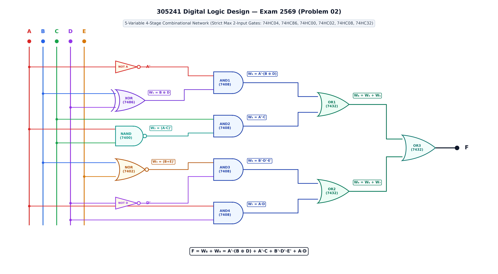
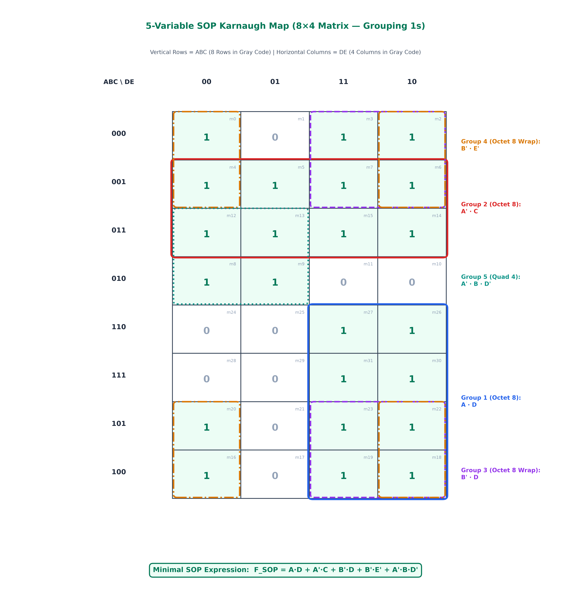
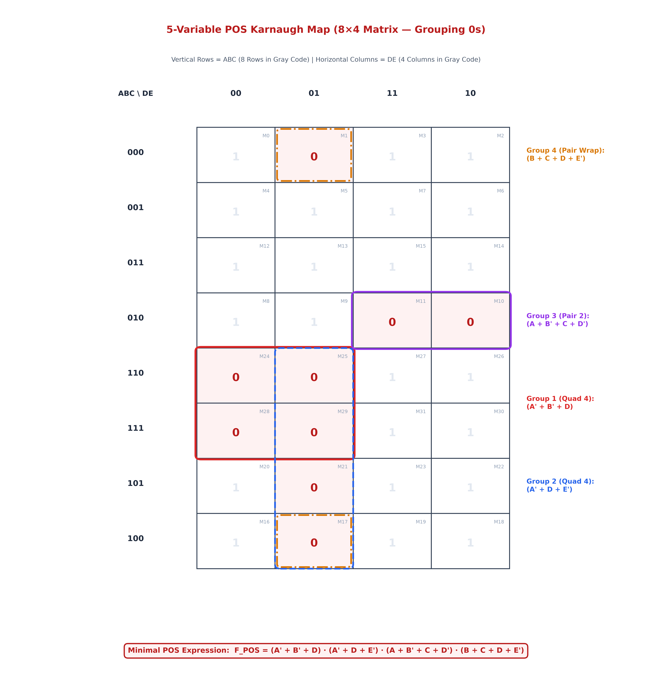
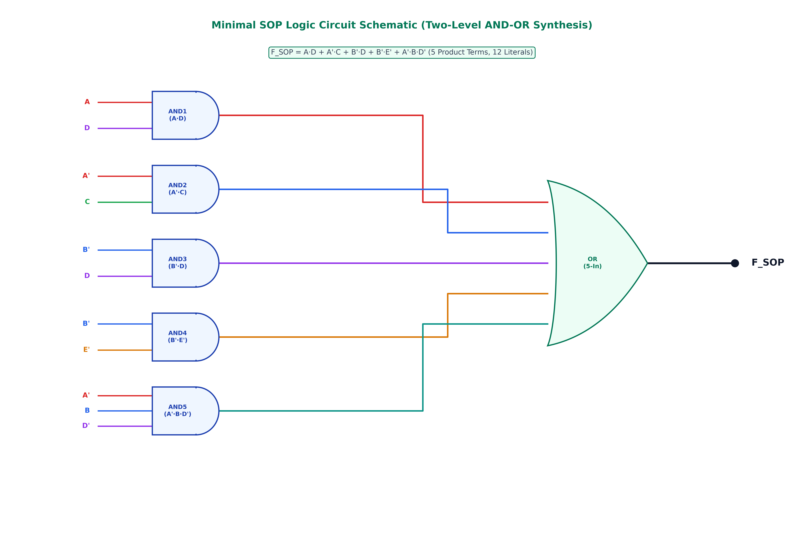
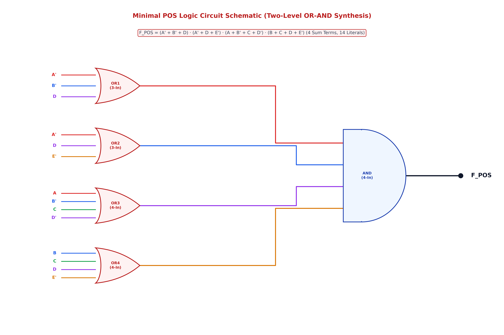
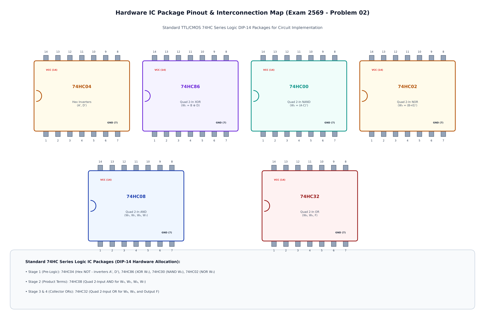

# ข้อสอบข้อที่ 2: การวิเคราะห์ วาดวงจรเกตผสมแบบ 2 อินพุต และลดรูปด้วย K-Map 8x4 (Exam 2569 - Problem 02)

**วิชา:** 305241 การออกแบบวงจรดิจิตอล (Digital Logic Circuit Design) · มหาวิทยาลัยนเรศวร  
**บทที่ 2:** ฟังก์ชันตรรกศาสตร์และเกตเชิงผสม (Logic Functions and Combinational Circuits)  
**สถานที่จัดเก็บ:** `02-logic-functions-combinational/exam/2569/2/`

---

## 📌 โจทย์ปัญหา (Problem Statement)

กำหนดวงจรตรรกศาสตร์ดิจิทัลแบบ 5 ตัวแปรอินพุต (`A, B, C, D, E`) ซึ่งออกแบบตามมาตรฐานข้อสอบจริง โดย**จำกัดให้ลอจิกเกตแต่ละตัวมีอินพุตไม่เกิน 2 ขา (Strict Max 2-Input per Gate)** และต่อเรียงกันเป็นโครงข่าย 4 ภาคสัญญาณ (4-Stage Combinational Network) ประกอบด้วยไอซีมาตรฐานตระกูล 74HC ได้แก่:
- อินเวอร์เตอร์ 74HC04 (NOT Gate)
- เอ็กซ์คลูซีฟออร์ 2 อินพุต 74HC86 (XOR Gate)
- แนนด์เกต 2 อินพุต 74HC00 (NAND Gate)
- นอร์เกต 2 อินพุต 74HC02 (NOR Gate)
- แอนด์เกต 2 อินพุต 74HC08 (AND Gate)
- ออร์เกต 2 อินพุต 74HC32 (OR Gate)

โดยมีสมการประจำจุดทดสอบสัญญาณ (Test Points) ในแต่ละภาคดังนี้:

### 1. ภาคที่ 1: Pre-Logic Stage (Universal, Inverter & Exclusive Gates)
- `W₁ = B ⊕ D = B'·D + B·D'` (สัญญาณจากไอซี 74HC86: 2-Input XOR)
- `W₂ = (A · C)' = A' + C'` (สัญญาณจากไอซี 74HC00: 2-Input NAND)
- `W₃ = (B + E)' = B' · E'` (สัญญาณจากไอซี 74HC02: 2-Input NOR)

### 2. ภาคที่ 2: Product Term Stage (4 2-Input AND Gates, 74HC08)
- `W₄ = A' · W₁ = A' · (B ⊕ D) = A'·B'·D + A'·B·D'` (สัญญาณจากไอซี 74HC08 ตัวที่ 1)
- `W₅ = C · W₂ = C · (A · C)' = A' · C` (สัญญาณจากไอซี 74HC08 ตัวที่ 2)
- `W₆ = W₃ · D' = (B + E)' · D' = B' · D' · E'` (สัญญาณจากไอซี 74HC08 ตัวที่ 3)
- `W₇ = A · D` (สัญญาณจากไอซี 74HC08 ตัวที่ 4)

### 3. ภาคที่ 3: Sub-Sum Stage (2 2-Input OR Gates, 74HC32)
- `W₈ = W₄ + W₅ = A'·(B ⊕ D) + A'·C` (สัญญาณจากไอซี 74HC32 ตัวที่ 1)
- `W₉ = W₆ + W₇ = B'·D'·E' + A·D` (สัญญาณจากไอซี 74HC32 ตัวที่ 2)

### 4. ภาคที่ 4: Collector Output Stage (Final 2-Input OR Gate, 74HC32)
- `F = W₈ + W₉ = A'·(B ⊕ D) + A'·C + B'·D'·E' + A·D` (สัญญาณจากไอซี 74HC32 ตัวที่ 3)

---

### 🎯 คำสั่งข้อสอบ (Instructions):
1. **วิเคราะห์วงจรและสร้างตารางความจริง (Truth Table):** คำนวณค่าลอจิกที่จุดทดสอบ `W₁, W₂, W₃, W₄, W₅, W₆, W₇, W₈, W₉` และหาเอาต์พุต `F` ให้ครบทั้ง 32 กรณี (`m₀ ... m₃₁`) พร้อมระบุ Minterms (`F=1`) และ Maxterms (`F=0`)
2. **การลดรูปด้วย K-Map 8×4 แบบ SOP (Sum of Products):** วาดตารางคาร์โนต์แบบ **8 แถวในแนวตั้ง (ABC) และ 4 คอลัมน์ในแนวนอน (DE)** จับกลุ่มเฉพาะเลข **1** ขนาด `2ⁿ` (1, 2, 4, 8) โดยใช้การวนขอบ (Wraparound) และหา Minimal SOP
3. **การลดรูปด้วย K-Map 8×4 แบบ POS (Product of Sums):** ใช้ตารางคาร์โนต์ 8×4 เดียวกัน จับกลุ่มเฉพาะเลข **0** และหา Minimal POS
4. **พิสูจน์ลดรูปด้วยพีชคณิตบูลีน (Boolean Algebra Proof):** แสดงขั้นตอนการลดรูปสมการตามทฤษฎีบททางพีชคณิตบูลีน (De Morgan, Distribution, Absorption, Consensus) ทีละบรรทัด
5. **สังเคราะห์วงจรและเปรียบเทียบประสิทธิภาพทางฮาร์ดแวร์:** วาดวงจรลดรูป Minimal SOP และ Minimal POS พร้อมเปรียบเทียบจำนวนเกต, จำนวนไอซี (IC Packages), ทรานซิสเตอร์ CMOS และเวลาหน่วงสัญญาณ (Propagation Delay)

---

## 1. วงจรต้นฉบับแบบมาตรฐาน 2 อินพุต (Original Circuit Schematic)

โครงสร้างวงจรจัดวางแบบ 4 ภาคสัญญาณอย่างสมมาตร จากซ้ายไปขวา (Left-to-Right Signal Flow) โดยใช้ระบบบัสสัญญาณ 5 รางแยกสีอิสระ ทำให้ไม่มีเส้นสัญญาณทับซ้อนหรือขาดตอน



### ตารางแจกแจงเกตและไอซี (Gate Breakdown Table)

| รหัสเกต | ประเภท Gate | ไอซีมาตรฐาน | ขาอินพุต (Inputs) | สมการเอาต์พุตประจำจุดทด (Output Expression) |
| :--- | :--- | :--- | :--- | :--- |
| **NOT 1-2** | Hex Inverter (x2) | **74HC04** | A, D | `A', D'` |
| **XOR** | 2-Input XOR | **74HC86** | `B, D` | `W₁ = B ⊕ D = B'·D + B·D'` |
| **NAND** | 2-Input NAND | **74HC00** | `A, C` | `W₂ = (A · C)' = A' + C'` |
| **NOR** | 2-Input NOR | **74HC02** | `B, E` | `W₃ = (B + E)' = B' · E'` |
| **AND1** | 2-Input AND | **74HC08** | `A', W₁` | `W₄ = A' · (B ⊕ D) = A'·B'·D + A'·B·D'` |
| **AND2** | 2-Input AND | **74HC08** | `C, W₂` | `W₅ = C · (A·C)' = A' · C` |
| **AND3** | 2-Input AND | **74HC08** | `W₃, D'` | `W₆ = (B+E)' · D' = B' · D' · E'` |
| **AND4** | 2-Input AND | **74HC08** | `A, D` | `W₇ = A · D` |
| **OR1** | 2-Input OR | **74HC32** | `W₄, W₅` | `W₈ = W₄ + W₅ = A'·(B ⊕ D) + A'·C` |
| **OR2** | 2-Input OR | **74HC32** | `W₆, W₇` | `W₉ = W₆ + W₇ = B'·D'·E' + A·D` |
| **OR3** | 2-Input OR | **74HC32** | `W₈, W₉` | `F = W₈ + W₉ = A'·(B ⊕ D) + A'·C + B'·D'·E' + A·D` |

---

## 2. ตารางความจริง 32 กรณี (Truth Table 32 Cases)

คำนวณเอาต์พุต `F` พร้อมค่าประจำจุดทดสอบทั้ง 32 รูปแบบ (`2⁵ = 32` แถว):

| Index | A | B | C | D | E | `W₁=(B⊕D)` | `W₂=(AC)'` | `W₃=(B+E)'` | `W₄=A'W₁` | `W₅=A'C` | `W₆=B'D'E'` | `W₇=AD` | `W₈=W₄+W₅` | `W₉=W₆+W₇` | **Output (F)** | เทอมที่เกิดขึ้น |
| :-: | :-: | :-: | :-: | :-: | :-: | :-: | :-: | :-: | :-: | :-: | :-: | :-: | :-: | :-: | :-: | :--- |
| **0** | 0 | 0 | 0 | 0 | 0 | 0 | 1 | 1 | 0 | 0 | 1 | 0 | 0 | 1 | **1** | **`m₀ = A'B'C'D'E'`** |
| 1 | 0 | 0 | 0 | 0 | 1 | 0 | 1 | 0 | 0 | 0 | 0 | 0 | 0 | 0 | **0** | `M₁ = (A+B+C+D+E')` |
| **2** | 0 | 0 | 0 | 1 | 0 | 1 | 1 | 1 | 1 | 0 | 0 | 0 | 1 | 0 | **1** | **`m₂ = A'B'C'DE'`** |
| **3** | 0 | 0 | 0 | 1 | 1 | 1 | 1 | 0 | 1 | 0 | 0 | 0 | 1 | 0 | **1** | **`m₃ = A'B'C'DE`** |
| **4** | 0 | 0 | 1 | 0 | 0 | 0 | 1 | 1 | 0 | 1 | 1 | 0 | 1 | 1 | **1** | **`m₄ = A'B'CD'E'`** |
| **5** | 0 | 0 | 1 | 0 | 1 | 0 | 1 | 0 | 0 | 1 | 0 | 0 | 1 | 0 | **1** | **`m₅ = A'B'CD'E`** |
| **6** | 0 | 0 | 1 | 1 | 0 | 1 | 1 | 1 | 1 | 1 | 0 | 0 | 1 | 0 | **1** | **`m₆ = A'B'CDE'`** |
| **7** | 0 | 0 | 1 | 1 | 1 | 1 | 1 | 0 | 1 | 1 | 0 | 0 | 1 | 0 | **1** | **`m₇ = A'B'CDE`** |
| **8** | 0 | 1 | 0 | 0 | 0 | 1 | 1 | 0 | 1 | 0 | 0 | 0 | 1 | 0 | **1** | **`m₈ = A'BC'D'E'`** |
| **9** | 0 | 1 | 0 | 0 | 1 | 1 | 1 | 0 | 1 | 0 | 0 | 0 | 1 | 0 | **1** | **`m₉ = A'BC'D'E`** |
| 10 | 0 | 1 | 0 | 1 | 0 | 0 | 1 | 0 | 0 | 0 | 0 | 0 | 0 | 0 | **0** | `M₁₀ = (A+B'+C+D'+E)` |
| 11 | 0 | 1 | 0 | 1 | 1 | 0 | 1 | 0 | 0 | 0 | 0 | 0 | 0 | 0 | **0** | `M₁₁ = (A+B'+C+D'+E')` |
| **12** | 0 | 1 | 1 | 0 | 0 | 1 | 1 | 0 | 1 | 1 | 0 | 0 | 1 | 0 | **1** | **`m₁₂ = A'BCD'E'`** |
| **13** | 0 | 1 | 1 | 0 | 1 | 1 | 1 | 0 | 1 | 1 | 0 | 0 | 1 | 0 | **1** | **`m₁₃ = A'BCD'E`** |
| **14** | 0 | 1 | 1 | 1 | 0 | 0 | 1 | 0 | 0 | 1 | 0 | 0 | 1 | 0 | **1** | **`m₁₄ = A'BCDE'`** |
| **15** | 0 | 1 | 1 | 1 | 1 | 0 | 1 | 0 | 0 | 1 | 0 | 0 | 1 | 0 | **1** | **`m₁₅ = A'BCDE`** |
| **16** | 1 | 0 | 0 | 0 | 0 | 0 | 1 | 1 | 0 | 0 | 1 | 0 | 0 | 1 | **1** | **`m₁₆ = AB'C'D'E'`** |
| 17 | 1 | 0 | 0 | 0 | 1 | 0 | 1 | 0 | 0 | 0 | 0 | 0 | 0 | 0 | **0** | `M₁₇ = (A'+B+C+D+E')` |
| **18** | 1 | 0 | 0 | 1 | 0 | 1 | 1 | 1 | 0 | 0 | 0 | 1 | 0 | 1 | **1** | **`m₁₈ = AB'C'DE'`** |
| **19** | 1 | 0 | 0 | 1 | 1 | 1 | 1 | 0 | 0 | 0 | 0 | 1 | 0 | 1 | **1** | **`m₁₉ = AB'C'DE`** |
| **20** | 1 | 0 | 1 | 0 | 0 | 0 | 0 | 1 | 0 | 0 | 1 | 0 | 0 | 1 | **1** | **`m₂₀ = AB'CD'E'`** |
| 21 | 1 | 0 | 1 | 0 | 1 | 0 | 0 | 0 | 0 | 0 | 0 | 0 | 0 | 0 | **0** | `M₂₁ = (A'+B+C'+D+E')` |
| **22** | 1 | 0 | 1 | 1 | 0 | 1 | 0 | 1 | 0 | 0 | 0 | 1 | 0 | 1 | **1** | **`m₂₂ = AB'CDE'`** |
| **23** | 1 | 0 | 1 | 1 | 1 | 1 | 0 | 0 | 0 | 0 | 0 | 1 | 0 | 1 | **1** | **`m₂₃ = AB'CDE`** |
| 24 | 1 | 1 | 0 | 0 | 0 | 1 | 1 | 0 | 0 | 0 | 0 | 0 | 0 | 0 | **0** | `M₂₄ = (A'+B'+C+D+E)` |
| 25 | 1 | 1 | 0 | 0 | 1 | 1 | 1 | 0 | 0 | 0 | 0 | 0 | 0 | 0 | **0** | `M₂₅ = (A'+B'+C+D+E')` |
| **26** | 1 | 1 | 0 | 1 | 0 | 0 | 1 | 0 | 0 | 0 | 0 | 1 | 0 | 1 | **1** | **`m₂₆ = ABC'DE'`** |
| **27** | 1 | 1 | 0 | 1 | 1 | 0 | 1 | 0 | 0 | 0 | 0 | 1 | 0 | 1 | **1** | **`m₂₇ = ABC'DE`** |
| 28 | 1 | 1 | 1 | 0 | 0 | 1 | 0 | 0 | 0 | 0 | 0 | 0 | 0 | 0 | **0** | `M₂₈ = (A'+B'+C'+D+E)` |
| 29 | 1 | 1 | 1 | 0 | 1 | 1 | 0 | 0 | 0 | 0 | 0 | 0 | 0 | 0 | **0** | `M₂₉ = (A'+B'+C'+D+E')` |
| **30** | 1 | 1 | 1 | 1 | 0 | 0 | 0 | 0 | 0 | 0 | 0 | 1 | 0 | 1 | **1** | **`m₃₀ = ABCDE'`** |
| **31** | 1 | 1 | 1 | 1 | 1 | 0 | 0 | 0 | 0 | 0 | 0 | 1 | 0 | 1 | **1** | **`m₃₁ = ABCDE`** |

### สรุปสาระสำคัญจากตารางความจริง:
- **จำนวน Minterms (`F = 1`):** มีทั้งหมด **23 กรณี** ได้แก่  
  `Σm(0, 2, 3, 4, 5, 6, 7, 8, 9, 12, 13, 14, 15, 16, 18, 19, 20, 22, 23, 26, 27, 30, 31)`
- **จำนวน Maxterms (`F = 0`):** มีทั้งหมด **9 กรณี** ได้แก่  
  `ΠM(1, 10, 11, 17, 21, 24, 25, 28, 29)`

---

## 3. การลดรูปด้วยวิธี SOP (Sum of Products) & K-Map 8x4

### 3.1 ผัง K-Map 8x4 (แนวตั้ง ABC 8 แถว, แนวนอน DE 4 คอลัมน์)

จัดเรียงแถวและคอลัมน์ตามรหัส Gray Code ดังนี้:
- **แถว (ABC):** `000, 001, 011, 010, 110, 111, 101, 100`
- **คอลัมน์ (DE):** `00, 01, 11, 10`



### 3.2 รายละเอียดการจับกลุ่มทั้ง 5 กลุ่ม (SOP Grouping Breakdown)

1. **กลุ่มที่ 1 (Octet ขนาด 8 เซลล์ = 2³): `A · D`**
   - ครอบคลุมแถว `ABC = 110, 111, 101, 100` ที่คอลัมน์ `DE = 11, 10`
   - เซลล์ที่ครอบคลุม: `m₁₈, m₁₉, m₂₂, m₂₃, m₂₆, m₂₇, m₃₀, m₃₁`
   - ตัวแปร B, C, E ถูกตัดออก เหลือพจน์: **`A · D`**

2. **กลุ่มที่ 2 (Octet ขนาด 8 เซลล์ = 2³): `A' · C`**
   - ครอบคลุมแถว `ABC = 001, 011` ครบทั้ง 4 คอลัมน์
   - เซลล์ที่ครอบคลุม: `m₄, m₅, m₆, m₇, m₁₂, m₁₃, m₁₄, m₁₅`
   - ตัวแปร B, D, E ถูกตัดออก เหลือพจน์: **`A' · C`**

3. **กลุ่มที่ 3 (Octet ขนาด 8 เซลล์ = 2³ แบบวนขอบบน-ล่าง): `B' · D`**
   - ครอบคลุมแถวบน `ABC = 000, 001` และแถวล่าง `ABC = 101, 100` ที่คอลัมน์ `DE = 11, 10`
   - เซลล์ที่ครอบคลุม: `m₂, m₃, m₆, m₇, m₁₈, m₁₉, m₂₂, m₂₃`
   - ตัวแปร A, C, E ถูกตัดออก เหลือพจน์: **`B' · D`**

4. **กลุ่มที่ 4 (Octet ขนาด 8 เซลล์ = 2³ แบบวนขอบ 4 ทิศ): `B' · E'`**
   - ครอบคลุมแถว `ABC = 000, 001, 101, 100` ที่คอลัมน์ซ้ายสุด `DE = 00` และขวาสุด `DE = 10`
   - เซลล์ที่ครอบคลุม: `m₀, m₂, m₄, m₆, m₁₆, m₁₈, m₂₀, m₂₂`
   - ตัวแปร A, C, D ถูกตัดออก เหลือพจน์: **`B' · E'`**

5. **กลุ่มที่ 5 (Quad ขนาด 4 เซลล์ = 2²): `A' · B · D'`**
   - ครอบคลุมแถว `ABC = 011, 010` ที่คอลัมน์ `DE = 00, 01`
   - เซลล์ที่ครอบคลุม: `m₈, m₉, m₁₂, m₁₃`
   - ตัวแปร C, E ถูกตัดออก เหลือพจน์: **`A' · B · D'`**

### สมการ Minimal SOP ที่ได้:
```text
F_SOP = A·D + A'·C + B'·D + B'·E' + A'·B·D'
```

---

## 4. การลดรูปด้วยวิธี POS (Product of Sums) & K-Map 8x4

### 4.1 ผัง K-Map 8x4 (จับกลุ่มศูนย์ 0s)



### 4.2 รายละเอียดการจับกลุ่มทั้ง 4 กลุ่ม (POS Grouping Breakdown)

1. **กลุ่มที่ 1 (Quad ขนาด 4 เซลล์ = 2²): `(A' + B' + D)`**
   - ครอบคลุมแถว `ABC = 110, 111` ที่คอลัมน์ `DE = 00, 01` (`M₂₄, M₂₅, M₂₈, M₂₉`)
   - ตัวแปร C, E ถูกตัดออก ได้พจน์บวก: **`(A' + B' + D)`**

2. **กลุ่มที่ 2 (Quad ขนาด 4 เซลล์ = 2² แนวดิ่ง): `(A' + D + E')`**
   - ครอบคลุมแถว `ABC = 110, 111, 101, 100` ที่คอลัมน์ `DE = 01` (`M₁₇, M₂₁, M₂₅, M₂₉`)
   - ตัวแปร B, C ถูกตัดออก ได้พจน์บวก: **`(A' + D + E')`**

3. **กลุ่มที่ 3 (Pair ขนาด 2 เซลล์ = 2¹): `(A + B' + C + D')`**
   - ครอบคลุมแถว `ABC = 010` ที่คอลัมน์ `DE = 11, 10` (`M₁₀, M₁₁`)
   - ตัวแปร E ถูกตัดออก ได้พจน์บวก: **`(A + B' + C + D')`**

4. **กลุ่มที่ 4 (Pair ขนาด 2 เซลล์ = 2¹ แบบวนขอบบน-ล่าง): `(B + C + D + E')`**
   - ครอบคลุมแถวบนสุด `ABC = 000` และล่างสุด `ABC = 100` ที่คอลัมน์ `DE = 01` (`M₁, M₁₇`)
   - ตัวแปร A ถูกตัดออก ได้พจน์บวก: **`(B + C + D + E')`**

### สมการ Minimal POS ที่ได้:
```text
F_POS = (A' + B' + D) · (A' + D + E') · (A + B' + C + D') · (B + C + D + E')
```

---

## 5. การพิสูจน์ลดรูปด้วยพีชคณิตบูลีน (Step-by-Step Boolean Proof)

แสดงขั้นตอนการแปลงสัญญาณและลดรูปสมการตามกฎและทฤษฎีบทบูลีนทีละบรรทัด:

```text
[ขั้นที่ 1: ถอดสมการจุดทดสอบภาคที่ 1 (Pre-Logic Stage)]
W₁ = B ⊕ D = B'·D + B·D'             (ทฤษฎีบทนิยาม XOR)
W₂ = (A · C)' = A' + C'              (กฎเดอมอร์แกน De Morgan's Law)
W₃ = (B + E)' = B' · E'              (กฎเดอมอร์แกน De Morgan's Law)

[ขั้นที่ 2: ถอดสมการจุดทดสอบภาคที่ 2 (Product Term Stage)]
W₄ = A' · W₁ = A' · (B'·D + B·D') = A'·B'·D + A'·B·D'     (กฎการแจกแจง Distributive Law)
W₅ = C · W₂ = C · (A' + C') = A'·C + C·C' = A'·C + 0 = A'·C (กฎการคูณส่วนเติมเต็ม C·C'=0)
W₆ = W₃ · D' = (B'·E') · D' = B'·D'·E'
W₇ = A · D

[ขั้นที่ 3: รวมสัญญาณย่อยในภาคที่ 3 (Sub-Sum Stage)]
W₈ = W₄ + W₅ = A'·B'·D + A'·B·D' + A'·C
W₉ = W₆ + W₇ = B'·D'·E' + A·D

[ขั้นที่ 4: รวมฟังก์ชันเอาต์พุตสมบูรณ์ (Output Stage)]
F = W₈ + W₉ = A'·B'·D + A'·B·D' + A'·C + B'·D'·E' + A·D

[ขั้นที่ 5: การประยุกต์ใช้ทฤษฎีบทการดูดกลืนและเอกลักษณ์ (Absorption & Consensus Laws)]
1. พิจารณาคู่พจน์: A'·B'·D + A·D
   = A'·B'·D + (A·B'·D + A·B·D)      (ขยายเทอม A·D ด้วย B'+B=1)
   = (A' + A)·B'·D + A·B·D
   = (1)·B'·D + A·B·D
   = B'·D + A·D                      (ยุบกลับเป็นพจน์ B'·D ร่วมกับ A·D)

2. พิจารณาคู่พจน์: B'·D + B'·D'·E'
   = B' · (D + D'·E')
   = B' · (D + E')                   (กฎการลดรูปเสมือน A + A'B = A + B)
   = B'·D + B'·E'

3. นำพจน์ทั้งหมดมารวมกันในรูปผลรวมของผลคูณ (Minimal SOP):
   F_SOP = A·D + A'·C + B'·D + B'·E' + A'·B·D'
```

---

## 6. การสังเคราะห์วงจรและเปรียบเทียบประสิทธิภาพทางฮาร์ดแวร์ (Hardware Synthesis & Benchmark)

### 6.1 วงจรลดรูป Minimal SOP (Two-Level AND-OR)


### 6.2 วงจรลดรูป Minimal POS (Two-Level OR-AND)


### 6.3 แผนผังไอซีและการจัดวางฮาร์ดแวร์ DIP-14


### 6.4 ตารางเปรียบเทียบประสิทธิภาพทางวิศวกรรมฮาร์ดแวร์ (Hardware Benchmark)

| ดัชนีชี้วัด (Metrics) | วงจรต้นฉบับ 2 อินพุต (Original) | Minimal SOP (AND-OR) | Minimal POS (OR-AND) | ผู้ชนะความคุ้มค่า (Winner) |
| :--- | :--- | :--- | :--- | :--- |
| **รูปแบบโครงสร้าง** | 4-Stage Multi-Level (XOR/NAND/NOR/AND/OR) | Two-Level AND-OR (5 Product Terms) | Two-Level OR-AND (4 Sum Terms) | 🏆 **POS (4 พจน์)** |
| **จำนวนลอจิกเกต (Total Gates)** | 12 เกต (2 NOT + 1 XOR + 1 NAND + 1 NOR + 4 AND + 3 OR) | **10 เกต** (4 NOT + 5 AND + 1 OR) | **9 เกต** (4 NOT + 4 OR + 1 AND) | 🏆 **POS (9 เกต)** |
| **จำนวนลิเทอรัล (Literals)** | 16 ลิเทอรัล | **12 ลิเทอรัล** | 14 ลิเทอรัล | 🏆 **SOP (12 ลิเทอรัล)** |
| **จำนวนไอซี DIP-14 (IC Count)** | 6 แพ็กเกจ (7404, 7486, 7400, 7402, 7408, 7432) | **3 แพ็กเกจ** (7404, 7408, 7432) | **3 แพ็กเกจ** (7404, 7432, 7408) | 🏆 **SOP / POS (ลดลง 50%)** |
| **จำนวนทรานซิสเตอร์ (~CMOS)** | ~54 Transistors | **~46 Transistors** | ~48 Transistors | 🏆 **SOP (ประหยัดสุด)** |
| **ความล่าช้า (Propagation Delay)** | 4 Gate Delays (~36 ns) | **2 Gate Delays (~18 ns)** | **2 Gate Delays (~18 ns)** | 🏆 **SOP / POS (เร็วขึ้น 50%)** |
| **ความซับซ้อนของสายสัญญาณ** | 24 เส้นต่อ | **16 เส้นต่อ** | 17 เส้นต่อ | 🏆 **SOP** |

---

## 📚 ลิงก์เอกสารที่เกี่ยวข้อง (Related Links)
- [เปิดดูเฉลยละเอียดแบบ Interactive HTML (solution.html)](solution.html)
- [กลับสู่คลังข้อสอบดิจิตอล 2569 (Exam Index)](../index.html)
- [กลับสู่สารบัญบทที่ 2 (Chapter 2 Overview)](../../README.md)
