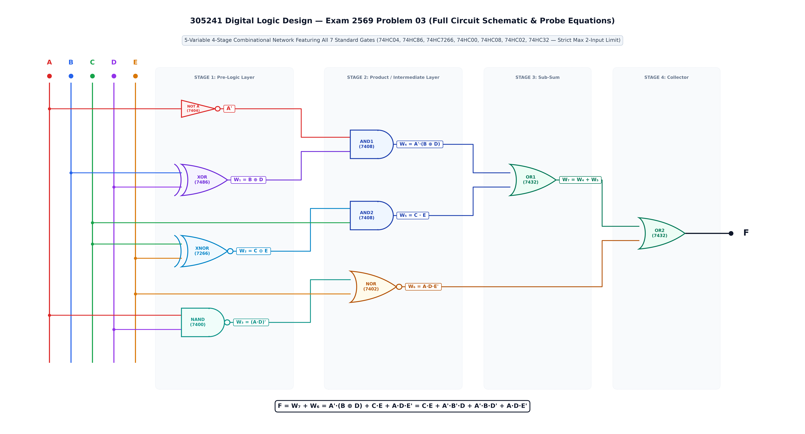
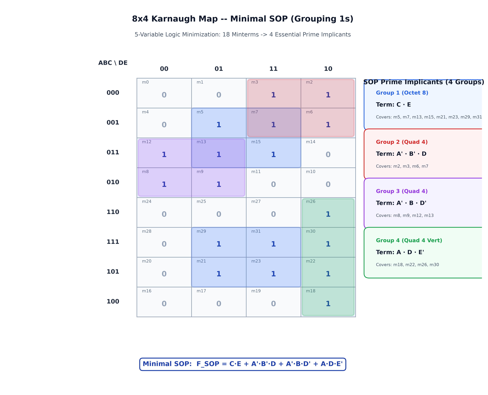
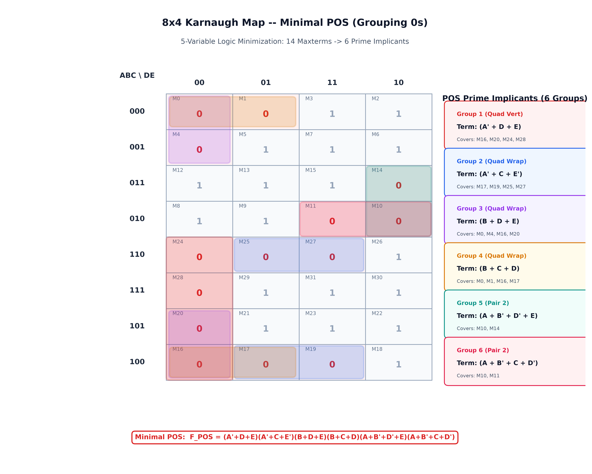
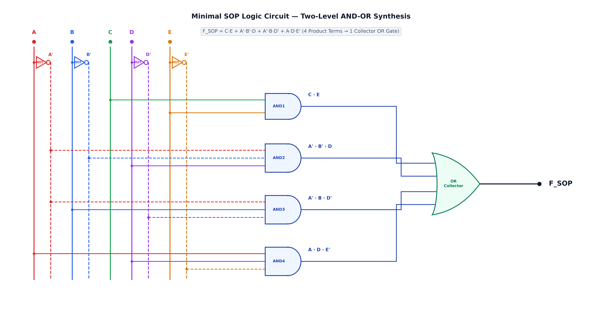
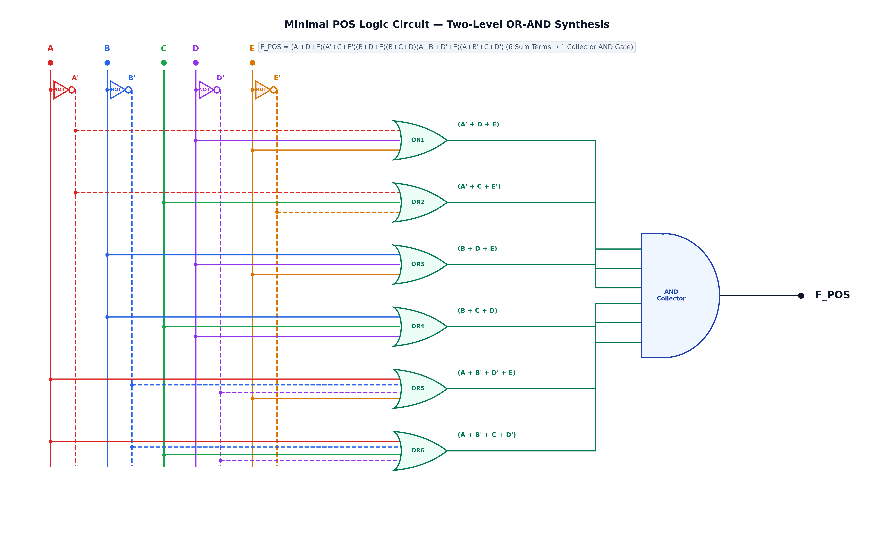
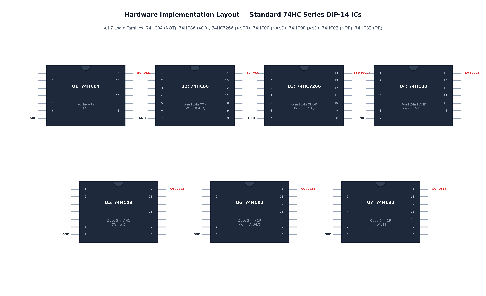

# ข้อสอบข้อที่ 3: วงจรลอจิกผสมครบ 7 ชนิดเกตมาตรฐาน (All 7 Standard Logic Gate Types · Max 2-Input) และการลดรูปด้วย K-Map 8×4

**วิชา:** 305241 การออกแบบวงจรดิจิตอล (Digital Logic Circuit Design) · มหาวิทยาลัยนเรศวร  
**บทที่ 2:** ฟังก์ชันตรรกศาสตร์และเกตเชิงผสม (Logic Functions and Combinational Circuits)  
**สถานที่จัดเก็บ:** `02-logic-functions-combinational/exam/2569/3/`  
**เอกสารเฉลยแบบโต้ตอบ (Interactive Solution):** [solution.html](solution.html)

---

## 📌 โจทย์ปัญหา (Problem Statement)

กำหนดวงจรตรรกศาสตร์ดิจิทัลแบบ 5 ตัวแปรอินพุต (`A, B, C, D, E`) ซึ่งได้รับการออกแบบตามมาตรฐานข้อสอบภาคปฏิบัติและบรรยาย โดยมีเงื่อนไขสำคัญดังนี้:
1. **มีลอจิกเกตมาตรฐานครบทั้ง 7 ชนิดตามหลักสูตร:** NOT, XOR, XNOR, NAND, NOR, AND, OR
2. **จำกัดจำนวนการซ้ำของเกตแต่ละชนิด:** ไม่เกิน 2 ตัวต่อชนิดเกตตลอดทั้งวงจร (`count(gate_type) ≤ 2`)
3. **จำกัดจำนวนอินพุตของแต่ละเกต:** ไม่เกิน 2 ขาอินพุตต่อเกต (`Strict Max 2-Input per Gate`)
4. **ไม่มีขาอินพุตหรือเกตลอย (Closed Network):** สัญญาณทุกเส้นเชื่อมต่ออย่างสมบูรณ์ 100%

โครงสร้างวงจรจัดวางแบบ 4 ระดับ (4-Stage Combinational Network) ประกอบด้วยไอซีมาตรฐานตระกูล 74HC Series รวม 7 ตัว ได้แก่:
- อินเวอร์เตอร์ 74HC04 (NOT Gate)
- เอ็กซ์คลูซีฟออร์ 74HC86 (XOR Gate)
- เอ็กซ์คลูซีฟนอร์ 74HC7266 (XNOR Gate)
- แนนด์เกต 74HC00 (NAND Gate)
- นอร์เกต 74HC02 (NOR Gate)
- แอนด์เกต 74HC08 (AND Gate × 2)
- ออร์เกต 74HC32 (OR Gate × 2)

```text
               ┌─────────────────────────────────────────────────────────────┐
               │         4-STAGE COMBINATIONAL NETWORK ARCHITECTURE          │
               └─────────────────────────────────────────────────────────────┘
  INPUTS           STAGE 1               STAGE 2           STAGE 3         STAGE 4       OUTPUT
  A ────────────► [ NOT ] ───► A' ────┐
  B, D ─────────► [ XOR ] ───► W₁ ───┼──► [ AND1 ] ──► W₄ ──┐
  C, E ─────────► [ XNOR] ───► W₂ ───┼──► [ AND2 ] ──► W₅ ──┴─► [ OR1 ] ──► W₇ ──┐
  A, D ─────────► [ NAND] ───► W₃ ───┼──► [ NOR  ] ──► W₆ ─────────────────────────┴─► [ OR2 ] ──► F
  C, E ──────────────────────────────┘
```

---

## 1. ผังวงจรต้นฉบับ (Original Circuit Schematic)

ผังวงจรเดินสายสัญญาณด้วยระบบบัสแนวตั้งแยก 9 รางสีอิสระ (`A, A', B, B', C, D, D', E, E'`) สัญญาณไหลจากซ้ายไปขวาอย่างสมมาตร ไร้การทับซ้อน:



### ตารางแจกแจงเกตและสมการประจำจุดทดสอบ (Gate Breakdown Table)

| รหัสเกต | ประเภท Gate | ไอซีมาตรฐาน | ขาอินพุต (Inputs) | สมการเอาต์พุตประจำจุดทดสอบ (Output Expression) |
| :--- | :--- | :--- | :--- | :--- |
| **NOT** | Hex Inverter | **74HC04** | `A` | `A'` |
| **XOR** | 2-Input XOR | **74HC86** | `B, D` | `W₁ = B ⊕ D = B'·D + B·D'` |
| **XNOR** | 2-Input XNOR | **74HC7266** | `C, E` | `W₂ = C ⊙ E = (C ⊕ E)' = C'·E' + C·E` |
| **NAND** | 2-Input NAND | **74HC00** | `A, D` | `W₃ = (A · D)' = A' + D'` |
| **AND1** | 2-Input AND | **74HC08** | `A', W₁` | `W₄ = A' · W₁ = A'·(B ⊕ D) = A'·B'·D + A'·B·D'` |
| **AND2** | 2-Input AND | **74HC08** | `W₂, C` | `W₅ = W₂ · C = (C ⊙ E) · C = C · E` (XNOR Absorption) |
| **NOR** | 2-Input NOR | **74HC02** | `W₃, E` | `W₆ = (W₃ + E)' = ((A · D)' + E)' = A · D · E'` (De Morgan) |
| **OR1** | 2-Input OR | **74HC32** | `W₄, W₅` | `W₇ = W₄ + W₅ = A'·(B ⊕ D) + C·E` |
| **OR2** | 2-Input OR | **74HC32** | `W₇, W₆` | `F = W₇ + W₆ = A'·(B ⊕ D) + C·E + A·D·E'` |

---

## 2. ตารางค่าความจริง 32 กรณี (Truth Table 32 Cases)

การประเมินค่าฟังก์ชันลอจิกครบทั้ง 32 รูปแบบ (`2⁵ = 32` แถว):

| Index | A | B | C | D | E | A' | `W₁ (XOR)` | `W₂ (XNOR)` | `W₃ (NAND)` | `W₄ (AND1)` | `W₅ (AND2)` | `W₆ (NOR)` | `W₇ (OR1)` | **F (Output)** | เทอมมาตรฐาน (Canonical Term) |
| :-: | :-: | :-: | :-: | :-: | :-: | :-: | :-: | :-: | :-: | :-: | :-: | :-: | :-: | :-: | :--- |
| 0 | 0 | 0 | 0 | 0 | 0 | 1 | 0 | 1 | 1 | 0 | 0 | 0 | 0 | **0** | `M₀ = (A + B + C + D + E)` |
| 1 | 0 | 0 | 0 | 0 | 1 | 1 | 0 | 0 | 1 | 0 | 0 | 0 | 0 | **0** | `M₁ = (A + B + C + D + E')` |
| **2** | 0 | 0 | 0 | 1 | 0 | 1 | 1 | 1 | 1 | 1 | 0 | 0 | 1 | **1** | **`m₂ = A'B'C'DE'`** |
| **3** | 0 | 0 | 0 | 1 | 1 | 1 | 1 | 0 | 1 | 1 | 0 | 0 | 1 | **1** | **`m₃ = A'B'C'DE`** |
| 4 | 0 | 0 | 1 | 0 | 0 | 1 | 0 | 0 | 1 | 0 | 0 | 0 | 0 | **0** | `M₄ = (A + B + C' + D + E)` |
| **5** | 0 | 0 | 1 | 0 | 1 | 1 | 0 | 1 | 1 | 0 | 1 | 0 | 1 | **1** | **`m₅ = A'B'CD'E`** |
| **6** | 0 | 0 | 1 | 1 | 0 | 1 | 1 | 0 | 1 | 1 | 0 | 0 | 1 | **1** | **`m₆ = A'B'CDE'`** |
| **7** | 0 | 0 | 1 | 1 | 1 | 1 | 1 | 1 | 1 | 1 | 1 | 0 | 1 | **1** | **`m₇ = A'B'CDE`** |
| **8** | 0 | 1 | 0 | 0 | 0 | 1 | 1 | 1 | 1 | 1 | 0 | 0 | 1 | **1** | **`m₈ = A'BC'D'E'`** |
| **9** | 0 | 1 | 0 | 0 | 1 | 1 | 1 | 0 | 1 | 1 | 0 | 0 | 1 | **1** | **`m₉ = A'BC'D'E`** |
| 10 | 0 | 1 | 0 | 1 | 0 | 1 | 0 | 1 | 1 | 0 | 0 | 0 | 0 | **0** | `M₁₀ = (A + B' + C + D' + E)` |
| 11 | 0 | 1 | 0 | 1 | 1 | 1 | 0 | 0 | 1 | 0 | 0 | 0 | 0 | **0** | `M₁₁ = (A + B' + C + D' + E')` |
| **12** | 0 | 1 | 1 | 0 | 0 | 1 | 1 | 0 | 1 | 1 | 0 | 0 | 1 | **1** | **`m₁₂ = A'BCD'E'`** |
| **13** | 0 | 1 | 1 | 0 | 1 | 1 | 1 | 1 | 1 | 1 | 1 | 0 | 1 | **1** | **`m₁₃ = A'BCD'E`** |
| 14 | 0 | 1 | 1 | 1 | 0 | 1 | 0 | 0 | 1 | 0 | 0 | 0 | 0 | **0** | `M₁₄ = (A + B' + C' + D' + E)` |
| **15** | 0 | 1 | 1 | 1 | 1 | 1 | 0 | 1 | 1 | 0 | 1 | 0 | 1 | **1** | **`m₁₅ = A'BCDE`** |
| 16 | 1 | 0 | 0 | 0 | 0 | 0 | 0 | 1 | 1 | 0 | 0 | 0 | 0 | **0** | `M₁₆ = (A' + B + C + D + E)` |
| 17 | 1 | 0 | 0 | 0 | 1 | 0 | 0 | 0 | 1 | 0 | 0 | 0 | 0 | **0** | `M₁₇ = (A' + B + C + D + E')` |
| **18** | 1 | 0 | 0 | 1 | 0 | 0 | 1 | 1 | 0 | 0 | 0 | 1 | 0 | **1** | **`m₁₈ = AB'C'DE'`** |
| 19 | 1 | 0 | 0 | 1 | 1 | 0 | 1 | 0 | 0 | 0 | 0 | 0 | 0 | **0** | `M₁₉ = (A' + B + C + D' + E')` |
| 20 | 1 | 0 | 1 | 0 | 0 | 0 | 0 | 0 | 1 | 0 | 0 | 0 | 0 | **0** | `M₂₀ = (A' + B + C' + D + E)` |
| **21** | 1 | 0 | 1 | 0 | 1 | 0 | 0 | 1 | 1 | 0 | 1 | 0 | 1 | **1** | **`m₂₁ = AB'CD'E`** |
| **22** | 1 | 0 | 1 | 1 | 0 | 0 | 1 | 0 | 0 | 0 | 0 | 1 | 0 | **1** | **`m₂₂ = AB'CDE'`** |
| **23** | 1 | 0 | 1 | 1 | 1 | 0 | 1 | 1 | 0 | 0 | 1 | 0 | 1 | **1** | **`m₂₃ = AB'CDE`** |
| 24 | 1 | 1 | 0 | 0 | 0 | 0 | 1 | 1 | 1 | 0 | 0 | 0 | 0 | **0** | `M₂₄ = (A' + B' + C + D + E)` |
| 25 | 1 | 1 | 0 | 0 | 1 | 0 | 1 | 0 | 1 | 0 | 0 | 0 | 0 | **0** | `M₂₅ = (A' + B' + C + D + E')` |
| **26** | 1 | 1 | 0 | 1 | 0 | 0 | 0 | 1 | 0 | 0 | 0 | 1 | 0 | **1** | **`m₂₆ = ABC'DE'`** |
| 27 | 1 | 1 | 0 | 1 | 1 | 0 | 0 | 0 | 0 | 0 | 0 | 0 | 0 | **0** | `M₂₇ = (A' + B' + C + D' + E')` |
| 28 | 1 | 1 | 1 | 0 | 0 | 0 | 1 | 0 | 1 | 0 | 0 | 0 | 0 | **0** | `M₂₈ = (A' + B' + C' + D + E)` |
| **29** | 1 | 1 | 1 | 0 | 1 | 0 | 1 | 1 | 1 | 0 | 1 | 0 | 1 | **1** | **`m₂₉ = ABC'D'E`** |
| **30** | 1 | 1 | 1 | 1 | 0 | 0 | 0 | 0 | 0 | 0 | 0 | 1 | 0 | **1** | **`m₃₀ = ABCDE'`** |
| **31** | 1 | 1 | 1 | 1 | 1 | 0 | 0 | 1 | 0 | 0 | 1 | 0 | 1 | **1** | **`m₃₁ = ABCDE`** |

### สรุปสมการมาตรฐาน (Canonical Forms):
- **Canonical SOP (18 Minterms):**  
  `F(A, B, C, D, E) = Σm(2, 3, 5, 6, 7, 8, 9, 12, 13, 15, 18, 21, 22, 23, 26, 29, 30, 31)`
- **Canonical POS (14 Maxterms):**  
  `F(A, B, C, D, E) = ΠM(0, 1, 4, 10, 11, 14, 16, 17, 19, 20, 24, 25, 27, 28)`

---

## 3. การพิสูจน์ลดรูปด้วยพีชคณิตบูลีน (Step-by-Step Boolean Algebra Proof)

### ขั้นตอนที่ 1: ถอดสมการของเกตในระดับที่ 1 (Pre-Logic Stage)
- `A' = NOT(A)`
- `W₁ = B ⊕ D = B'·D + B·D'`
- `W₂ = C ⊙ E = (C ⊕ E)' = C'·E' + C·E`
- `W₃ = (A · D)' = A' + D'`

### ขั้นตอนที่ 2: ถอดและลดรูปสมการในระดับที่ 2 (Product / Intermediate Stage)
1. **พจน์ `W₄` (AND1 Gate):**
   ```text
   W₄ = A' · W₁ = A' · (B'·D + B·D') = A'·B'·D + A'·B·D'
   ```
2. **พจน์ `W₅` (AND2 Gate — XNOR Absorption Property):**
   ```text
   W₅ = W₂ · C = (C'·E' + C·E) · C
      = C·C'·E' + C·C·E
      = 0·E' + C·E
      = C·E
   ```
3. **พจน์ `W₆` (NOR Gate — De Morgan's Law on NAND):**
   ```text
   W₆ = (W₃ + E)' = ((A · D)' + E)'
      = ((A · D)')' · E'       [กฎเดอมอร์แกน: (X + Y)' = X' · Y']
      = (A · D) · E'           [กฎการปฏิเสธซ้อน: (X')' = X]
      = A · D · E'
   ```

### ขั้นตอนที่ 3: รวมสัญญาณในระดับที่ 3 และ 4 (Collector OR Stage)
- `W₇ = W₄ + W₅ = A'·B'·D + A'·B·D' + C·E`
- `F = W₇ + W₆ = C·E + A'·B'·D + A'·B·D' + A·D·E'`

```text
┌─────────────────────────────────────────────────────────────────────────────┐
│  MINIMAL SOP RESULT: F_SOP = C·E + A'·B'·D + A'·B·D' + A·D·E'               │
│  (4 Product Terms, 10 Literals)                                             │
└─────────────────────────────────────────────────────────────────────────────┘
```

---

## 4. การลดรูปด้วยแผนผังคาร์โนฟ 8×4 (K-Map 8×4 Minimization)

### 4.1 Minimal SOP (จัดกลุ่มลอจิก 1 ได้ 4 Essential Prime Implicants)



| กลุ่ม | ขนาด | มินเทอมที่ครอบคลุม | ตัวแปรที่คงที่ | พจน์ผลคูณ (Product Term) |
| :--- | :---: | :--- | :--- | :--- |
| **กลุ่ม 1 (Octet)** | 8 ช่อง | `m₅, m₇, m₁₃, m₁₅, m₂₁, m₂₃, m₂₉, m₃₁` | `C=1, E=1` | **`C · E`** |
| **กลุ่ม 2 (Quad)** | 4 ช่อง | `m₂, m₃, m₆, m₇` | `A=0, B=0, D=1` | **`A' · B' · D`** |
| **กลุ่ม 3 (Quad)** | 4 ช่อง | `m₈, m₉, m₁₂, m₁₃` | `A=0, B=1, D=0` | **`A' · B · D'`** |
| **กลุ่ม 4 (Quad Vert)** | 4 ช่อง | `m₁₈, m₂₂, m₂₆, m₃₀` | `A=1, D=1, E=0` | **`A · D · E'`** |

`F_SOP = C·E + A'·B'·D + A'·B·D' + A·D·E'`

---

### 4.2 Minimal POS (จัดกลุ่มลอจิก 0 ได้ 6 Prime Implicants)



| กลุ่ม | ขนาด | แมกซ์เทอมที่ครอบคลุม | ตัวแปรที่คงที่ | พจน์ผลบวก (Sum Term) |
| :--- | :---: | :--- | :--- | :--- |
| **กลุ่ม 1 (Quad Vert)** | 4 ช่อง | `M₁₆, M₂₀, M₂₄, M₂₈` | `A=1, D=0, E=0` | **`(A' + D + E)`** |
| **กลุ่ม 2 (Quad Wrap)** | 4 ช่อง | `M₁₇, M₁₉, M₂₅, M₂₇` | `A=1, C=0, E=1` | **`(A' + C + E')`** |
| **กลุ่ม 3 (Quad Wrap)** | 4 ช่อง | `M₀, M₄, M₁₆, M₂₀` | `B=0, D=0, E=0` | **`(B + D + E)`** |
| **กลุ่ม 4 (Quad Wrap)** | 4 ช่อง | `M₀, M₁, M₁₆, M₁₇` | `B=0, C=0, D=0` | **`(B + C + D)`** |
| **กลุ่ม 5 (Pair)** | 2 ช่อง | `M₁₀, M₁₄` | `A=0, B=1, D=1, E=0` | **`(A + B' + D' + E)`** |
| **กลุ่ม 6 (Pair)** | 2 ช่อง | `M₁₀, M₁₁` | `A=0, B=1, C=0, D=1` | **`(A + B' + C + D')`** |

`F_POS = (A' + D + E) · (A' + C + E') · (B + D + E) · (B + C + D) · (A + B' + D' + E) · (A + B' + C + D')`

---

## 5. การสังเคราะห์ผังวงจรลอจิก 2 ระดับ (Two-Level Circuit Synthesis)

### 5.1 ผังวงจร Minimal SOP (AND-OR Network)


### 5.2 ผังวงจร Minimal POS (OR-AND Network)


---

## 6. การเปรียบเทียบประสิทธิภาพทางฮาร์ดแวร์ (Hardware Benchmark)



| พารามิเตอร์เปรียบเทียบ | วงจรเริ่มต้น (Original 4-Stage) | วงจร Minimal SOP (AND-OR) ⭐ | วงจร Minimal POS (OR-AND) |
| :--- | :---: | :---: | :---: |
| **จำนวนเกตหลัก (Main Gates)** | 9 เกต (7 ชนิด) | **5 เกต** (AND×4, OR×1) | 7 เกต (OR×6, AND×1) |
| **จำนวนอินเวอร์เตอร์ (NOT)** | 1 เกต | **4 เกต** (A', B', D', E') | 4 เกต (A', B', D', E') |
| **จำนวนลิทเทอรัล (Literals)** | 22 ลิทเทอรัล | **10 ลิทเทอรัล** | 20 ลิทเทอรัล |
| **จำนวนแพ็กเกจไอซี (DIP-14 ICs)** | **7 ตัว** (ครบทุกเบอร์) | **3 ตัว** (74HC04, 74HC08, 74HC32) | **3-4 ตัว** (74HC04, 74HC32×2, 74HC30) |
| **ความลึกของวงจร (Logic Depth)** | 4 ระดับ (4 Stages) | **2 ระดับ (2 Stages)** | 2 ระดับ (2 Stages) |
| **ความหน่วงสัญญาณ (Propagation Delay)** | ≈ 36 ns | **≈ 18 ns (เร็วขึ้น 2 เท่า!)** | ≈ 18 ns |
| **ความซับซ้อนในการเดินสาย (Routing)** | สูงมาก (ใช้ไอซี 7 ตัว) | **ต่ำมาก (ประหยัดพื้นที่ 57%)** | ปานกลาง |

---

## 📁 รายการไฟล์ในข้อนี้

- [solution.html](solution.html): เฉลยละเอียดและซิมูเลเตอร์ 5 สวิตช์แบบโต้ตอบ
- [README.md](README.md): เอกสารสรุปข้อสอบและการพิสูจน์
- [verify_logic.py](verify_logic.py): สคริปต์ตรวจสอบความถูกต้องของลอจิกทั้ง 32 กรณี
- [generate_all_diagrams.py](generate_all_diagrams.py): สคริปต์สร้างผังไดอะแกรม 300 DPI ทั้ง 6 รูป
- `assets/`: ไดเรกทอรีเก็บภาพไดอะแกรมความละเอียดสูง (300 DPI)
