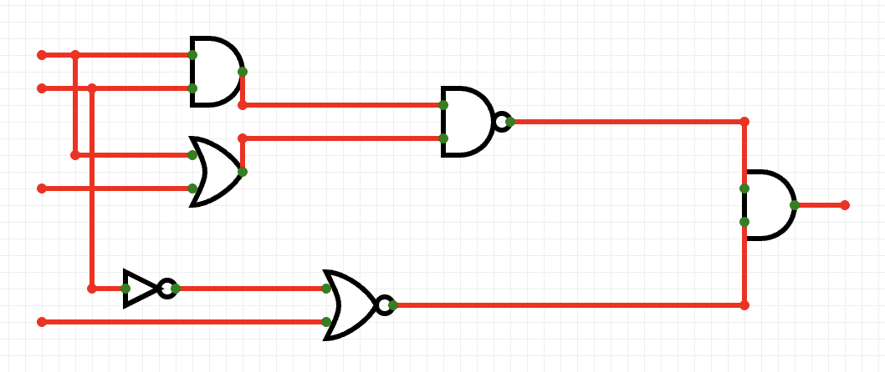
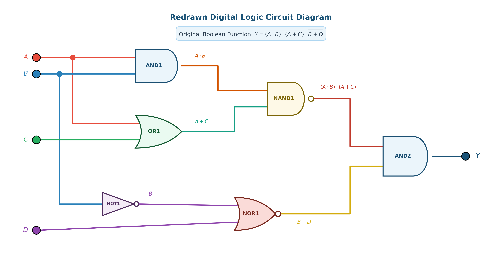
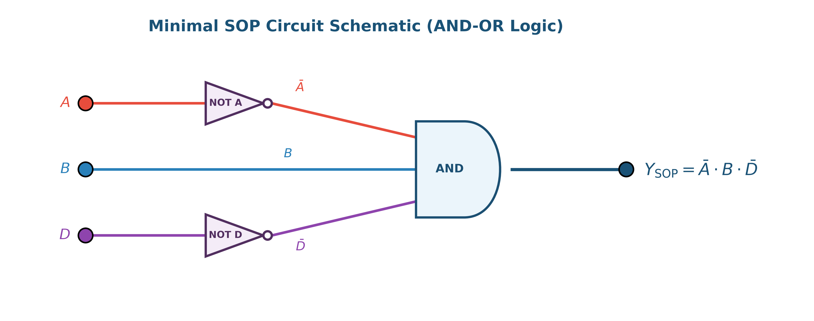

# ตัวอย่างโจทย์ที่ 1: การวิเคราะห์และลดรูปวงจรตรรกศาสตร์ดิจิทัล (Digital Logic Circuit Minimization)

**สถานที่จัดเก็บ:** `02-logic-functions-combinational/exercises/01`

---

## 📌 โจทย์ปัญหา (Problem Statement)

จงวิเคราะห์วงจรตรรกศาสตร์ดิจิทัลจากภาพถ่ายต้นฉบับ หาตารางความจริง (Truth Table) ลดรูปสมการพีชคณิตบูลีนด้วยวิธี **SOP (Sum of Products)** และ **POS (Product of Sums)** พร้อมทั้งเขียนวงจรตรรกศาสตร์ที่ลดรูปแล้ว

### 🖼️ ภาพถ่ายโจทย์ต้นฉบับ


---

## 1. วงจรต้นฉบับที่จัดระเบียบใหม่ (Redrawn Circuit Diagram)

เพื่อความง่ายในการวิเคราะห์ ได้ทำการจัดระเบียบสายสัญญาณ (Wiring Routing) กำหนดโค้ดสีอินพุต (A, B, C, D) และระบุชื่อ Gate และจุดทด (Intermediate Nodes) อย่างชัดเจน:



### ตารางแยกโครงสร้าง Gate ย่อย (Gate Breakdown)

| Gate Label | ประเภท Gate | อินพุต (Inputs) | สมการเอาต์พุต (Output Expression) |
| :--- | :--- | :--- | :--- |
| **AND1** | AND Gate | A, B | `W₁ = A · B` |
| **OR1** | OR Gate | A, C | `W₂ = A + C` |
| **NOT1** | Inverter (NOT) | B | `W₃ = B'` |
| **NAND1** | NAND Gate | `W₁, W₂` | `W₄ = ((A · B) · (A + C))\'` |
| **NOR1** | NOR Gate | `W₃, D` | `W₅ = (\bar{B)\' + D}` |
| **AND2** | AND Gate | `W₄, W₅` | `Y = W₄ · W₅ = ((A · B) · (A + C))\' · (\bar{B)\' + D}` |

---

## 2. ตารางความจริง (Truth Table) และ Minterms / Maxterms

วิเคราะห์ค่าเอาต์พุต Y สำหรับทุกกรณีอินพุต `2⁴ = 16` กรณี (`m₀ ... m₁5}`):

| Index | A | B | C | D | `W₁=A· B` | `W₂=A+C` | `W₄=NAND1` | `W₃=B'` | `W₅=NOR1` | **Output (Y)** | Minterm (`Y=1`) | Maxterm (`Y=0`) |
| :-: | :-: | :-: | :-: | :-: | :-: | :-: | :-: | :-: | :-: | :-: | :-: | :---: | :---: |
| 0 | 0 | 0 | 0 | 0 | 0 | 0 | 1 | 1 | 0 | **0** | - | `M₀ = (A+B+C+D)` |
| 1 | 0 | 0 | 0 | 1 | 0 | 0 | 1 | 1 | 0 | **0** | - | `M₁ = (A+B+C+D')` |
| 2 | 0 | 0 | 1 | 0 | 0 | 1 | 1 | 1 | 0 | **0** | - | `M₂ = (A+B+C'+D)` |
| 3 | 0 | 0 | 1 | 1 | 0 | 1 | 1 | 1 | 0 | **0** | - | `M₃ = (A+B+C'+D')` |
| **4** | **0** | **1** | **0** | **0** | 0 | 0 | 1 | 0 | 1 | **1** | **`m₄ = A'BC'D'`** | - |
| 5 | 0 | 1 | 0 | 1 | 0 | 0 | 1 | 0 | 0 | **0** | - | `M₅ = (A+B'+C+D')` |
| **6** | **0** | **1** | **1** | **0** | 0 | 1 | 1 | 0 | 1 | **1** | **`m₆ = A'BCD'`** | - |
| 7 | 0 | 1 | 1 | 1 | 0 | 1 | 1 | 0 | 0 | **0** | - | `M₇ = (A+B'+C'+D')` |
| 8 | 1 | 0 | 0 | 0 | 0 | 1 | 1 | 1 | 0 | **0** | - | `M₈ = (A'+B+C+D)` |
| 9 | 1 | 0 | 0 | 1 | 0 | 1 | 1 | 1 | 0 | **0** | - | `M₉ = (A'+B+C+D')` |
| 10 | 1 | 0 | 1 | 0 | 0 | 1 | 1 | 1 | 0 | **0** | - | `M₁0} = (A'+B+C'+D)` |
| 11 | 1 | 0 | 1 | 1 | 0 | 1 | 1 | 1 | 0 | **0** | - | `M₁1} = (A'+B+C'+D')` |
| 12 | 1 | 1 | 0 | 0 | 1 | 1 | 0 | 0 | 1 | **0** | - | `M₁2} = (A'+B'+C+D)` |
| 13 | 1 | 1 | 0 | 1 | 1 | 1 | 0 | 0 | 0 | **0** | - | `M₁3} = (A'+B'+C+D')` |
| 14 | 1 | 1 | 1 | 0 | 1 | 1 | 0 | 0 | 1 | **0** | - | `M₁4} = (A'+B'+C'+D)` |
| 15 | 1 | 1 | 1 | 1 | 1 | 1 | 0 | 0 | 0 | **0** | - | `M₁5} = (A'+B'+C'+D')` |

---

## 3. การลดรูปด้วยวิธี SOP (Sum of Products)

### 3.1 Canonical SOP Form
นำกรณีที่ `Y = 1` มาบวกกัน (`m₄` และ `m₆`):
```text
Y_{SOP, canonical} = \sum m(4, 6) = A'BC'D' + A'BCD'
```

### 3.2 การลดรูปด้วยพีชคณิตบูลีน (Boolean Algebra Step-by-Step)
1. ดึงตัวร่วม `A'BD'` ออกมา:
   ```text
Y = A'BD' · (C' + C)
```
2. ใช้กฎตัวเติมเต็ม (Complement Law: `C' + C = 1`):
   ```text
Y = A'BD' · (1)
```
3. ได้สมการ SOP ขั้นต่ำ:
   ```text
Y_{SOP = A' · B · D'}
```

### 3.3 การลดรูปด้วย Karnaugh Map 4x4 (Grouping 1s)


- จับคู่ `m₄` และ `m₆` แบบม้วนขอบ (Wrap-around pair) ในแถว `AB=01`
- ตัดตัวแปร C ออก ได้ผลลัพธ์ `A'BD'`

### 3.4 ไดอะแกรมวงจรตรรกศาสตร์ SOP (AND-OR Logic)



---

## 4. การลดรูปด้วยวิธี POS (Product of Sums)

### 4.1 Canonical POS Form
นำกรณีที่ `Y = 0` มาคูณกัน ทั้งหมด 14 พจน์:
```text
Y_{POS, canonical} = \prod M(0, 1, 2, 3, 5, 7, 8, 9, 10, 11, 12, 13, 14, 15)
```

### 4.2 การลดรูปด้วยพีชคณิตบูลีน (Boolean Algebra & De Morgan)
จากตำแหน่งที่ `Y = 0` สามารถสรุป `Y'` ได้ดังนี้:
```text
Y' = A + B' + D
```

Invert ทั้งสองข้าง:
```text
Y = (\bar{Y)\'} = (A + \bar{B)\' + D}
```

ใช้กฎ De Morgan พิสูจน์:
```text
Y = (A + \bar{B)\' + D} = A' · \bar{B'} · D' = A' · B · D'
```

### 4.3 การลดรูปด้วย Karnaugh Map 4x4 (Grouping 0s)


### 4.4 ไดอะแกรมวงจรตรรกศาสตร์ POS (NOR Logic)


---

## 5. สรุปผลการลดรูปและวงจรสมดุลอย่างง่าย (Simplified Circuit)

จากการลดรูปทั้งสองวิธี ทำให้ทราบว่า **อินพุต C เป็น Don't-Care Input (ไม่มีผลต่อเอาต์พุต Y)** สามารถลดจำนวน Gate จาก 6 ตัวเหลือเพียง 2-3 ตัว:


### 📊 ภาพเปรียบเทียบวงจรทั้งหมด (Circuit Comparison)


### 📊 ภาพเปรียบเทียบ SOP vs POS (SOP vs POS Infographic)


---

## 6. ตารางเปรียบเทียบประสิทธิภาพทางฮาร์ดแวร์ (Hardware Benchmark)

| ดัชนีเปรียบเทียบ | วงจรเดิม (Original) | วิธี SOP (Sum of Products) | วิธี POS (Product of Sums) | ผู้ชนะ (Winner) |
| :--- | :--- | :--- | :--- | :--- |
| **จำนวน Logic Gates** | 6 Gates | 3 Gates (2 NOT + 1 AND) | **2 Gates (1 NOT + 1 NOR)** | 🏆 **POS** |
| **จำนวน Transistors (CMOS)** | ~28 Transistors | ~14 Transistors | **~10 Transistors** | 🏆 **POS** |
| **จำนวน Propagation Delay Steps** | 3 Steps | 2 Steps | **2 Steps** | 🏆 **POS / SOP** |
| **การใช้พื้นที่บนชิป (Silicon Area)** | สูง | ปานกลาง | **ต่ำสุด** | 🏆 **POS** |

---

## 📁 สรุปไฟล์ในโฟลเดอร์นี้

1. [`image.png`](image.png) - ภาพถ่ายโจทย์วงจรต้นฉบับ
2. [`README.md`](README.md) - เอกสารสรุปโจทย์ วิธีทำ และผลลัพธ์ฉบับสมบูรณ์
3. [`digital_logic_circuit_redrawn.png`](digital_logic_circuit_redrawn.png) - ภาพวงจรเดิมที่จัดระเบียบใหม่
4. [`digital_logic_circuit_simplified.png`](digital_logic_circuit_simplified.png) - ภาพวงจรที่ลดรูปอย่างง่าย
5. [`digital_logic_circuit_comparison.png`](digital_logic_circuit_comparison.png) - ภาพเปรียบเทียบวงจรเดิม vs วงจรลดรูป
6. [`kmap_sop_diagram.png`](kmap_sop_diagram.png) - K-Map 4x4 สำหรับ SOP
7. [`kmap_pos_diagram.png`](kmap_pos_diagram.png) - K-Map 4x4 สำหรับ POS
8. [`sop_circuit_diagram.png`](sop_circuit_diagram.png) - วงจรตรรกศาสตร์ SOP
9. [`pos_circuit_diagram.png`](pos_circuit_diagram.png) - วงจรตรรกศาสตร์ POS
10. [`sop_pos_comparison.png`](sop_pos_comparison.png) - อินโฟกราฟิกสรุปเปรียบเทียบ SOP vs POS
11. [`generate_all_diagrams.py`](generate_all_diagrams.py) - สคริปต์ Python สำหรับสร้างและ Generate รูปภาพความละเอียดสูงทั้งหมด
