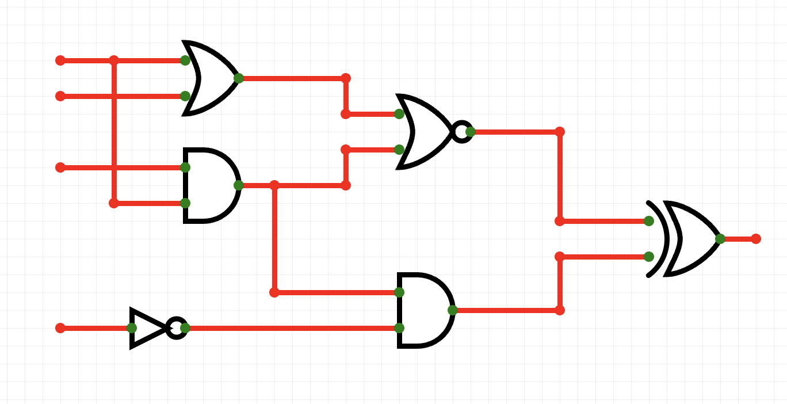
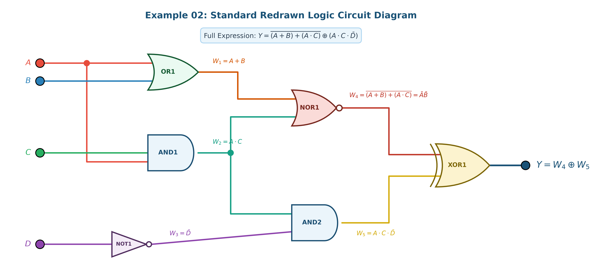
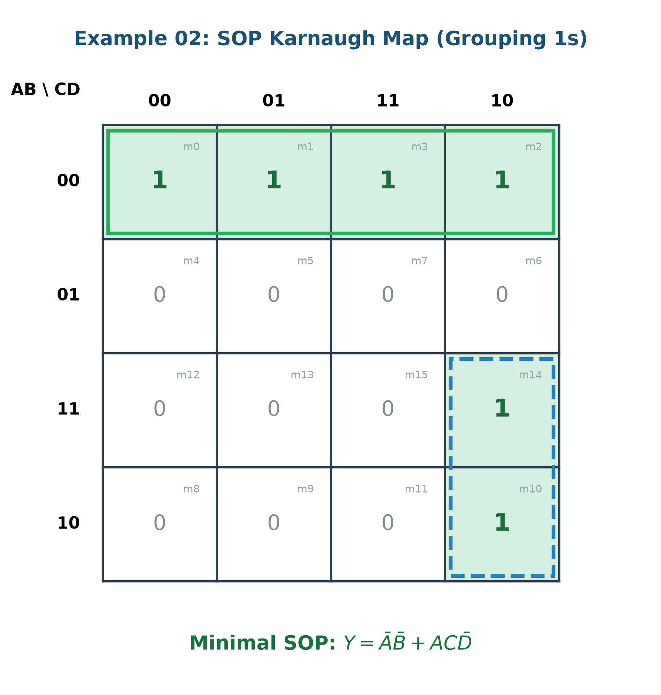
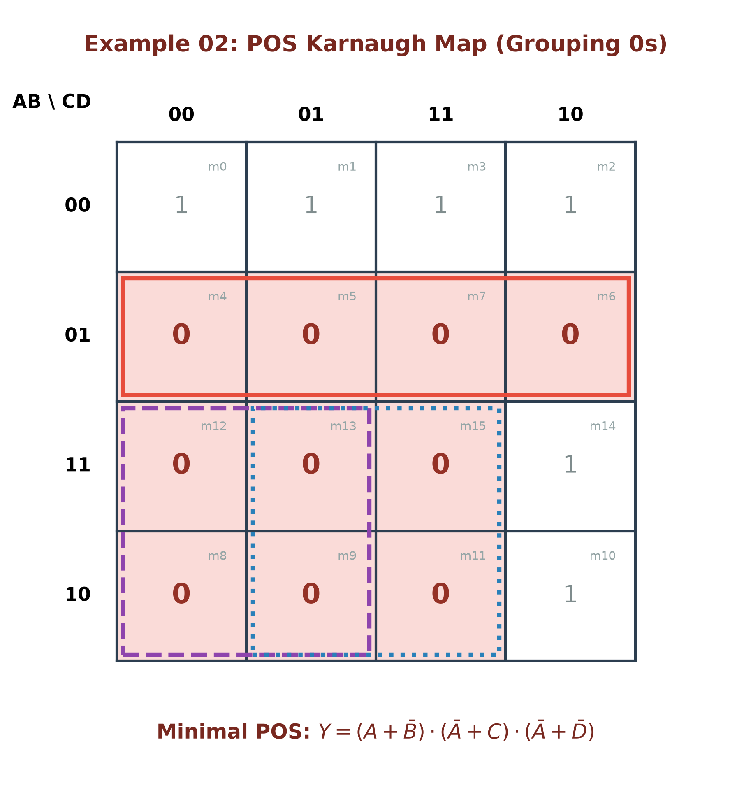
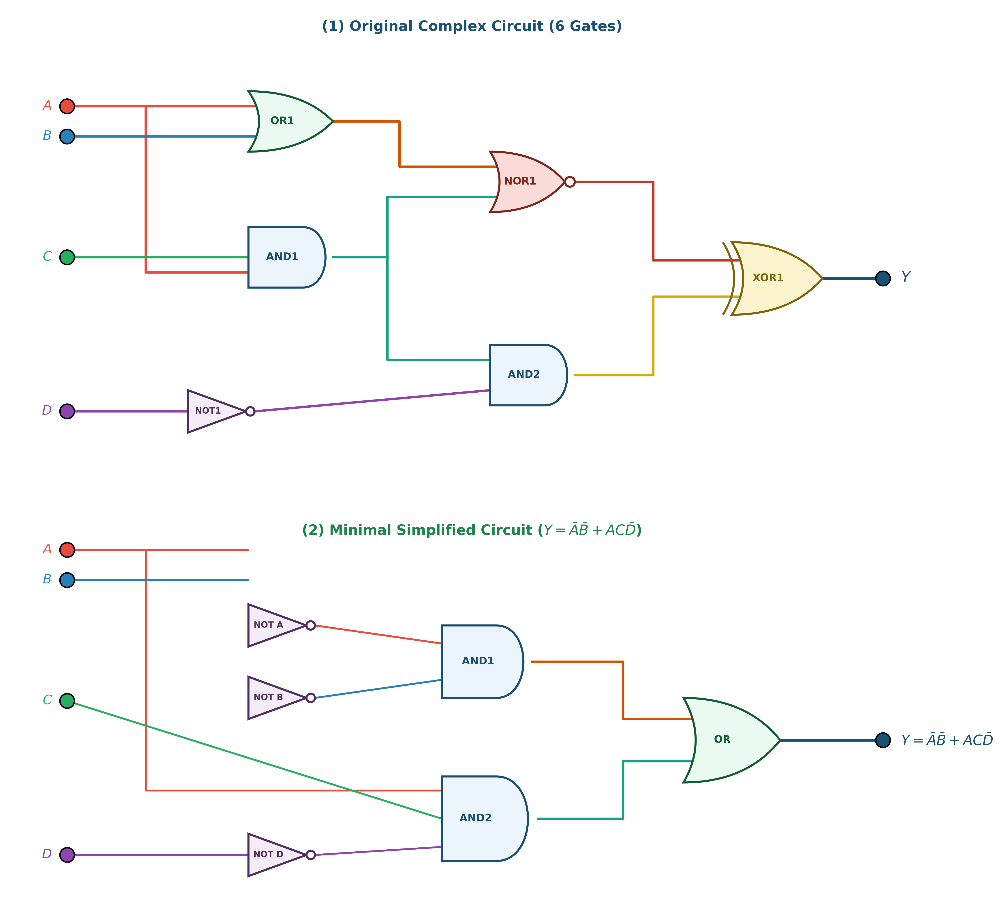
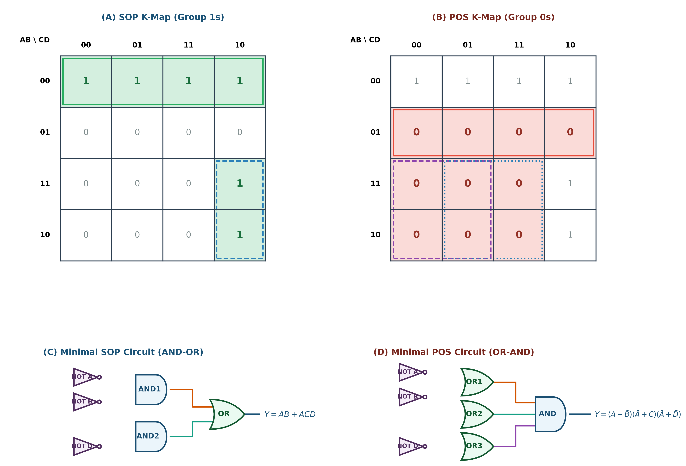

# ตัวอย่างโจทย์ที่ 2: การวิเคราะห์และลดรูปวงจรตรรกศาสตร์ดิจิทัล (Digital Logic Circuit Minimization Example 02)

**สถานที่จัดเก็บ:** `02-logic-functions-combinational/exercises/02`

---

## 📌 โจทย์ปัญหา (Problem Statement)

จงวิเคราะห์วงจรตรรกศาสตร์ดิจิทัลจากภาพถ่ายโจทย์ต้นฉบับ หาตารางความจริง (Truth Table) ลดรูปสมการพีชคณิตบูลีนด้วยวิธี **SOP (Sum of Products)** และ **POS (Product of Sums)** อย่างละเอียด พร้อมทั้งเขียนวงจรตรรกศาสตร์ที่ลดรูปแล้วตามมาตรฐาน

### 🖼️ ภาพถ่ายโจทย์ต้นฉบับ


---

## 1. วงจรต้นฉบับที่จัดระเบียบใหม่ (Standard Redrawn Circuit Diagram)

เพื่อความถูกต้องในการวิเคราะห์ ได้ทำการจัดระเบียบสายสัญญาณ (Bus Routing) แยกสีอินพุตหลักทั้ง 4 สัญญาณ (A, B, C, D) ระบุชื่อ Logic Gate ทุกตัวอย่างชัดเจน และติดป้ายสมการกำกับทุกจุดทด intermediate nodes (`W₁, W₂, W₃, W₄, W₅`):



### ตารางแยกโครงสร้าง Gate ย่อย (Gate Breakdown & Netlist)

| Gate Label | ประเภท Gate | อินพุต (Inputs) | สมการเอาต์พุตประจำจุดทด (Output Expression) |
| :--- | :--- | :--- | :--- |
| **OR1** | OR Gate | A, B | `W₁ = A + B` |
| **AND1** | AND Gate | C, A | `W₂ = A · C` |
| **NOT1** | Inverter (NOT) | D | `W₃ = D'` |
| **NOR1** | NOR Gate | `W₁, W₂` | `W₄ = ((A + B) + (A · C))\' = A' · B'` |
| **AND2** | AND Gate | `W₂, W₃` | `W₅ = W₂ · W₃ = A · C · D'` |
| **XOR1** | XOR Gate (Final) | `W₄, W₅` | `Y = W₄ ⊕ W₅ = ((A + B) + (A · C))\' ⊕ (A · C · D')` |

---

## 2. ตารางความจริง (Truth Table) และ Minterms / Maxterms

คำนวณเอาต์พุต Y สำหรับทั้ง 16 กรณี (`m₀ ... m₁5}`):

| Index | A | B | C | D | `W₁=A+B` | `W₂=A· C` | `W₃=D'` | `W₄=NOR1` | `W₅=AND2` | **Output (Y)** | Minterm (`Y=1`) | Maxterm (`Y=0`) |
| :-: | :-: | :-: | :-: | :-: | :-: | :-: | :-: | :-: | :-: | :-: | :-: | :---: | :---: |
| **0** | **0** | **0** | **0** | **0** | 0 | 0 | 1 | 1 | 0 | **1** | **`m₀ = A'B'C'D'`** | - |
| **1** | **0** | **0** | **0** | **1** | 0 | 0 | 0 | 1 | 0 | **1** | **`m₁ = A'B'C'D`** | - |
| **2** | **0** | **0** | **1** | **0** | 0 | 0 | 1 | 1 | 0 | **1** | **`m₂ = A'B'CD'`** | - |
| **3** | **0** | **0** | **1** | **1** | 0 | 0 | 0 | 1 | 0 | **1** | **`m₃ = A'B'CD`** | - |
| 4 | 0 | 1 | 0 | 0 | 1 | 0 | 1 | 0 | 0 | **0** | - | `M₄ = (A+B'+C+D)` |
| 5 | 0 | 1 | 0 | 1 | 1 | 0 | 0 | 0 | 0 | **0** | - | `M₅ = (A+B'+C+D')` |
| 6 | 0 | 1 | 1 | 0 | 1 | 0 | 1 | 0 | 0 | **0** | - | `M₆ = (A+B'+C'+D)` |
| 7 | 0 | 1 | 1 | 1 | 1 | 0 | 0 | 0 | 0 | **0** | - | `M₇ = (A+B'+C'+D')` |
| 8 | 1 | 0 | 0 | 0 | 1 | 0 | 1 | 0 | 0 | **0** | - | `M₈ = (A'+B+C+D)` |
| 9 | 1 | 0 | 0 | 1 | 1 | 0 | 0 | 0 | 0 | **0** | - | `M₉ = (A'+B+C+D')` |
| **10** | **1** | **0** | **1** | **0** | 1 | 1 | 1 | 0 | 1 | **1** | **`m₁0} = AB'CD'`** | - |
| 11 | 1 | 0 | 1 | 1 | 1 | 1 | 0 | 0 | 0 | **0** | - | `M₁1} = (A'+B+C'+D')` |
| 12 | 1 | 1 | 0 | 0 | 1 | 0 | 1 | 0 | 0 | **0** | - | `M₁2} = (A'+B'+C+D)` |
| 13 | 1 | 1 | 0 | 1 | 1 | 0 | 0 | 0 | 0 | **0** | - | `M₁3} = (A'+B'+C+D')` |
| **14** | **1** | **1** | **1** | **0** | 1 | 1 | 1 | 0 | 1 | **1** | **`m₁4} = ABCD'`** | - |
| 15 | 1 | 1 | 1 | 1 | 1 | 1 | 0 | 0 | 0 | **0** | - | `M₁5} = (A'+B'+C'+D')` |

---

## 3. การลดรูปด้วยวิธี SOP (Sum of Products)

### 3.1 Canonical SOP Form
นำกรณีที่เอาต์พุต `Y = 1` มารวมกัน (`m₀, m₁, m₂, m₃, m₁0}, m₁4}`):
```text
Y_{SOP, canonical} = \sum m(0, 1, 2, 3, 10, 14)
```
```text
= A'B'C'D' + A'B'C'D + A'B'CD' + A'B'CD + AB'CD' + ABCD'
```

---

### 3.2 การลดรูปด้วยพีชคณิตบูลีน (Boolean Algebra Step-by-Step)

จากสมการวงจรหลัก `Y = W₄ ⊕ W₅`:

1. **ลดรูป `W₄`:**
   ```text
W₄ = ((A + B) + (A · C))\'
```
   ใช้กฎการกลืนกลืน (Absorption Law: `(A + B) + A · C = A + B`):
   ```text
W₄ = (A + B)\' = A' · B'   (De Morgan's Law)
```

2. **พิจารณา `W₅`:**
   ```text
W₅ = A · C · D'
```

3. **กระจายสมการ XOR `Y = W₄ ⊕ W₅ = W₄ · (W₅)\' + (W₄)\' · W₅`:**

   - **พจน์แรก `W₄ · (W₅)\'`:**
     ```text
(W₅)\' = (A · C · \bar{D)\'} = A' + C' + D
```
     ```text
W₄ · (W₅)\' = (A'B') · (A' + C' + D) = A'B'A' + A'B'C' + A'B'D
```
     ```text
= A'B' + A'B'C' + A'B'D = A'B' · (1 + C' + D) = A'B'
```

   - **พจน์ที่สอง `(W₄)\' · W₅`:**
     ```text
(W₄)\' = (\bar{A)\'B'} = A + B
```
     ```text
(W₄)\' · W₅ = (A + B) · (A C D') = (A · A C D') + (B · A C D')
```
     ```text
= A C D' + A B C D' = A C D' · (1 + B) = A C D'
```

4. **รวมทั้งสองพจน์ได้สมการ SOP ขั้นต่ำ:**
   ```text
Y_{SOP = A'B' + A C D'}
```

---

### 3.3 การลดรูปด้วย Karnaugh Map 4x4 (Grouping 1s)



- **กลุ่มที่ 1 (Quad 4 ตัวในแถวแรก `AB=00`):** ครอบคลุม `m₀, m₁, m₃, m₂` `→` ตัด C, D ออก เหลือ `A'B'`
- **กลุ่มที่ 2 (Pair 2 ตัวในคอลัมน์ `CD=10`):** ครอบคลุม `m₁0}, m₁4}` ในแถว `AB=10, 11` `→` ตัด B ออก เหลือ `A C D'`
- **รวมสมการ SOP:** `A'B' + A C D'`

---

### 3.4 ไดอะแกรมวงจรตรรกศาสตร์ SOP (AND-OR Logic)


---

## 4. การลดรูปด้วยวิธี POS (Product of Sums)

### 4.1 Canonical POS Form
นำกรณีที่เอาต์พุต `Y = 0` มาคูณกัน ทั้งหมด 10 พจน์:
```text
Y_{POS, canonical} = \prod M(4, 5, 6, 7, 8, 9, 11, 12, 13, 15)
```

---

### 4.2 การลดรูปด้วยพีชคณิตบูลีน (Boolean Algebra & De Morgan)
จากสมการ SOP `Y = A'B' + A C D'` แปลงเป็น POS โดยใช้กฎการกระจาย (Distributive Law):

```text
Y = (A'B') + (A C D')
```
```text
= (A'B' + A) · (A'B' + C D')
```
```text
= (A + A')(A + B') · (A' + C)(B' + C) · (A' + D')(B' + D')
```
```text
= (1)(A + B') · (A' + C) · (B' + C) · (A' + D') · (B' + D')
```

ตัดพจน์ส่วนเกินด้วย Absorptive Simplification จะได้สมการ POS ขั้นต่ำ 3 พจน์:
```text
Y_{POS = (A + B') · (A' + C) · (A' + D')}
```

---

### 4.3 การลดรูปด้วย Karnaugh Map 4x4 (Grouping 0s)



- **กลุ่มที่ 1 (Quad แถว `AB=01`):** ครอบคลุม `m₄, m₅, m₇, m₆` `→` Maxterm: `(A + B')`
- **กลุ่มที่ 2 (Quad คอลัมน์ `CD=00, 01` ของ 2 แถวล่าง):** ครอบคลุม `m₈, m₉, m₁2}, m₁3}` `→` Maxterm: `(A' + C)`
- **กลุ่มที่ 3 (Quad คอลัมน์ `CD=01, 11` ของ 2 แถวล่าง):** ครอบคลุม `m₉, m₁1}, m₁3}, m₁5}` `→` Maxterm: `(A' + D')`
- **รวมสมการ POS:** `(A + B') · (A' + C) · (A' + D')`

---

### 4.4 ไดอะแกรมวงจรตรรกศาสตร์ POS (OR-AND Logic)


---

## 5. สรุปผลการลดรูปและภาพรวมวงจร (Circuit Simplification & Comparisons)

### 📊 วงจรสมดุลอย่างง่าย (Simplified Equivalent Circuit)


### 📊 ภาพเปรียบเทียบวงจรเดิม vs วงจรลดรูป (Circuit Comparison)


### 📊 ภาพเปรียบเทียบ SOP vs POS (SOP vs POS Infographic)


---

## 6. ตารางเปรียบเทียบประสิทธิภาพทางฮาร์ดแวร์ (Hardware Benchmark)

| ดัชนีเปรียบเทียบ | วงจรเดิม (Original) | วิธี SOP (Sum of Products) | วิธี POS (Product of Sums) | ผู้ชนะ (Winner) |
| :--- | :--- | :--- | :--- | :--- |
| **จำนวน Logic Gates** | 6 Gates (มี XOR) | **6 Gates (3 NOT + 2 AND + 1 OR)** | 7 Gates (3 NOT + 3 OR + 1 AND) | 🏆 **SOP** |
| **จำนวน Transistors (CMOS)** | ~34 Transistors | **~26 Transistors** | ~30 Transistors | 🏆 **SOP** |
| **จำนวน Propagation Delay Steps** | 3 Gate Delays | **2 Gate Delays** | 2 Gate Delays | 🏆 **SOP / POS** |
| **โครงสร้างทางตรรกศาสตร์** | ซับซ้อนสูง | **AND-OR Standard** | OR-AND Standard | 🏆 **SOP** |

---

## 📁 สรุปไฟล์ทั้งหมดในโฟลเดอร์นี้

1. [`image.png`](image.png) - ภาพถ่ายโจทย์ต้นฉบับ
2. [`README.md`](README.md) - เอกสารสรุปโจทย์ วิธีทำ และการวิเคราะห์ฉบับสมบูรณ์
3. [`digital_logic_circuit_redrawn.png`](digital_logic_circuit_redrawn.png) - ภาพวงจรเดิมจัดระเบียบใหม่ตามมาตรฐาน
4. [`digital_logic_circuit_simplified.png`](digital_logic_circuit_simplified.png) - ภาพวงจรสมดุลที่ลดรูปอย่างง่าย
5. [`digital_logic_circuit_comparison.png`](digital_logic_circuit_comparison.png) - ภาพเปรียบเทียบวงจรเดิม vs วงจรลดรูป
6. [`kmap_sop_diagram.png`](kmap_sop_diagram.png) - K-Map 4x4 สำหรับ SOP (จับกลุ่มเลข 1)
7. [`kmap_pos_diagram.png`](kmap_pos_diagram.png) - K-Map 4x4 สำหรับ POS (จับกลุ่มเลข 0)
8. [`sop_circuit_diagram.png`](sop_circuit_diagram.png) - วงจรตรรกศาสตร์ SOP
9. [`pos_circuit_diagram.png`](pos_circuit_diagram.png) - วงจรตรรกศาสตร์ POS
10. [`sop_pos_comparison.png`](sop_pos_comparison.png) - อินโฟกราฟิกสรุปเปรียบเทียบ SOP vs POS
11. [`generate_all_diagrams.py`](generate_all_diagrams.py) - สคริปต์ Python สำหรับสร้างและ Render รูปภาพความละเอียดสูงทั้งหมด
