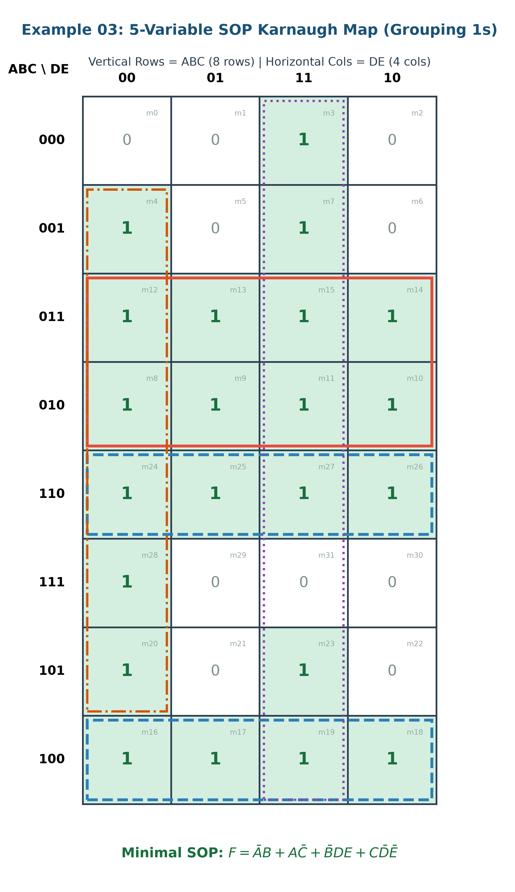
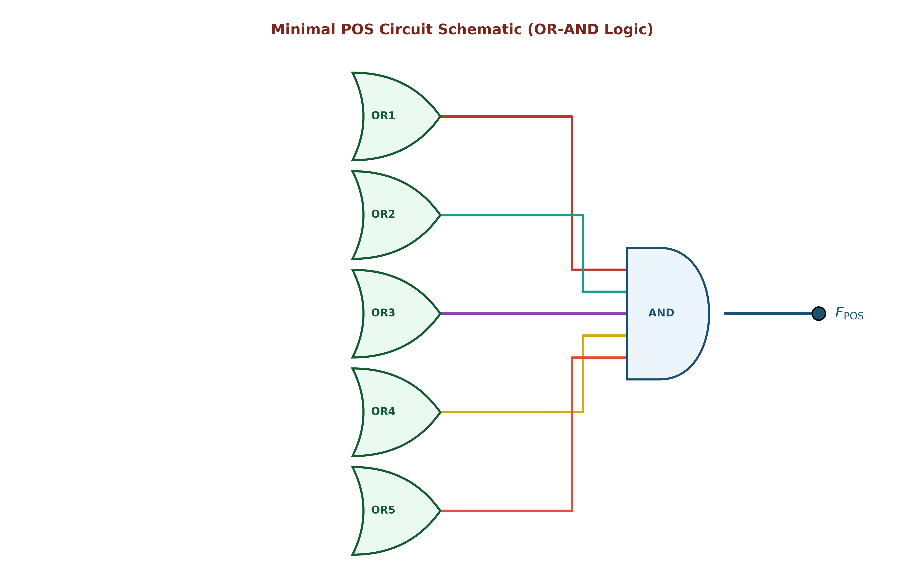

# ตัวอย่างโจทย์ที่ 3: การวิเคราะห์ วาดวงจร และลดรูปวงจรตรรกศาสตร์ 5 ตัวแปร (Digital Logic Circuit Example 03)

**สถานที่จัดเก็บ:** `02-logic-functions-combinational/exercises/03`

---

## 📌 โจทย์ปัญหา (Problem Statement)

จงวิเคราะห์วงจรตรรกศาสตร์ดิจิทัลแบบ 5 ตัวแปร (A, B, C, D, E) จากสมการ SOP:
```text
F = X₁ + X₂ + X₃ + X₄
```

โดยที่:
- `X₁ = A'B`
- `X₂ = AC'`
- `X₃ = B'DE`
- `X₄ = CD'E'`

จงสร้างตารางความจริง (Truth Table) ทั้ง 32 กรณี วิเคราะห์ลดรูปด้วยพีชคณิตบูลีน และทำ **K-Map 8x4 (แนวตั้ง ABC 8 แถว และแนวนอน DE 4 คอลัมน์)** โดยจับกลุ่มขนาด 2ⁿ (1, 2, 4, 8, 16, 32) ทั้งแบบ **SOP (วง 1)** และ **POS (วง 0)** อย่างละเอียดทุกขั้นตอน

---

## 1. วงจรต้นฉบับแบบมาตรฐาน AND–OR–NOT (Standard Redrawn Circuit)

โครงสร้างวงจรแบ่งออกเป็น 3 ขั้นตอน:
1. **ขั้นที่ 1:** สัญญาณกลับค่า (`A', B', C', D', E'`) ผ่าน NOT Gates 5 ตัว
2. **ขั้นที่ 2:** สร้าง Product terms (`X₁, X₂, X₃, X₄`) ผ่าน AND Gates 4 ตัว
3. **ขั้นที่ 3:** รวบรวมผลลัพธ์ผ่าน 4-Input OR Gate ตัวสุดท้าย (`F = X₁ + X₂ + X₃ + X₄`)


### ตารางแยกโครงสร้าง Gate ย่อย (Gate Breakdown)

| Gate Label | ประเภท Gate | อินพุต (Inputs) | สมการเอาต์พุตประจำจุดทด (Output Expression) |
| :--- | :--- | :--- | :--- |
| **NOT Gates** | Inverters (x5) | A, B, C, D, E | `A', B', C', D', E'` |
| **AND1** | 2-Input AND Gate | `A', B` | `X₁ = A'B` |
| **AND2** | 2-Input AND Gate | `A, C'` | `X₂ = AC'` |
| **AND3** | 3-Input AND Gate | `B', D, E` | `X₃ = B'DE` |
| **AND4** | 3-Input AND Gate | `C, D', E'` | `X₄ = CD'E'` |
| **OR** | 4-Input OR Gate | `X₁, X₂, X₃, X₄` | `F = X₁ + X₂ + X₃ + X₄ = A'B + AC' + B'DE + CD'E'` |

---

## 2. ตารางความจริง (Truth Table 32 Cases) และ Minterms / Maxterms

คำนวณเอาต์พุต F สำหรับอินพุต 5 ตัวแปรทั้งหมด `2⁵ = 32` กรณี (`m₀ ... m₃1}`):

| Index | A | B | C | D | E | `X₁=A'B` | `X₂=AC'` | `X₃=B'DE` | `X₄=CD'E'` | **Output (F)** | Minterm (`F=1`) | Maxterm (`F=0`) |
| :-: | :-: | :-: | :-: | :-: | :-: | :-: | :-: | :-: | :-: | :-: | :-: | :---: | :---: |
| 0 | 0 | 0 | 0 | 0 | 0 | 0 | 0 | 0 | 0 | **0** | - | `M₀ = (A+B+C+D+E)` |
| 1 | 0 | 0 | 0 | 0 | 1 | 0 | 0 | 0 | 0 | **0** | - | `M₁ = (A+B+C+D+E')` |
| 2 | 0 | 0 | 0 | 1 | 0 | 0 | 0 | 0 | 0 | **0** | - | `M₂ = (A+B+C+D'+E)` |
| **3** | **0** | **0** | **0** | **1** | **1** | 0 | 0 | 1 | 0 | **1** | **`m₃ = A'B'C'DE`** | - |
| **4** | **0** | **0** | **1** | **0** | **0** | 0 | 0 | 0 | 1 | **1** | **`m₄ = A'B'CD'E'`** | - |
| 5 | 0 | 0 | 1 | 0 | 1 | 0 | 0 | 0 | 0 | **0** | - | `M₅ = (A+B+C'+D+E')` |
| 6 | 0 | 0 | 1 | 1 | 0 | 0 | 0 | 0 | 0 | **0** | - | `M₆ = (A+B+C'+D'+E)` |
| **7** | **0** | **0** | **1** | **1** | **1** | 0 | 0 | 1 | 0 | **1** | **`m₇ = A'B'CDE`** | - |
| **8** | **0** | **1** | **0** | **0** | **0** | 1 | 0 | 0 | 0 | **1** | **`m₈ = A'BC'D'E'`** | - |
| **9** | **0** | **1** | **0** | **0** | **1** | 1 | 0 | 0 | 0 | **1** | **`m₉ = A'BC'D'E`** | - |
| **10** | **0** | **1** | **0** | **1** | **0** | 1 | 0 | 0 | 0 | **1** | **`m₁0} = A'BC'DE'`** | - |
| **11** | **0** | **1** | **0** | **1** | **1** | 1 | 0 | 0 | 0 | **1** | **`m₁1} = A'BC'DE`** | - |
| **12** | **0** | **1** | **1** | **0** | **0** | 1 | 0 | 0 | 1 | **1** | **`m₁2} = A'BCD'E'`** | - |
| **13** | **0** | **1** | **1** | **0** | **1** | 1 | 0 | 0 | 0 | **1** | **`m₁3} = A'BCD'E`** | - |
| **14** | **0** | **1** | **1** | **1** | **0** | 1 | 0 | 0 | 0 | **1** | **`m₁4} = A'BCDE'`** | - |
| **15** | **0** | **1** | **1** | **1** | **1** | 1 | 0 | 0 | 0 | **1** | **`m₁5} = A'BCDE`** | - |
| **16** | **1** | **0** | **0** | **0** | **0** | 0 | 1 | 0 | 0 | **1** | **`m₁6} = AB'C'D'E'`** | - |
| **17** | **1** | **0** | **0** | **0** | **1** | 0 | 1 | 0 | 0 | **1** | **`m₁7} = AB'C'D'E`** | - |
| **18** | **1** | **0** | **0** | **1** | **0** | 0 | 1 | 0 | 0 | **1** | **`m₁8} = AB'C'DE'`** | - |
| **19** | **1** | **0** | **0** | **1** | **1** | 0 | 1 | 1 | 0 | **1** | **`m₁9} = AB'C'DE`** | - |
| **20** | **1** | **0** | **1** | **0** | **0** | 0 | 0 | 0 | 1 | **1** | **`m₂0} = AB'CD'E'`** | - |
| 21 | 1 | 0 | 1 | 0 | 1 | 0 | 0 | 0 | 0 | **0** | - | `M₂1} = (A'+B+C'+D+E')` |
| 22 | 1 | 0 | 1 | 1 | 0 | 0 | 0 | 0 | 0 | **0** | - | `M₂2} = (A'+B+C'+D'+E)` |
| **23** | **1** | **0** | **1** | **1** | **1** | 0 | 0 | 1 | 0 | **1** | **`m₂3} = AB'CDE`** | - |
| **24** | **1** | **1** | **0** | **0** | **0** | 0 | 1 | 0 | 0 | **1** | **`m₂4} = ABC'D'E'`** | - |
| **25** | **1** | **1** | **0** | **0** | **1** | 0 | 1 | 0 | 0 | **1** | **`m₂5} = ABC'D'E`** | - |
| **26** | **1** | **1** | **0** | **1** | **0** | 0 | 1 | 0 | 0 | **1** | **`m₂6} = ABC'DE'`** | - |
| **27** | **1** | **1** | **0** | **1** | **1** | 0 | 1 | 0 | 0 | **1** | **`m₂7} = ABC'DE`** | - |
| **28** | **1** | **1** | **1** | **0** | **0** | 0 | 0 | 0 | 1 | **1** | **`m₂8} = ABCD'E'`** | - |
| 29 | 1 | 1 | 1 | 0 | 1 | 0 | 0 | 0 | 0 | **0** | - | `M₂9} = (A'+B'+C'+D+E')` |
| 30 | 1 | 1 | 1 | 1 | 0 | 0 | 0 | 0 | 0 | **0** | - | `M₃0} = (A'+B'+C'+D'+E)` |
| 31 | 1 | 1 | 1 | 1 | 1 | 0 | 0 | 0 | 0 | **0** | - | `M₃1} = (A'+B'+C'+D'+E')` |

* **สรุป:** เอาต์พุตเป็น `1` จำนวน **22 กรณี** (`m₃, m₄, m₇, m₈ ... m₂0}, m₂3} ... m₂8}`) และเอาต์พุตเป็น `0` จำนวน **10 กรณี** (`M₀, M₁, M₂, M₅, M₆, M₂1}, M₂2}, M₂9}, M₃0}, M₃1}`)

---

## 3. การลดรูปด้วยวิธี SOP (Sum of Products) & K-Map 8x4

### 3.1 K-Map 8x4 (แนวตั้ง ABC 8 แถว, แนวนอน DE 4 คอลัมน์)

จับกลุ่มเฉพาะเลข **1** จำนวน 22 เซลล์ โดยใช้กลุ่มขนาดพลังของสอง (`2ⁿ = 1, 2, 4, 8, 16, 32`):



### รายละเอียดการจับกลุ่มทั้ง 4 กลุ่ม (SOP Grouping Breakdown)

1. **กลุ่มที่ 1 (ขนาด 8 เซลล์ = 2³):**
   - ครอบคลุมแถว `ABC = 011` และ 010 ทั้ง 4 คอลัมน์ (`m₈, m₉, m₁0}, m₁1}, m₁2}, m₁3}, m₁4}, m₁5}`)
   - ตัวแปร C, D, E ถูกตัดออกทั้งหมด เหลือพจน์: `A'B`

2. **กลุ่มที่ 2 (ขนาด 8 เซลล์ = 2³):**
   - ครอบคลุมแถว `ABC = 110` และ 100 ทั้ง 4 คอลัมน์ (`m₁6}, m₁7}, m₁8}, m₁9}, m₂4}, m₂5}, m₂6}, m₂7}`)
   - ตัวแปร B, D, E ถูกตัดออกทั้งหมด เหลือพจน์: `AC'`

3. **กลุ่มที่ 3 (ขนาด 4 เซลล์ = 2²):**
   - ครอบคลุมคอลัมน์ `DE = 11` ในแถวที่ `B=0` (`m₃, m₇, m₁9}, m₂3}`)
   - ตัวแปร A, C ถูกตัดออก เหลือพจน์: `B'DE`

4. **กลุ่มที่ 4 (ขนาด 4 เซลล์ = 2²):**
   - ครอบคลุมคอลัมน์ `DE = 00` ในแถวที่ `C=1` (`m₄, m₁2}, m₂0}, m₂8}`)
   - ตัวแปร A, B ถูกตัดออก เหลือพจน์: `CD'E'`

---

### 3.2 สรุปสมการ SOP ขั้นต่ำ (Minimal SOP Expression)

```text
F_{SOP = A'B + AC' + B'DE + CD'E'}
```

*(สมการต้นฉบับถูกจัดอยู่ในรูปขั้นต่ำที่สุดเรียบร้อยแล้ว ไม่สามารถลดจำนวนพจน์ลงได้อีกทางคณิตศาสตร์!)*

---

## 4. การลดรูปด้วยวิธี POS (Product of Sums) & K-Map 8x4

### 4.1 K-Map 8x4 (แนวตั้ง ABC 8 แถว, แนวนอน DE 4 คอลัมน์)

จับกลุ่มเฉพาะเลข **0** จำนวน 10 เซลล์ โดยใช้กลุ่มขนาดพลังของสอง (`2ⁿ = 2¹ = 2`):


### รายละเอียดการจับกลุ่มทั้ง 5 คู่ (POS Grouping Breakdown)

1. **คู่ที่ 1 (ขนาด 2 เซลล์ = 2¹):** ครอบคลุม `m₀, m₁` ในแถว `ABC=000` คอลัมน์ `DE=00, 01` `→` Maxterm: `(A + B + C + D)`
2. **คู่ที่ 2 (ขนาด 2 เซลล์ = 2¹):** ครอบคลุม `m₂, m₆` ในคอลัมน์ `DE=10` แถว `ABC=000, 001` `→` Maxterm: `(A + B + D' + E)`
3. **คู่ที่ 3 (ขนาด 2 เซลล์ = 2¹):** ครอบคลุม `m₅, m₂1}` ในคอลัมน์ `DE=01` แถว `ABC=001, 101` `→` Maxterm: `(B + C' + D + E')`
4. **คู่ที่ 4 (ขนาด 2 เซลล์ = 2¹):** ครอบคลุม `m₂2}, m₃0}` ในคอลัมน์ `DE=10` แถว `ABC=101, 111` `→` Maxterm: `(A' + C' + D' + E)`
5. **คู่ที่ 5 (ขนาด 2 เซลล์ = 2¹):** ครอบคลุม `m₂9}, m₃1}` ในแถว `ABC=111` คอลัมน์ `DE=01, 11` `→` Maxterm: `(A' + B' + C' + E')`

---

### 4.2 สรุปสมการ POS ขั้นต่ำ (Minimal POS Expression)

```text
F_{POS = (A+B+C+D)(A+B+D'+E)(B+C'+D+E')(A'+C'+D'+E)(A'+B'+C'+E')}
```

---

### 4.3 ไดอะแกรมวงจรตรรกศาสตร์ POS (OR-AND Logic Diagram)



---

## 5. ตารางเปรียบเทียบประสิทธิภาพทางฮาร์ดแวร์ (Hardware Optimization Benchmark)

| ดัชนีเปรียบเทียบ | วงจรเดิม / SOP (AND-OR Logic) | วิธี POS (OR-AND Logic) | ผู้ชนะ (Winner) |
| :--- | :--- | :--- | :--- |
| **สมการตรรกศาสตร์** | `F = A'B + AC' + B'DE + CD'E'` | `F = (A+B+C+D)...(5 terms)` | 🏆 **SOP** |
| **จำนวน Logic Gates** | **10 Gates (5 NOT + 4 AND + 1 OR)** | 11 Gates (5 NOT + 5 OR + 1 AND) | 🏆 **SOP** |
| **จำนวน Transistors (CMOS)** | **~44 Transistors** | ~58 Transistors | 🏆 **SOP** (ประหยัดกว่า) |
| **จำนวน Propagation Delay Steps** | **3 Gate Delays** | 3 Gate Delays | **เสมอกัน** |
| **ความเหมาะสมในการผลิต** | เหมาะสำหรับโครงสร้าง AND-OR | เหมาะสำหรับโครงสร้าง OR-AND | 🏆 **SOP** |

---

## 📁 สรุปไฟล์ทั้งหมดในโฟลเดอร์นี้

1. [`README.md`](README.md) - เอกสารสรุปโจทย์ ตารางความจริง 32 กรณี K-Map 8x4 และผลการลดรูปฉบับสมบูรณ์
2. [`digital_logic_circuit_redrawn.png`](digital_logic_circuit_redrawn.png) - ภาพวงจรต้นฉบับวาดใหม่ระดับมาตรฐาน (ระบุ `X₁, X₂, X₃, X₄` ชัดเจน)
3. [`kmap_sop_diagram.png`](kmap_sop_diagram.png) - K-Map 8x4 สำหรับ SOP (จับกลุ่มเลข 1 แนวตั้ง ABC แนวนอน DE)
4. [`kmap_pos_diagram.png`](kmap_pos_diagram.png) - K-Map 8x4 สำหรับ POS (จับกลุ่มเลข 0 แนวตั้ง ABC แนวนอน DE)
5. [`pos_circuit_diagram.png`](pos_circuit_diagram.png) - วงจรตรรกศาสตร์ POS (OR-AND Logic)
6. [`generate_all_diagrams.py`](generate_all_diagrams.py) - สคริปต์ Python สำหรับสร้างและ Render รูปภาพความละเอียดสูงทั้งหมด
