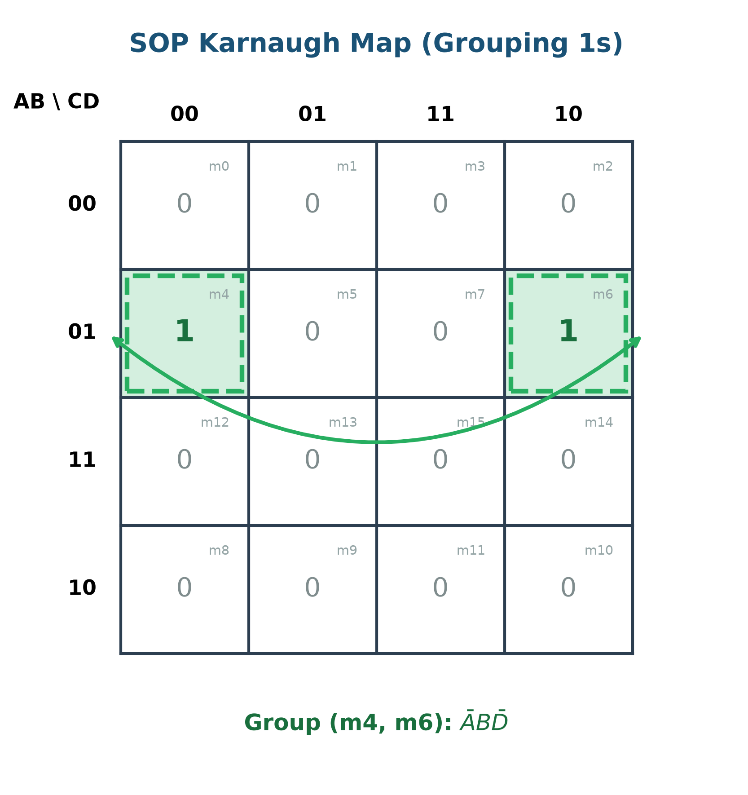
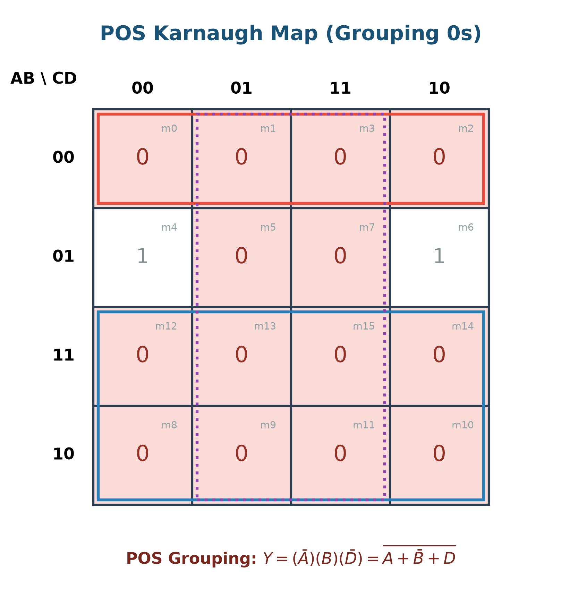
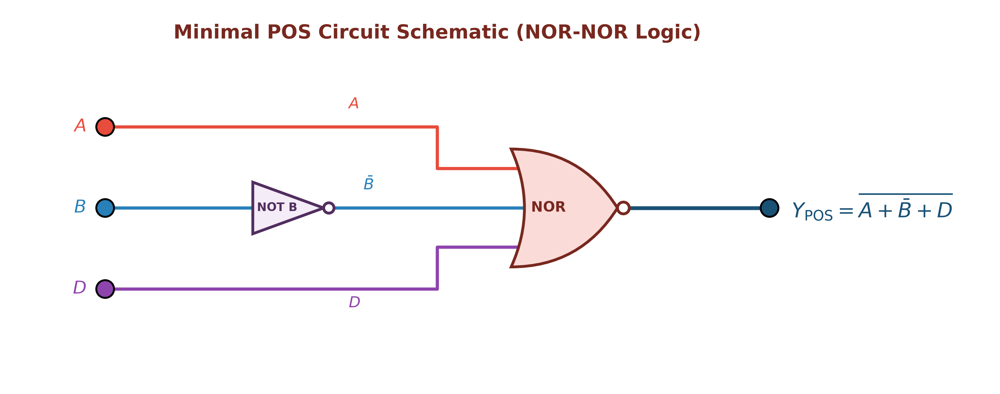
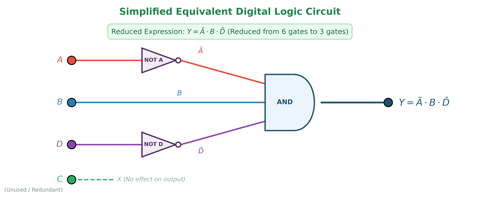
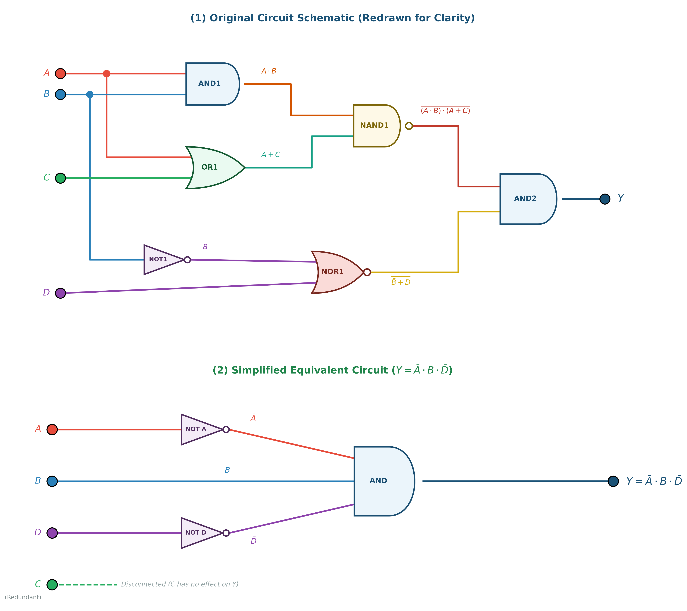
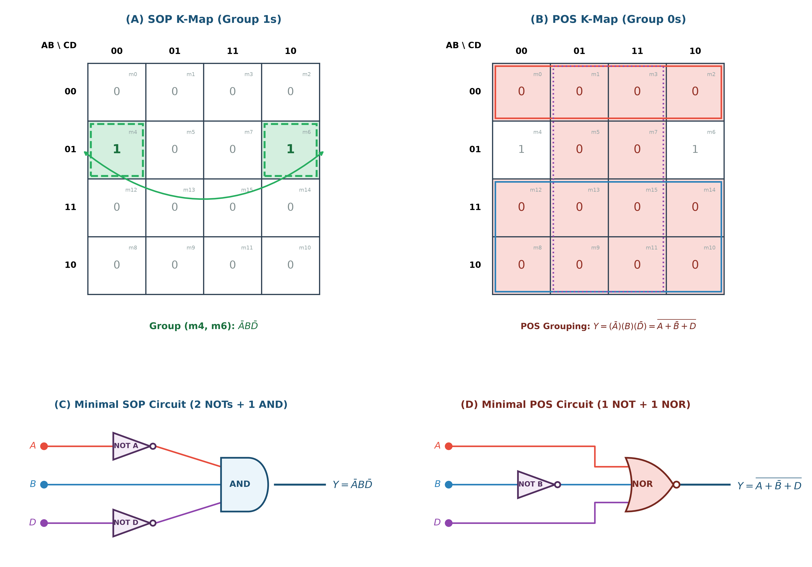

# ตัวอย่างโจทย์ที่ 1: การวิเคราะห์และลดรูปวงจรตรรกศาสตร์ดิจิทัล (Digital Logic Circuit Minimization)

**สถานที่จัดเก็บ:** `02-logic-gates/examples/01`

---

## 📌 โจทย์ปัญหา (Problem Statement)

จงวิเคราะห์วงจรตรรกศาสตร์ดิจิทัลจากภาพถ่ายต้นฉบับ หาตารางความจริง (Truth Table) ลดรูปสมการพีชคณิตบูลีนด้วยวิธี **SOP (Sum of Products)** และ **POS (Product of Sums)** พร้อมทั้งเขียนวงจรตรรกศาสตร์ที่ลดรูปแล้ว

### 🖼️ ภาพถ่ายโจทย์ต้นฉบับ

---

## 1. วงจรต้นฉบับที่จัดระเบียบใหม่ (Redrawn Circuit Diagram)

เพื่อความง่ายในการวิเคราะห์ ได้ทำการจัดระเบียบสายสัญญาณ (Wiring Routing) กำหนดโค้ดสีอินพุต ($A, B, C, D$) และระบุชื่อ Gate และจุดทด (Intermediate Nodes) อย่างชัดเจน:

### ตารางแยกโครงสร้าง Gate ย่อย (Gate Breakdown)

| Gate Label | ประเภท Gate | อินพุต (Inputs) | สมการเอาต์พุต (Output Expression) |
| :--- | :--- | :--- | :--- |
| **AND1** | AND Gate | $A, B$ | $W_1 = A \cdot B$ |
| **OR1** | OR Gate | $A, C$ | $W_2 = A + C$ |
| **NOT1** | Inverter (NOT) | $B$ | $W_3 = \bar{B}$ |
| **NAND1** | NAND Gate | $W_1, W_2$ | $W_4 = \overline{(A \cdot B) \cdot (A + C)}$ |
| **NOR1** | NOR Gate | $W_3, D$ | $W_5 = \overline{\bar{B} + D}$ |
| **AND2** | AND Gate | $W_4, W_5$ | $Y = W_4 \cdot W_5 = \overline{(A \cdot B) \cdot (A + C)} \cdot \overline{\bar{B} + D}$ |

---

## 2. ตารางความจริง (Truth Table) และ Minterms / Maxterms

วิเคราะห์ค่าเอาต์พุต $Y$ สำหรับทุกกรณีอินพุต $2^4 = 16$ กรณี ($m_0 \dots m_{15}$):

| Index | $A$ | $B$ | $C$ | $D$ | $W_1=A\cdot B$ | $W_2=A+C$ | $W_4=\text{NAND1}$ | $W_3=\bar{B}$ | $W_5=\text{NOR1}$ | **Output ($Y$)** | Minterm ($Y=1$) | Maxterm ($Y=0$) |
| :-: | :-: | :-: | :-: | :-: | :-: | :-: | :-: | :-: | :-: | :-: | :-: | :---: | :---: |
| 0 | 0 | 0 | 0 | 0 | 0 | 0 | 1 | 1 | 0 | **0** | - | $M_0 = (A+B+C+D)$ |
| 1 | 0 | 0 | 0 | 1 | 0 | 0 | 1 | 1 | 0 | **0** | - | $M_1 = (A+B+C+\bar{D})$ |
| 2 | 0 | 0 | 1 | 0 | 0 | 1 | 1 | 1 | 0 | **0** | - | $M_2 = (A+B+\bar{C}+D)$ |
| 3 | 0 | 0 | 1 | 1 | 0 | 1 | 1 | 1 | 0 | **0** | - | $M_3 = (A+B+\bar{C}+\bar{D})$ |
| **4** | **0** | **1** | **0** | **0** | 0 | 0 | 1 | 0 | 1 | **1** | **$m_4 = \bar{A}B\bar{C}\bar{D}$** | - |
| 5 | 0 | 1 | 0 | 1 | 0 | 0 | 1 | 0 | 0 | **0** | - | $M_5 = (A+\bar{B}+C+\bar{D})$ |
| **6** | **0** | **1** | **1** | **0** | 0 | 1 | 1 | 0 | 1 | **1** | **$m_6 = \bar{A}BC\bar{D}$** | - |
| 7 | 0 | 1 | 1 | 1 | 0 | 1 | 1 | 0 | 0 | **0** | - | $M_7 = (A+\bar{B}+\bar{C}+\bar{D})$ |
| 8 | 1 | 0 | 0 | 0 | 0 | 1 | 1 | 1 | 0 | **0** | - | $M_8 = (\bar{A}+B+C+D)$ |
| 9 | 1 | 0 | 0 | 1 | 0 | 1 | 1 | 1 | 0 | **0** | - | $M_9 = (\bar{A}+B+C+\bar{D})$ |
| 10 | 1 | 0 | 1 | 0 | 0 | 1 | 1 | 1 | 0 | **0** | - | $M_{10} = (\bar{A}+B+\bar{C}+D)$ |
| 11 | 1 | 0 | 1 | 1 | 0 | 1 | 1 | 1 | 0 | **0** | - | $M_{11} = (\bar{A}+B+\bar{C}+\bar{D})$ |
| 12 | 1 | 1 | 0 | 0 | 1 | 1 | 0 | 0 | 1 | **0** | - | $M_{12} = (\bar{A}+\bar{B}+C+D)$ |
| 13 | 1 | 1 | 0 | 1 | 1 | 1 | 0 | 0 | 0 | **0** | - | $M_{13} = (\bar{A}+\bar{B}+C+\bar{D})$ |
| 14 | 1 | 1 | 1 | 0 | 1 | 1 | 0 | 0 | 1 | **0** | - | $M_{14} = (\bar{A}+\bar{B}+\bar{C}+D)$ |
| 15 | 1 | 1 | 1 | 1 | 1 | 1 | 0 | 0 | 0 | **0** | - | $M_{15} = (\bar{A}+\bar{B}+\bar{C}+\bar{D})$ |

---

## 3. การลดรูปด้วยวิธี SOP (Sum of Products)

### 3.1 Canonical SOP Form
นำกรณีที่ $Y = 1$ มาบวกกัน ($m_4$ และ $m_6$):
$$Y_{\text{SOP, canonical}} = \sum m(4, 6) = \bar{A}B\bar{C}\bar{D} + \bar{A}BC\bar{D}$$

### 3.2 การลดรูปด้วยพีชคณิตบูลีน (Boolean Algebra Step-by-Step)
1. ดึงตัวร่วม $\bar{A}B\bar{D}$ ออกมา:
   $$Y = \bar{A}B\bar{D} \cdot (\bar{C} + C)$$
2. ใช้กฎตัวเติมเต็ม (Complement Law: $\bar{C} + C = 1$):
   $$Y = \bar{A}B\bar{D} \cdot (1)$$
3. ได้สมการ SOP ขั้นต่ำ:
   $$\mathbf{Y_{\text{SOP}} = \bar{A} \cdot B \cdot \bar{D}}$$

### 3.3 การลดรูปด้วย Karnaugh Map 4x4 (Grouping 1s)

- จับคู่ $m_4$ และ $m_6$ แบบม้วนขอบ (Wrap-around pair) ในแถว $AB=01$
- ตัดตัวแปร $C$ ออก ได้ผลลัพธ์ $\mathbf{\bar{A}B\bar{D}}$

### 3.4 ไดอะแกรมวงจรตรรกศาสตร์ SOP (AND-OR Logic)

---

## 4. การลดรูปด้วยวิธี POS (Product of Sums)

### 4.1 Canonical POS Form
นำกรณีที่ $Y = 0$ มาคูณกัน ทั้งหมด 14 พจน์:
$$Y_{\text{POS, canonical}} = \prod M(0, 1, 2, 3, 5, 7, 8, 9, 10, 11, 12, 13, 14, 15)$$

### 4.2 การลดรูปด้วยพีชคณิตบูลีน (Boolean Algebra & De Morgan)
จากตำแหน่งที่ $Y = 0$ สามารถสรุป $\bar{Y}$ ได้ดังนี้:
$$\bar{Y} = A + \bar{B} + D$$

Invert ทั้งสองข้าง:
$$Y = \overline{\bar{Y}} = \mathbf{\overline{A + \bar{B} + D}}$$

ใช้กฎ De Morgan พิสูจน์:
$$Y = \overline{A + \bar{B} + D} = \bar{A} \cdot \bar{\bar{B}} \cdot \bar{D} = \mathbf{\bar{A} \cdot B \cdot \bar{D}}$$

### 4.3 การลดรูปด้วย Karnaugh Map 4x4 (Grouping 0s)

### 4.4 ไดอะแกรมวงจรตรรกศาสตร์ POS (NOR Logic)

---

## 5. สรุปผลการลดรูปและวงจรสมดุลอย่างง่าย (Simplified Circuit)

จากการลดรูปทั้งสองวิธี ทำให้ทราบว่า **อินพุต $C$ เป็น Don't-Care Input (ไม่มีผลต่อเอาต์พุต $Y$)** สามารถลดจำนวน Gate จาก 6 ตัวเหลือเพียง 2-3 ตัว:

### 📊 ภาพเปรียบเทียบวงจรทั้งหมด (Circuit Comparison)

### 📊 ภาพเปรียบเทียบ SOP vs POS (SOP vs POS Infographic)

---

## 6. ตารางเปรียบเทียบประสิทธิภาพทางฮาร์ดแวร์ (Hardware Benchmark)

| ดัชนีเปรียบเทียบ | วงจรเดิม (Original) | วิธี SOP (Sum of Products) | วิธี POS (Product of Sums) | ผู้ชนะ (Winner) |
| :--- | :--- | :--- | :--- | :--- |
| **จำนวน Logic Gates** | 6 Gates | 3 Gates (2 NOT + 1 AND) | **2 Gates (1 NOT + 1 NOR)** | 🏆 **POS** |
| **จำนวน Transistors (CMOS)** | ~28 Transistors | ~14 Transistors | **~10 Transistors** | 🏆 **POS** |
| **จำนวน Propagation Delay Steps** | 3 Steps | 2 Steps | **2 Steps** | 🏆 **POS / SOP** |
| **การใช้พื้นที่บนชิป (Silicon Area)** | สูง | ปานกลาง | **ต่ำสุด** | 🏆 **POS** |

---

## 📁 สรุปไฟล์ในโฟลเดอร์นี้

1. [`image.png`](image.png) - ภาพถ่ายโจทย์วงจรต้นฉบับ
2. [`README.md`](README.md) - เอกสารสรุปโจทย์ วิธีทำ และผลลัพธ์ฉบับสมบูรณ์
3. [`digital_logic_circuit_redrawn.png`](digital_logic_circuit_redrawn.png) - ภาพวงจรเดิมที่จัดระเบียบใหม่
4. [`digital_logic_circuit_simplified.png`](digital_logic_circuit_simplified.png) - ภาพวงจรที่ลดรูปอย่างง่าย
5. [`digital_logic_circuit_comparison.png`](digital_logic_circuit_comparison.png) - ภาพเปรียบเทียบวงจรเดิม vs วงจรลดรูป
6. [`kmap_sop_diagram.png`](kmap_sop_diagram.png) - K-Map 4x4 สำหรับ SOP
7. [`kmap_pos_diagram.png`](kmap_pos_diagram.png) - K-Map 4x4 สำหรับ POS
8. [`sop_circuit_diagram.png`](sop_circuit_diagram.png) - วงจรตรรกศาสตร์ SOP
9. [`pos_circuit_diagram.png`](pos_circuit_diagram.png) - วงจรตรรกศาสตร์ POS
10. [`sop_pos_comparison.png`](sop_pos_comparison.png) - อินโฟกราฟิกสรุปเปรียบเทียบ SOP vs POS
11. [`generate_all_diagrams.py`](generate_all_diagrams.py) - สคริปต์ Python สำหรับสร้างและ Generate รูปภาพความละเอียดสูงทั้งหมด
