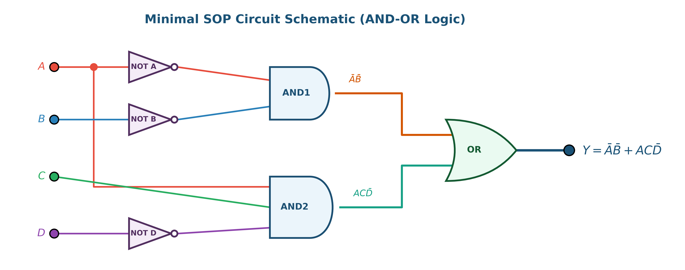
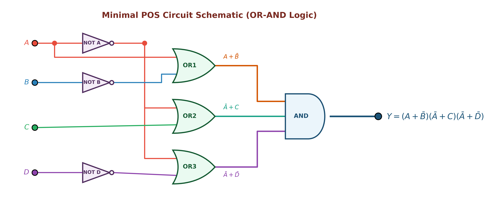
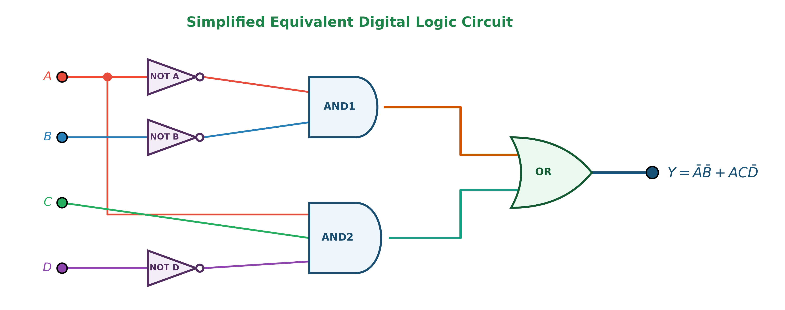

# ตัวอย่างโจทย์ที่ 2: การวิเคราะห์และลดรูปวงจรตรรกศาสตร์ดิจิทัล (Digital Logic Circuit Minimization Example 02)

**สถานที่จัดเก็บ:** `02-logic-gates/examples/02`

---

## 📌 โจทย์ปัญหา (Problem Statement)

จงวิเคราะห์วงจรตรรกศาสตร์ดิจิทัลจากภาพถ่ายโจทย์ต้นฉบับ หาตารางความจริง (Truth Table) ลดรูปสมการพีชคณิตบูลีนด้วยวิธี **SOP (Sum of Products)** และ **POS (Product of Sums)** อย่างละเอียด พร้อมทั้งเขียนวงจรตรรกศาสตร์ที่ลดรูปแล้วตามมาตรฐาน

### 🖼️ ภาพถ่ายโจทย์ต้นฉบับ

---

## 1. วงจรต้นฉบับที่จัดระเบียบใหม่ (Standard Redrawn Circuit Diagram)

เพื่อความถูกต้องในการวิเคราะห์ ได้ทำการจัดระเบียบสายสัญญาณ (Bus Routing) แยกสีอินพุตหลักทั้ง 4 สัญญาณ ($A, B, C, D$) ระบุชื่อ Logic Gate ทุกตัวอย่างชัดเจน และติดป้ายสมการกำกับทุกจุดทด intermediate nodes ($W_1, W_2, W_3, W_4, W_5$):

### ตารางแยกโครงสร้าง Gate ย่อย (Gate Breakdown & Netlist)

| Gate Label | ประเภท Gate | อินพุต (Inputs) | สมการเอาต์พุตประจำจุดทด (Output Expression) |
| :--- | :--- | :--- | :--- |
| **OR1** | OR Gate | $A, B$ | $W_1 = A + B$ |
| **AND1** | AND Gate | $C, A$ | $W_2 = A \cdot C$ |
| **NOT1** | Inverter (NOT) | $D$ | $W_3 = \bar{D}$ |
| **NOR1** | NOR Gate | $W_1, W_2$ | $W_4 = \overline{(A + B) + (A \cdot C)} = \bar{A} \cdot \bar{B}$ |
| **AND2** | AND Gate | $W_2, W_3$ | $W_5 = W_2 \cdot W_3 = A \cdot C \cdot \bar{D}$ |
| **XOR1** | XOR Gate (Final) | $W_4, W_5$ | $Y = W_4 \oplus W_5 = \overline{(A + B) + (A \cdot C)} \oplus (A \cdot C \cdot \bar{D})$ |

---

## 2. ตารางความจริง (Truth Table) และ Minterms / Maxterms

คำนวณเอาต์พุต $Y$ สำหรับทั้ง 16 กรณี ($m_0 \dots m_{15}$):

| Index | $A$ | $B$ | $C$ | $D$ | $W_1=A+B$ | $W_2=A\cdot C$ | $W_3=\bar{D}$ | $W_4=\text{NOR1}$ | $W_5=\text{AND2}$ | **Output ($Y$)** | Minterm ($Y=1$) | Maxterm ($Y=0$) |
| :-: | :-: | :-: | :-: | :-: | :-: | :-: | :-: | :-: | :-: | :-: | :-: | :---: | :---: |
| **0** | **0** | **0** | **0** | **0** | 0 | 0 | 1 | 1 | 0 | **1** | **$m_0 = \bar{A}\bar{B}\bar{C}\bar{D}$** | - |
| **1** | **0** | **0** | **0** | **1** | 0 | 0 | 0 | 1 | 0 | **1** | **$m_1 = \bar{A}\bar{B}\bar{C}D$** | - |
| **2** | **0** | **0** | **1** | **0** | 0 | 0 | 1 | 1 | 0 | **1** | **$m_2 = \bar{A}\bar{B}C\bar{D}$** | - |
| **3** | **0** | **0** | **1** | **1** | 0 | 0 | 0 | 1 | 0 | **1** | **$m_3 = \bar{A}\bar{B}CD$** | - |
| 4 | 0 | 1 | 0 | 0 | 1 | 0 | 1 | 0 | 0 | **0** | - | $M_4 = (A+\bar{B}+C+D)$ |
| 5 | 0 | 1 | 0 | 1 | 1 | 0 | 0 | 0 | 0 | **0** | - | $M_5 = (A+\bar{B}+C+\bar{D})$ |
| 6 | 0 | 1 | 1 | 0 | 1 | 0 | 1 | 0 | 0 | **0** | - | $M_6 = (A+\bar{B}+\bar{C}+D)$ |
| 7 | 0 | 1 | 1 | 1 | 1 | 0 | 0 | 0 | 0 | **0** | - | $M_7 = (A+\bar{B}+\bar{C}+\bar{D})$ |
| 8 | 1 | 0 | 0 | 0 | 1 | 0 | 1 | 0 | 0 | **0** | - | $M_8 = (\bar{A}+B+C+D)$ |
| 9 | 1 | 0 | 0 | 1 | 1 | 0 | 0 | 0 | 0 | **0** | - | $M_9 = (\bar{A}+B+C+\bar{D})$ |
| **10** | **1** | **0** | **1** | **0** | 1 | 1 | 1 | 0 | 1 | **1** | **$m_{10} = A\bar{B}C\bar{D}$** | - |
| 11 | 1 | 0 | 1 | 1 | 1 | 1 | 0 | 0 | 0 | **0** | - | $M_{11} = (\bar{A}+B+\bar{C}+\bar{D})$ |
| 12 | 1 | 1 | 0 | 0 | 1 | 0 | 1 | 0 | 0 | **0** | - | $M_{12} = (\bar{A}+\bar{B}+C+D)$ |
| 13 | 1 | 1 | 0 | 1 | 1 | 0 | 0 | 0 | 0 | **0** | - | $M_{13} = (\bar{A}+\bar{B}+C+\bar{D})$ |
| **14** | **1** | **1** | **1** | **0** | 1 | 1 | 1 | 0 | 1 | **1** | **$m_{14} = ABC\bar{D}$** | - |
| 15 | 1 | 1 | 1 | 1 | 1 | 1 | 0 | 0 | 0 | **0** | - | $M_{15} = (\bar{A}+\bar{B}+\bar{C}+\bar{D})$ |

---

## 3. การลดรูปด้วยวิธี SOP (Sum of Products)

### 3.1 Canonical SOP Form
นำกรณีที่เอาต์พุต $Y = 1$ มารวมกัน ($m_0, m_1, m_2, m_3, m_{10}, m_{14}$):
$$Y_{\text{SOP, canonical}} = \sum m(0, 1, 2, 3, 10, 14)$$
$$= \bar{A}\bar{B}\bar{C}\bar{D} + \bar{A}\bar{B}\bar{C}D + \bar{A}\bar{B}C\bar{D} + \bar{A}\bar{B}CD + A\bar{B}C\bar{D} + ABC\bar{D}$$

---

### 3.2 การลดรูปด้วยพีชคณิตบูลีน (Boolean Algebra Step-by-Step)

จากสมการวงจรหลัก $Y = W_4 \oplus W_5$:

1. **ลดรูป $W_4$:**
   $$W_4 = \overline{(A + B) + (A \cdot C)}$$
   ใช้กฎการกลืนกลืน (Absorption Law: $(A + B) + A \cdot C = A + B$):
   $$W_4 = \overline{A + B} = \bar{A} \cdot \bar{B} \quad \text{(De Morgan's Law)}$$

2. **พิจารณา $W_5$:**
   $$W_5 = A \cdot C \cdot \bar{D}$$

3. **กระจายสมการ XOR $Y = W_4 \oplus W_5 = W_4 \cdot \overline{W_5} + \overline{W_4} \cdot W_5$:**

   - **พจน์แรก $W_4 \cdot \overline{W_5}$:**
     $$\overline{W_5} = \overline{A \cdot C \cdot \bar{D}} = \bar{A} + \bar{C} + D$$
     $$W_4 \cdot \overline{W_5} = (\bar{A}\bar{B}) \cdot (\bar{A} + \bar{C} + D) = \bar{A}\bar{B}\bar{A} + \bar{A}\bar{B}\bar{C} + \bar{A}\bar{B}D$$
     $$= \bar{A}\bar{B} + \bar{A}\bar{B}\bar{C} + \bar{A}\bar{B}D = \bar{A}\bar{B} \cdot (1 + \bar{C} + D) = \mathbf{\bar{A}\bar{B}}$$

   - **พจน์ที่สอง $\overline{W_4} \cdot W_5$:**
     $$\overline{W_4} = \overline{\bar{A}\bar{B}} = A + B$$
     $$\overline{W_4} \cdot W_5 = (A + B) \cdot (A C \bar{D}) = (A \cdot A C \bar{D}) + (B \cdot A C \bar{D})$$
     $$= A C \bar{D} + A B C \bar{D} = A C \bar{D} \cdot (1 + B) = \mathbf{A C \bar{D}}$$

4. **รวมทั้งสองพจน์ได้สมการ SOP ขั้นต่ำ:**
   $$\mathbf{Y_{\text{SOP}} = \bar{A}\bar{B} + A C \bar{D}}$$

---

### 3.3 การลดรูปด้วย Karnaugh Map 4x4 (Grouping 1s)

- **กลุ่มที่ 1 (Quad 4 ตัวในแถวแรก $AB=00$):** ครอบคลุม $m_0, m_1, m_3, m_2$ $\rightarrow$ ตัด $C, D$ ออก เหลือ $\mathbf{\bar{A}\bar{B}}$
- **กลุ่มที่ 2 (Pair 2 ตัวในคอลัมน์ $CD=10$):** ครอบคลุม $m_{10}, m_{14}$ ในแถว $AB=10, 11$ $\rightarrow$ ตัด $B$ ออก เหลือ $\mathbf{A C \bar{D}}$
- **รวมสมการ SOP:** $\mathbf{\bar{A}\bar{B} + A C \bar{D}}$

---

### 3.4 ไดอะแกรมวงจรตรรกศาสตร์ SOP (AND-OR Logic)

---

## 4. การลดรูปด้วยวิธี POS (Product of Sums)

### 4.1 Canonical POS Form
นำกรณีที่เอาต์พุต $Y = 0$ มาคูณกัน ทั้งหมด 10 พจน์:
$$Y_{\text{POS, canonical}} = \prod M(4, 5, 6, 7, 8, 9, 11, 12, 13, 15)$$

---

### 4.2 การลดรูปด้วยพีชคณิตบูลีน (Boolean Algebra & De Morgan)
จากสมการ SOP $Y = \bar{A}\bar{B} + A C \bar{D}$ แปลงเป็น POS โดยใช้กฎการกระจาย (Distributive Law):

$$Y = (\bar{A}\bar{B}) + (A C \bar{D})$$
$$= (\bar{A}\bar{B} + A) \cdot (\bar{A}\bar{B} + C \bar{D})$$
$$= (A + \bar{A})(A + \bar{B}) \cdot (\bar{A} + C)(\bar{B} + C) \cdot (\bar{A} + \bar{D})(\bar{B} + \bar{D})$$
$$= (1)(A + \bar{B}) \cdot (\bar{A} + C) \cdot (\bar{B} + C) \cdot (\bar{A} + \bar{D}) \cdot (\bar{B} + \bar{D})$$

ตัดพจน์ส่วนเกินด้วย Absorptive Simplification จะได้สมการ POS ขั้นต่ำ 3 พจน์:
$$\mathbf{Y_{\text{POS}} = (A + \bar{B}) \cdot (\bar{A} + C) \cdot (\bar{A} + \bar{D})}$$

---

### 4.3 การลดรูปด้วย Karnaugh Map 4x4 (Grouping 0s)

- **กลุ่มที่ 1 (Quad แถว $AB=01$):** ครอบคลุม $m_4, m_5, m_7, m_6$ $\rightarrow$ Maxterm: $\mathbf{(A + \bar{B})}$
- **กลุ่มที่ 2 (Quad คอลัมน์ $CD=00, 01$ ของ 2 แถวล่าง):** ครอบคลุม $m_8, m_9, m_{12}, m_{13}$ $\rightarrow$ Maxterm: $\mathbf{(\bar{A} + C)}$
- **กลุ่มที่ 3 (Quad คอลัมน์ $CD=01, 11$ ของ 2 แถวล่าง):** ครอบคลุม $m_9, m_{11}, m_{13}, m_{15}$ $\rightarrow$ Maxterm: $\mathbf{(\bar{A} + \bar{D})}$
- **รวมสมการ POS:** $\mathbf{(A + \bar{B}) \cdot (\bar{A} + C) \cdot (\bar{A} + \bar{D})}$

---

### 4.4 ไดอะแกรมวงจรตรรกศาสตร์ POS (OR-AND Logic)

---

## 5. สรุปผลการลดรูปและภาพรวมวงจร (Circuit Simplification & Comparisons)

### 📊 วงจรสมดุลอย่างง่าย (Simplified Equivalent Circuit)

### 📊 ภาพเปรียบเทียบวงจรเดิม vs วงจรลดรูป (Circuit Comparison)

### 📊 ภาพเปรียบเทียบ SOP vs POS (SOP vs POS Infographic)

---

## 6. ตารางเปรียบเทียบประสิทธิภาพทางฮาร์ดแวร์ (Hardware Benchmark)

| ดัชนีเปรียบเทียบ | วงจรเดิม (Original) | วิธี SOP (Sum of Products) | วิธี POS (Product of Sums) | ผู้ชนะ (Winner) |
| :--- | :--- | :--- | :--- | :--- |
| **จำนวน Logic Gates** | 6 Gates (มี XOR) | **6 Gates (3 NOT + 2 AND + 1 OR)** | 7 Gates (3 NOT + 3 OR + 1 AND) | 🏆 **SOP** |
| **จำนวน Transistors (CMOS)** | ~34 Transistors | **~26 Transistors** | ~30 Transistors | 🏆 **SOP** |
| **จำนวน Propagation Delay Steps** | 3 Gate Delays | **2 Gate Delays** | 2 Gate Delays | 🏆 **SOP / POS** |
| **โครงสร้างทางตรรกศาสตร์** | ซับซ้อนสูง | **AND-OR Standard** | OR-AND Standard | 🏆 **SOP** |

---

## 📁 สรุปไฟล์ทั้งหมดในโฟลเดอร์นี้

1. [`image.png`](image.png) - ภาพถ่ายโจทย์ต้นฉบับ
2. [`README.md`](README.md) - เอกสารสรุปโจทย์ วิธีทำ และการวิเคราะห์ฉบับสมบูรณ์
3. [`digital_logic_circuit_redrawn.png`](digital_logic_circuit_redrawn.png) - ภาพวงจรเดิมจัดระเบียบใหม่ตามมาตรฐาน
4. [`digital_logic_circuit_simplified.png`](digital_logic_circuit_simplified.png) - ภาพวงจรสมดุลที่ลดรูปอย่างง่าย
5. [`digital_logic_circuit_comparison.png`](digital_logic_circuit_comparison.png) - ภาพเปรียบเทียบวงจรเดิม vs วงจรลดรูป
6. [`kmap_sop_diagram.png`](kmap_sop_diagram.png) - K-Map 4x4 สำหรับ SOP (จับกลุ่มเลข 1)
7. [`kmap_pos_diagram.png`](kmap_pos_diagram.png) - K-Map 4x4 สำหรับ POS (จับกลุ่มเลข 0)
8. [`sop_circuit_diagram.png`](sop_circuit_diagram.png) - วงจรตรรกศาสตร์ SOP
9. [`pos_circuit_diagram.png`](pos_circuit_diagram.png) - วงจรตรรกศาสตร์ POS
10. [`sop_pos_comparison.png`](sop_pos_comparison.png) - อินโฟกราฟิกสรุปเปรียบเทียบ SOP vs POS
11. [`generate_all_diagrams.py`](generate_all_diagrams.py) - สคริปต์ Python สำหรับสร้างและ Render รูปภาพความละเอียดสูงทั้งหมด
