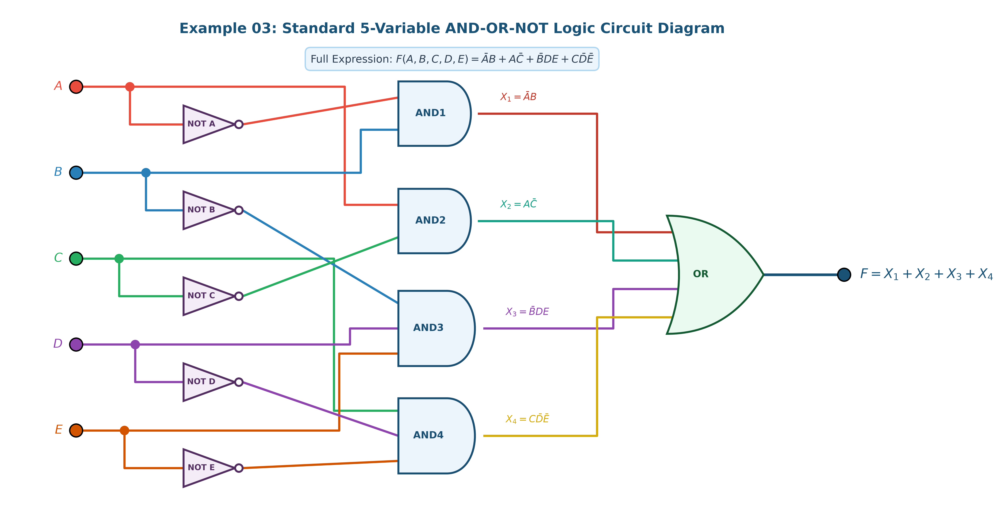
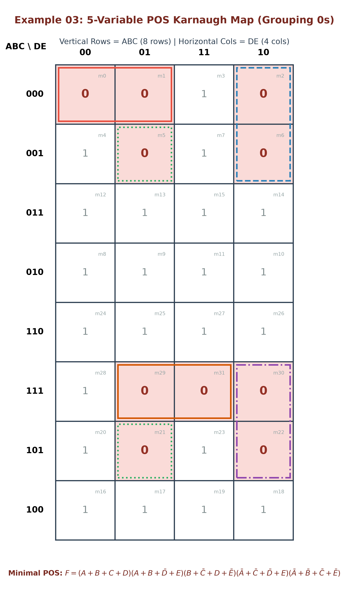

# ตัวอย่างโจทย์ที่ 3: การวิเคราะห์ วาดวงจร และลดรูปวงจรตรรกศาสตร์ 5 ตัวแปร (Digital Logic Circuit Example 03)

**สถานที่จัดเก็บ:** `02-logic-gates/examples/03`

---

## 📌 โจทย์ปัญหา (Problem Statement)

จงวิเคราะห์วงจรตรรกศาสตร์ดิจิทัลแบบ 5 ตัวแปร ($A, B, C, D, E$) จากสมการ SOP:
$$F = X_1 + X_2 + X_3 + X_4$$

โดยที่:
- $X_1 = \bar{A}B$
- $X_2 = A\bar{C}$
- $X_3 = \bar{B}DE$
- $X_4 = C\bar{D}\bar{E}$

จงสร้างตารางความจริง (Truth Table) ทั้ง 32 กรณี วิเคราะห์ลดรูปด้วยพีชคณิตบูลีน และทำ **K-Map 8x4 (แนวตั้ง $ABC$ 8 แถว และแนวนอน $DE$ 4 คอลัมน์)** โดยจับกลุ่มขนาด $2^n$ ($1, 2, 4, 8, 16, 32$) ทั้งแบบ **SOP (วง 1)** และ **POS (วง 0)** อย่างละเอียดทุกขั้นตอน

---

## 1. วงจรต้นฉบับแบบมาตรฐาน AND–OR–NOT (Standard Redrawn Circuit)

โครงสร้างวงจรแบ่งออกเป็น 3 ขั้นตอน:
1. **ขั้นที่ 1:** สัญญาณกลับค่า ($\bar{A}, \bar{B}, \bar{C}, \bar{D}, \bar{E}$) ผ่าน NOT Gates 5 ตัว
2. **ขั้นที่ 2:** สร้าง Product terms ($X_1, X_2, X_3, X_4$) ผ่าน AND Gates 4 ตัว
3. **ขั้นที่ 3:** รวบรวมผลลัพธ์ผ่าน 4-Input OR Gate ตัวสุดท้าย ($F = X_1 + X_2 + X_3 + X_4$)

### ตารางแยกโครงสร้าง Gate ย่อย (Gate Breakdown)

| Gate Label | ประเภท Gate | อินพุต (Inputs) | สมการเอาต์พุตประจำจุดทด (Output Expression) |
| :--- | :--- | :--- | :--- |
| **NOT Gates** | Inverters (x5) | $A, B, C, D, E$ | $\bar{A}, \bar{B}, \bar{C}, \bar{D}, \bar{E}$ |
| **AND1** | 2-Input AND Gate | $\bar{A}, B$ | $X_1 = \bar{A}B$ |
| **AND2** | 2-Input AND Gate | $A, \bar{C}$ | $X_2 = A\bar{C}$ |
| **AND3** | 3-Input AND Gate | $\bar{B}, D, E$ | $X_3 = \bar{B}DE$ |
| **AND4** | 3-Input AND Gate | $C, \bar{D}, \bar{E}$ | $X_4 = C\bar{D}\bar{E}$ |
| **OR** | 4-Input OR Gate | $X_1, X_2, X_3, X_4$ | $F = X_1 + X_2 + X_3 + X_4 = \bar{A}B + A\bar{C} + \bar{B}DE + C\bar{D}\bar{E}$ |

---

## 2. ตารางความจริง (Truth Table 32 Cases) และ Minterms / Maxterms

คำนวณเอาต์พุต $F$ สำหรับอินพุต 5 ตัวแปรทั้งหมด $2^5 = 32$ กรณี ($m_0 \dots m_{31}$):

| Index | $A$ | $B$ | $C$ | $D$ | $E$ | $X_1=\bar{A}B$ | $X_2=A\bar{C}$ | $X_3=\bar{B}DE$ | $X_4=C\bar{D}\bar{E}$ | **Output ($F$)** | Minterm ($F=1$) | Maxterm ($F=0$) |
| :-: | :-: | :-: | :-: | :-: | :-: | :-: | :-: | :-: | :-: | :-: | :-: | :---: | :---: |
| 0 | 0 | 0 | 0 | 0 | 0 | 0 | 0 | 0 | 0 | **0** | - | $M_0 = (A+B+C+D+E)$ |
| 1 | 0 | 0 | 0 | 0 | 1 | 0 | 0 | 0 | 0 | **0** | - | $M_1 = (A+B+C+D+\bar{E})$ |
| 2 | 0 | 0 | 0 | 1 | 0 | 0 | 0 | 0 | 0 | **0** | - | $M_2 = (A+B+C+\bar{D}+E)$ |
| **3** | **0** | **0** | **0** | **1** | **1** | 0 | 0 | 1 | 0 | **1** | **$m_3 = \bar{A}\bar{B}\bar{C}DE$** | - |
| **4** | **0** | **0** | **1** | **0** | **0** | 0 | 0 | 0 | 1 | **1** | **$m_4 = \bar{A}\bar{B}C\bar{D}\bar{E}$** | - |
| 5 | 0 | 0 | 1 | 0 | 1 | 0 | 0 | 0 | 0 | **0** | - | $M_5 = (A+B+\bar{C}+D+\bar{E})$ |
| 6 | 0 | 0 | 1 | 1 | 0 | 0 | 0 | 0 | 0 | **0** | - | $M_6 = (A+B+\bar{C}+\bar{D}+E)$ |
| **7** | **0** | **0** | **1** | **1** | **1** | 0 | 0 | 1 | 0 | **1** | **$m_7 = \bar{A}\bar{B}CDE$** | - |
| **8** | **0** | **1** | **0** | **0** | **0** | 1 | 0 | 0 | 0 | **1** | **$m_8 = \bar{A}B\bar{C}\bar{D}\bar{E}$** | - |
| **9** | **0** | **1** | **0** | **0** | **1** | 1 | 0 | 0 | 0 | **1** | **$m_9 = \bar{A}B\bar{C}\bar{D}E$** | - |
| **10** | **0** | **1** | **0** | **1** | **0** | 1 | 0 | 0 | 0 | **1** | **$m_{10} = \bar{A}B\bar{C}D\bar{E}$** | - |
| **11** | **0** | **1** | **0** | **1** | **1** | 1 | 0 | 0 | 0 | **1** | **$m_{11} = \bar{A}B\bar{C}DE$** | - |
| **12** | **0** | **1** | **1** | **0** | **0** | 1 | 0 | 0 | 1 | **1** | **$m_{12} = \bar{A}BC\bar{D}\bar{E}$** | - |
| **13** | **0** | **1** | **1** | **0** | **1** | 1 | 0 | 0 | 0 | **1** | **$m_{13} = \bar{A}BC\bar{D}E$** | - |
| **14** | **0** | **1** | **1** | **1** | **0** | 1 | 0 | 0 | 0 | **1** | **$m_{14} = \bar{A}BCD\bar{E}$** | - |
| **15** | **0** | **1** | **1** | **1** | **1** | 1 | 0 | 0 | 0 | **1** | **$m_{15} = \bar{A}BCDE$** | - |
| **16** | **1** | **0** | **0** | **0** | **0** | 0 | 1 | 0 | 0 | **1** | **$m_{16} = A\bar{B}\bar{C}\bar{D}\bar{E}$** | - |
| **17** | **1** | **0** | **0** | **0** | **1** | 0 | 1 | 0 | 0 | **1** | **$m_{17} = A\bar{B}\bar{C}\bar{D}E$** | - |
| **18** | **1** | **0** | **0** | **1** | **0** | 0 | 1 | 0 | 0 | **1** | **$m_{18} = A\bar{B}\bar{C}D\bar{E}$** | - |
| **19** | **1** | **0** | **0** | **1** | **1** | 0 | 1 | 1 | 0 | **1** | **$m_{19} = A\bar{B}\bar{C}DE$** | - |
| **20** | **1** | **0** | **1** | **0** | **0** | 0 | 0 | 0 | 1 | **1** | **$m_{20} = A\bar{B}C\bar{D}\bar{E}$** | - |
| 21 | 1 | 0 | 1 | 0 | 1 | 0 | 0 | 0 | 0 | **0** | - | $M_{21} = (\bar{A}+B+\bar{C}+D+\bar{E})$ |
| 22 | 1 | 0 | 1 | 1 | 0 | 0 | 0 | 0 | 0 | **0** | - | $M_{22} = (\bar{A}+B+\bar{C}+\bar{D}+E)$ |
| **23** | **1** | **0** | **1** | **1** | **1** | 0 | 0 | 1 | 0 | **1** | **$m_{23} = A\bar{B}CDE$** | - |
| **24** | **1** | **1** | **0** | **0** | **0** | 0 | 1 | 0 | 0 | **1** | **$m_{24} = AB\bar{C}\bar{D}\bar{E}$** | - |
| **25** | **1** | **1** | **0** | **0** | **1** | 0 | 1 | 0 | 0 | **1** | **$m_{25} = AB\bar{C}\bar{D}E$** | - |
| **26** | **1** | **1** | **0** | **1** | **0** | 0 | 1 | 0 | 0 | **1** | **$m_{26} = AB\bar{C}D\bar{E}$** | - |
| **27** | **1** | **1** | **0** | **1** | **1** | 0 | 1 | 0 | 0 | **1** | **$m_{27} = AB\bar{C}DE$** | - |
| **28** | **1** | **1** | **1** | **0** | **0** | 0 | 0 | 0 | 1 | **1** | **$m_{28} = ABC\bar{D}\bar{E}$** | - |
| 29 | 1 | 1 | 1 | 0 | 1 | 0 | 0 | 0 | 0 | **0** | - | $M_{29} = (\bar{A}+\bar{B}+\bar{C}+D+\bar{E})$ |
| 30 | 1 | 1 | 1 | 1 | 0 | 0 | 0 | 0 | 0 | **0** | - | $M_{30} = (\bar{A}+\bar{B}+\bar{C}+\bar{D}+E)$ |
| 31 | 1 | 1 | 1 | 1 | 1 | 0 | 0 | 0 | 0 | **0** | - | $M_{31} = (\bar{A}+\bar{B}+\bar{C}+\bar{D}+\bar{E})$ |

* **สรุป:** เอาต์พุตเป็น `1` จำนวน **22 กรณี** ($m_3, m_4, m_7, m_8 \dots m_{20}, m_{23} \dots m_{28}$) และเอาต์พุตเป็น `0` จำนวน **10 กรณี** ($M_0, M_1, M_2, M_5, M_6, M_{21}, M_{22}, M_{29}, M_{30}, M_{31}$)

---

## 3. การลดรูปด้วยวิธี SOP (Sum of Products) & K-Map 8x4

### 3.1 K-Map 8x4 (แนวตั้ง $ABC$ 8 แถว, แนวนอน $DE$ 4 คอลัมน์)

จับกลุ่มเฉพาะเลข **1** จำนวน 22 เซลล์ โดยใช้กลุ่มขนาดพลังของสอง ($2^n = 1, 2, 4, 8, 16, 32$):

### รายละเอียดการจับกลุ่มทั้ง 4 กลุ่ม (SOP Grouping Breakdown)

1. **กลุ่มที่ 1 (ขนาด 8 เซลล์ = $2^3$):**
   - ครอบคลุมแถว $ABC = 011$ และ $010$ ทั้ง 4 คอลัมน์ ($m_8, m_9, m_{10}, m_{11}, m_{12}, m_{13}, m_{14}, m_{15}$)
   - ตัวแปร $C, D, E$ ถูกตัดออกทั้งหมด เหลือพจน์: $\mathbf{\bar{A}B}$

2. **กลุ่มที่ 2 (ขนาด 8 เซลล์ = $2^3$):**
   - ครอบคลุมแถว $ABC = 110$ และ $100$ ทั้ง 4 คอลัมน์ ($m_{16}, m_{17}, m_{18}, m_{19}, m_{24}, m_{25}, m_{26}, m_{27}$)
   - ตัวแปร $B, D, E$ ถูกตัดออกทั้งหมด เหลือพจน์: $\mathbf{A\bar{C}}$

3. **กลุ่มที่ 3 (ขนาด 4 เซลล์ = $2^2$):**
   - ครอบคลุมคอลัมน์ $DE = 11$ ในแถวที่ $B=0$ ($m_3, m_7, m_{19}, m_{23}$)
   - ตัวแปร $A, C$ ถูกตัดออก เหลือพจน์: $\mathbf{\bar{B}DE}$

4. **กลุ่มที่ 4 (ขนาด 4 เซลล์ = $2^2$):**
   - ครอบคลุมคอลัมน์ $DE = 00$ ในแถวที่ $C=1$ ($m_4, m_{12}, m_{20}, m_{28}$)
   - ตัวแปร $A, B$ ถูกตัดออก เหลือพจน์: $\mathbf{C\bar{D}\bar{E}}$

---

### 3.2 สรุปสมการ SOP ขั้นต่ำ (Minimal SOP Expression)

$$\mathbf{F_{\text{SOP}} = \bar{A}B + A\bar{C} + \bar{B}DE + C\bar{D}\bar{E}}$$

*(สมการต้นฉบับถูกจัดอยู่ในรูปขั้นต่ำที่สุดเรียบร้อยแล้ว ไม่สามารถลดจำนวนพจน์ลงได้อีกทางคณิตศาสตร์!)*

---

## 4. การลดรูปด้วยวิธี POS (Product of Sums) & K-Map 8x4

### 4.1 K-Map 8x4 (แนวตั้ง $ABC$ 8 แถว, แนวนอน $DE$ 4 คอลัมน์)

จับกลุ่มเฉพาะเลข **0** จำนวน 10 เซลล์ โดยใช้กลุ่มขนาดพลังของสอง ($2^n = 2^1 = 2$):

### รายละเอียดการจับกลุ่มทั้ง 5 คู่ (POS Grouping Breakdown)

1. **คู่ที่ 1 (ขนาด 2 เซลล์ = $2^1$):** ครอบคลุม $m_0, m_1$ ในแถว $ABC=000$ คอลัมน์ $DE=00, 01$ $\rightarrow$ Maxterm: $\mathbf{(A + B + C + D)}$
2. **คู่ที่ 2 (ขนาด 2 เซลล์ = $2^1$):** ครอบคลุม $m_2, m_6$ ในคอลัมน์ $DE=10$ แถว $ABC=000, 001$ $\rightarrow$ Maxterm: $\mathbf{(A + B + \bar{D} + E)}$
3. **คู่ที่ 3 (ขนาด 2 เซลล์ = $2^1$):** ครอบคลุม $m_5, m_{21}$ ในคอลัมน์ $DE=01$ แถว $ABC=001, 101$ $\rightarrow$ Maxterm: $\mathbf{(B + \bar{C} + D + \bar{E})}$
4. **คู่ที่ 4 (ขนาด 2 เซลล์ = $2^1$):** ครอบคลุม $m_{22}, m_{30}$ ในคอลัมน์ $DE=10$ แถว $ABC=101, 111$ $\rightarrow$ Maxterm: $\mathbf{(\bar{A} + \bar{C} + \bar{D} + E)}$
5. **คู่ที่ 5 (ขนาด 2 เซลล์ = $2^1$):** ครอบคลุม $m_{29}, m_{31}$ ในแถว $ABC=111$ คอลัมน์ $DE=01, 11$ $\rightarrow$ Maxterm: $\mathbf{(\bar{A} + \bar{B} + \bar{C} + \bar{E})}$

---

### 4.2 สรุปสมการ POS ขั้นต่ำ (Minimal POS Expression)

$$\mathbf{F_{\text{POS}} = (A+B+C+D)(A+B+\bar{D}+E)(B+\bar{C}+D+\bar{E})(\bar{A}+\bar{C}+\bar{D}+E)(\bar{A}+\bar{B}+\bar{C}+\bar{E})}$$

---

### 4.3 ไดอะแกรมวงจรตรรกศาสตร์ POS (OR-AND Logic Diagram)

---

## 5. ตารางเปรียบเทียบประสิทธิภาพทางฮาร์ดแวร์ (Hardware Optimization Benchmark)

| ดัชนีเปรียบเทียบ | วงจรเดิม / SOP (AND-OR Logic) | วิธี POS (OR-AND Logic) | ผู้ชนะ (Winner) |
| :--- | :--- | :--- | :--- |
| **สมการตรรกศาสตร์** | $F = \bar{A}B + A\bar{C} + \bar{B}DE + C\bar{D}\bar{E}$ | $F = (A+B+C+D)\dots(5\text{ terms})$ | 🏆 **SOP** |
| **จำนวน Logic Gates** | **10 Gates (5 NOT + 4 AND + 1 OR)** | 11 Gates (5 NOT + 5 OR + 1 AND) | 🏆 **SOP** |
| **จำนวน Transistors (CMOS)** | **~44 Transistors** | ~58 Transistors | 🏆 **SOP** (ประหยัดกว่า) |
| **จำนวน Propagation Delay Steps** | **3 Gate Delays** | 3 Gate Delays | **เสมอกัน** |
| **ความเหมาะสมในการผลิต** | เหมาะสำหรับโครงสร้าง AND-OR | เหมาะสำหรับโครงสร้าง OR-AND | 🏆 **SOP** |

---

## 📁 สรุปไฟล์ทั้งหมดในโฟลเดอร์นี้

1. [`README.md`](README.md) - เอกสารสรุปโจทย์ ตารางความจริง 32 กรณี K-Map 8x4 และผลการลดรูปฉบับสมบูรณ์
2. [`digital_logic_circuit_redrawn.png`](digital_logic_circuit_redrawn.png) - ภาพวงจรต้นฉบับวาดใหม่ระดับมาตรฐาน (ระบุ $X_1, X_2, X_3, X_4$ ชัดเจน)
3. [`kmap_sop_diagram.png`](kmap_sop_diagram.png) - K-Map 8x4 สำหรับ SOP (จับกลุ่มเลข 1 แนวตั้ง ABC แนวนอน DE)
4. [`kmap_pos_diagram.png`](kmap_pos_diagram.png) - K-Map 8x4 สำหรับ POS (จับกลุ่มเลข 0 แนวตั้ง ABC แนวนอน DE)
5. [`pos_circuit_diagram.png`](pos_circuit_diagram.png) - วงจรตรรกศาสตร์ POS (OR-AND Logic)
6. [`generate_all_diagrams.py`](generate_all_diagrams.py) - สคริปต์ Python สำหรับสร้างและ Render รูปภาพความละเอียดสูงทั้งหมด
