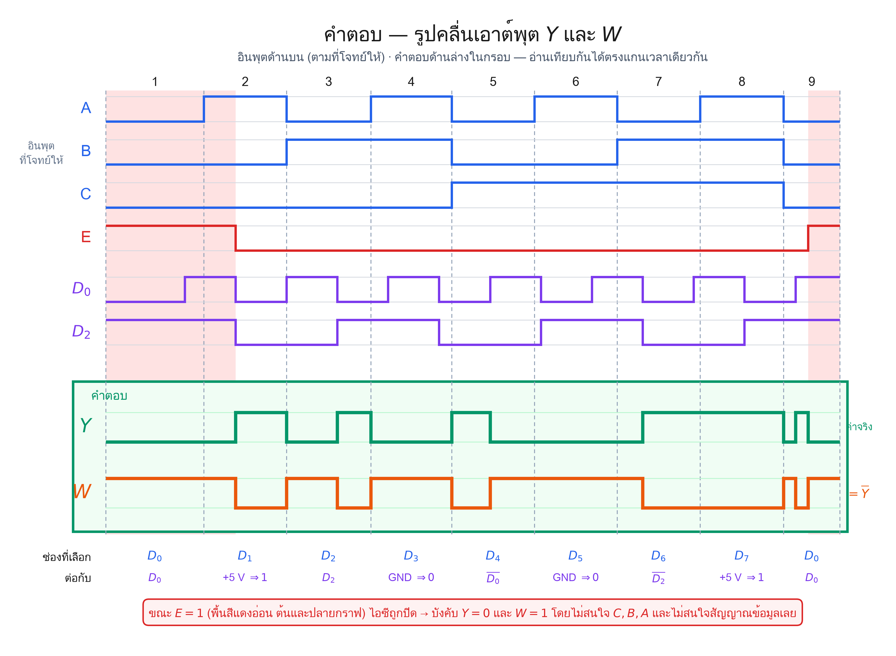
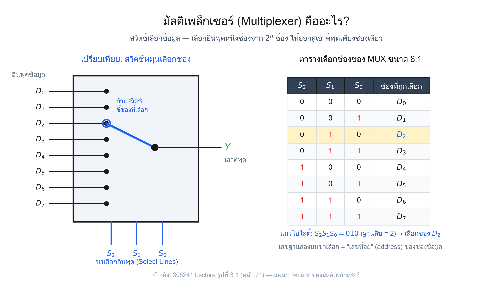
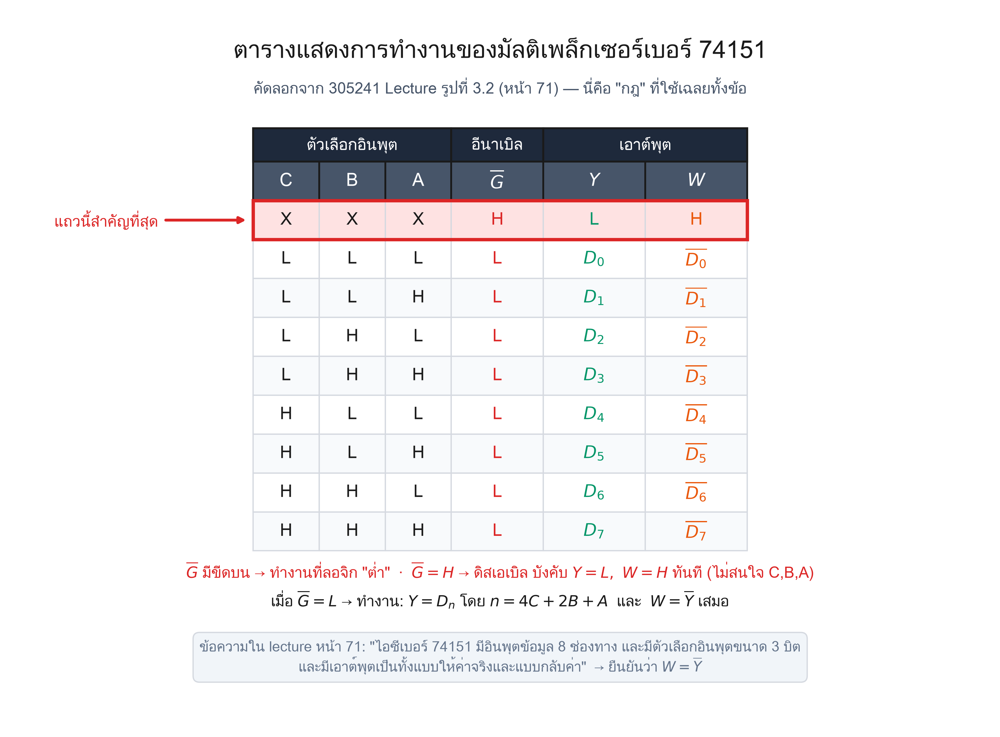
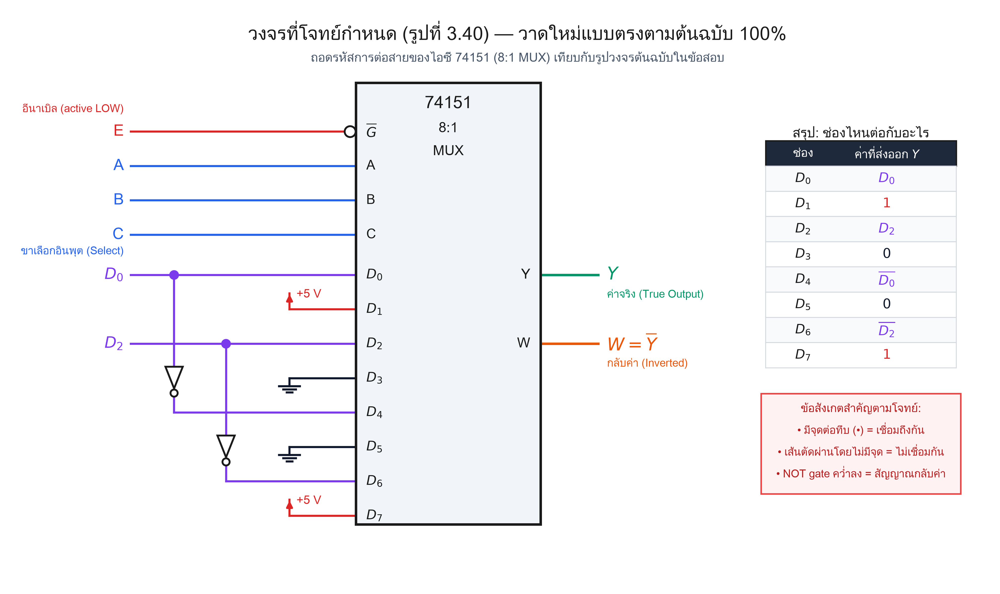
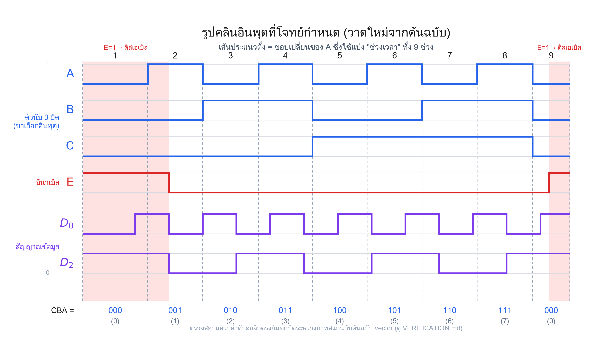
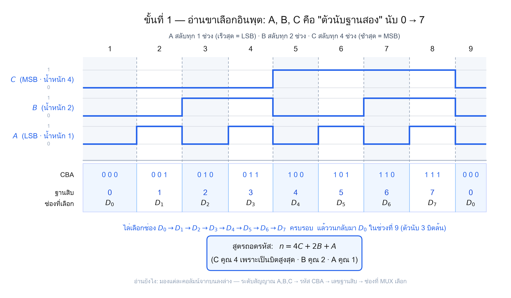
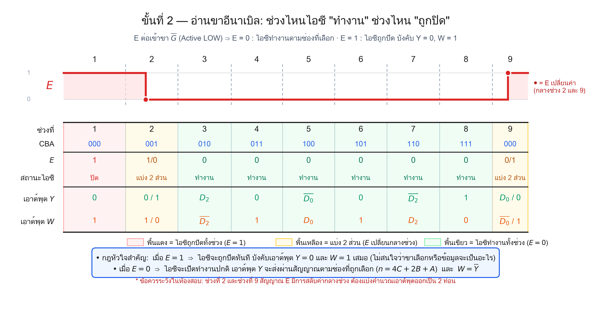
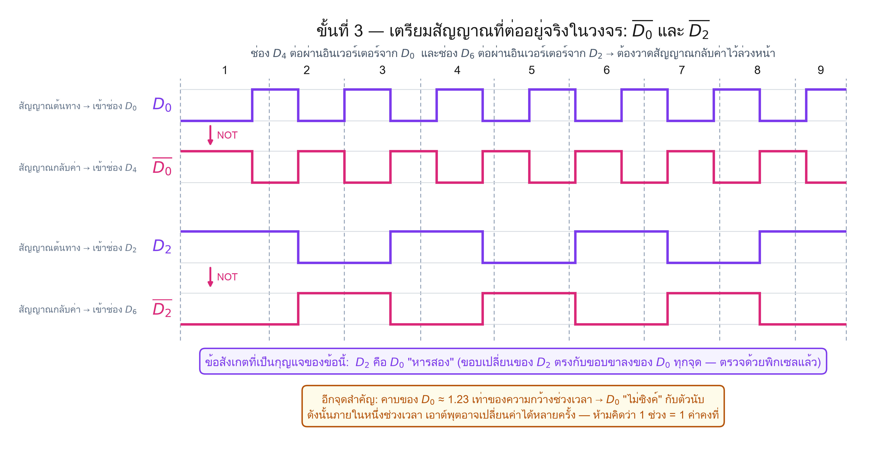
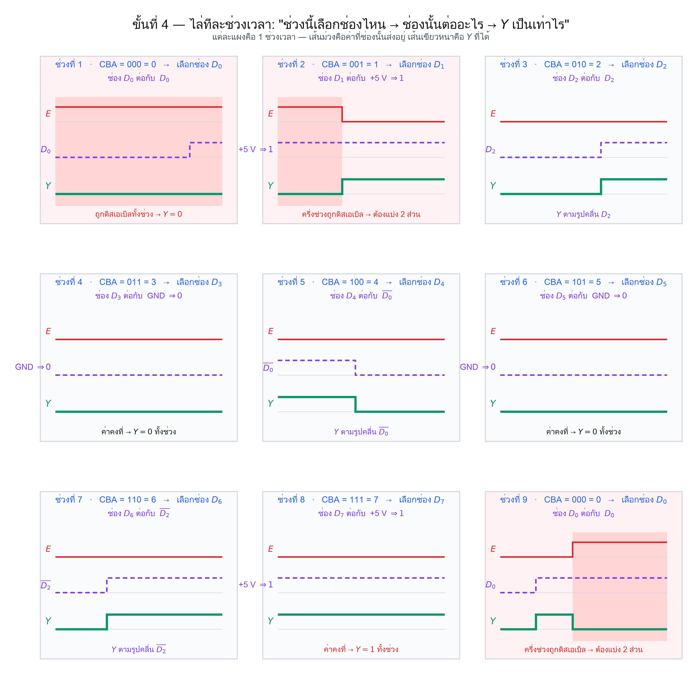
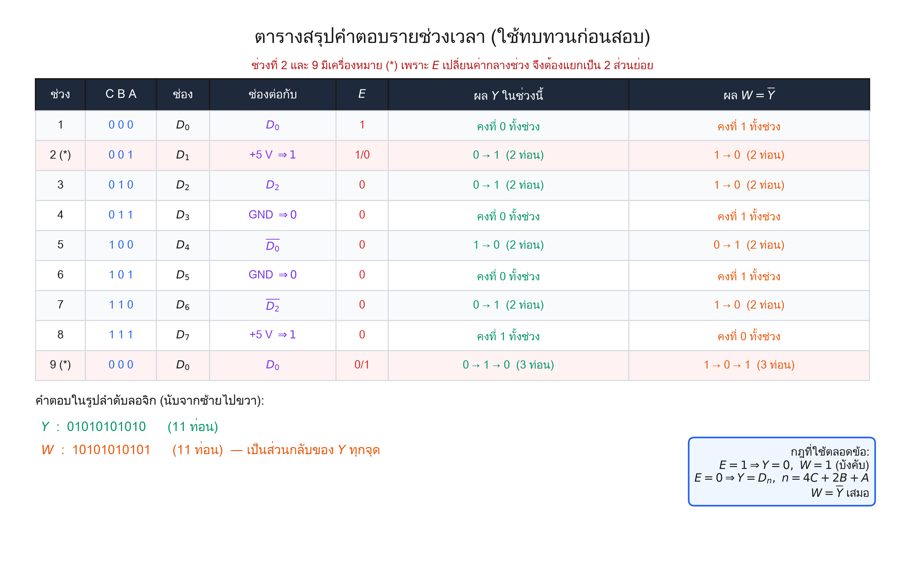

# 🔀 เฉลยละเอียด — ข้อสอบ MUX/DMUX ข้อที่ 1 (รูปที่ 3.40)

> **โจทย์:** จงหารูปคลื่นเอาต์พุต Y และรูปคลื่นเอาต์พุต W จากวงจรและรูปคลื่นอินพุตที่กำหนดให้ในรูปที่ 3.40
>
> — แบบฝึกหัดท้ายบทที่ 3, `305241_lecture.pdf` หน้า 110 (เลขหน้าในเล่ม 97)

เอกสารนี้เฉลย **ทุกขั้นตอน ไม่ข้าม ไม่ลัด** พร้อมสอนทฤษฎีที่ใช้ควบคู่กันไป
เขียนสำหรับคนที่ยังไม่มีพื้นฐาน MUX เลย — อ่านจากบนลงล่างได้ต่อเนื่อง

> 🖥️ **ชอบอ่านแบบหน้าเว็บ?** เปิด [`solution.html`](solution.html) —
> ฉบับจัดหน้าแบบตำราเรียน มีสารบัญคลิกกระโดด ตารางสวย คลิกรูปขยายเต็มจอ
> และ **ห้องทดลอง 74151** ที่คลิกผังขา/หมุนโมเดล DIP-16 3D/เล่นลำดับโจทย์จริงได้
> (ทำงานในไฟล์เดียว ไม่ต้องติดตั้งไลบรารีหรือเชื่อมต่ออินเทอร์เน็ต)

📄 **ภาพโจทย์ต้นฉบับ:** [`assets/example01_original.jpeg`](assets/example01_original.jpeg)
🔍 **หลักฐานการตรวจสอบความถูกต้อง:** [`VERIFICATION.md`](VERIFICATION.md)

---

## 📑 สารบัญ

| # | หัวข้อ | สิ่งที่จะได้ |
| :-: | :--- | :--- |
| [0](#0-สรุปคำตอบก่อน-สำหรับคนรีบ) | สรุปคำตอบก่อน | เห็นคำตอบทันที |
| [1](#1-ปรับพื้นฐาน-multiplexer-คืออะไร) | ปรับพื้นฐาน MUX | เข้าใจว่า MUX ทำอะไร |
| [2](#2-กฎการทำงานของ-74151-อ้างอิงจาก-lecture) | กฎของ 74151 | ตารางฟังก์ชันที่ใช้ทั้งข้อ |
| [LAB](#lab-ห้องทดลอง-74151--จากขาไอซีสู่คำตอบข้อ-1) | ห้องทดลอง 74151 | คลิก pinout, หมุน 3D และเล่นโจทย์จริง |
| [3](#3-ขั้นที่-1--อ่านวงจร-ว่าแต่ละช่องต่อกับอะไร) | อ่านวงจร | แผนที่ช่อง `D₀`–`D₇` |
| [4](#4-ขั้นที่-2--อ่านขาเลือกอินพุต-a-b-c-เป็นตัวนับ) | อ่าน A, B, C | รู้ว่าช่วงไหนเลือกช่องไหน |
| [5](#5-ขั้นที่-3--อ่านขาอีนาเบิล-e) | อ่านขาอีนาเบิล | รู้ว่าช่วงไหนวงจรถูกปิด |
| [6](#6-ขั้นที่-4--เตรียมสัญญาณกลับค่า) | เตรียมสัญญาณกลับค่า | ได้ `(D₀)\', (D₂)\'` |
| [7](#7-ขั้นที่-5--ไล่คำตอบทีละช่วงเวลา) | ไล่ทีละช่วง | ที่มาของคำตอบทุกช่วง |
| [8](#8-คำตอบ-รูปคลื่น-y-และ-w) | คำตอบรูปคลื่น | รูปคำตอบสมบูรณ์ |
| [9](#9-สมการบูลีนของวงจรนี้) | สมการบูลีน | เขียนเป็นสมการได้ |
| [10](#10-จุดที่ข้อสอบตั้งใจดัก) | จุดที่ข้อสอบดัก | กันพลาดตอนสอบ |
| [11](#11-ตรวจคำตอบด้วยตัวเอง) | ตรวจคำตอบเอง | มั่นใจก่อนส่ง |

---

## 0. สรุปคำตอบก่อน (สำหรับคนรีบ)



**คำตอบในรูปลำดับลอจิก** (ไล่จากซ้ายไปขวา นับเฉพาะช่วงที่ค่าเปลี่ยน):

```text
Y = 0\,1\,0\,1\,0\,1\,0\,1\,0\,1\,0 \qquad (11 ท่อน)
```
```text
W = 1\,0\,1\,0\,1\,0\,1\,0\,1\,0\,1 \qquad (11 ท่อน, เป็นส่วนกลับของ  Y  ทุกจุด)
```

**กฎ 3 ข้อที่ใช้ตลอดข้อนี้:**

1. `E = 1` → ไอซีถูกปิด → **บังคับ** `Y = 0,\ W = 1` (ไม่สนใจอะไรเลย)
2. `E = 0` → ไอซีทำงาน → `Y = Dₙ` โดย `n = 4C + 2B + A`
3. `W = (Y)\'` **เสมอ**

> ⚠️ ถ้าอ่านแค่หัวข้อนี้แล้วไปสอบ จะพลาด **2 จุดที่ข้อสอบตั้งใจดัก** — อ่านหัวข้อ [10](#10-จุดที่ข้อสอบตั้งใจดัก) ด้วย

---

## 1. ปรับพื้นฐาน: Multiplexer คืออะไร?



**มัลติเพล็กเซอร์ (Multiplexer, MUX)** หรือ **อุปกรณ์เลือกข้อมูล (Data Selector)**
คือวงจรที่ทำหน้าที่เหมือน **สวิตช์หมุนเลือกช่อง**

- มีอินพุตข้อมูลหลายช่อง = 2ⁿ ช่อง
- มีเอาต์พุตช่องเดียว = Y
- ใช้ **ขาเลือกอินพุต (Select Lines)** จำนวน n เส้น เป็นตัวบอกว่า "จะให้ช่องไหนผ่าน"

### 1.1 หัวใจของแนวคิด: ขาเลือกอินพุตคือ "เลขที่อยู่"

เลขฐานสองบนขาเลือกอินพุต = **เลขที่อยู่ (address)** ของช่องข้อมูล

ตัวอย่าง MUX ขนาด 8:1 → ต้องใช้ขาเลือก `n = 3` เส้น (เพราะ `2³ = 8`)

| `S₂ S₁ S₀` | ค่าฐานสิบ | ช่องที่ถูกเลือก |
| :-: | :-: | :-: |
| 0 0 0 | 0 | `D₀` |
| 0 0 1 | 1 | `D₁` |
| 0 1 0 | 2 | `D₂` |
| 0 1 1 | 3 | `D₃` |
| 1 0 0 | 4 | `D₄` |
| 1 0 1 | 5 | `D₅` |
| 1 1 0 | 6 | `D₆` |
| 1 1 1 | 7 | `D₇` |

> 🔗 **ตารางเต็ม 9 ช่วง:** ดูใน [หัวข้อ 4.2 ถอดรหัสด้วย `n = 4C + 2B + A`](#42-ถอดรหัสได้ตารางนี้)
>
> 📖 **อ้างอิง lecture:** รูปที่ 3.1 หน้า 82 (`assets/lecture_refs/lecture_fig3_1_mux_block.png`) — แผนภาพบล็อกของมัลติเพล็กเซอร์

### 1.2 ไอซีตระกูล MUX ที่ lecture กล่าวถึง

ข้อความจาก `305241_lecture.pdf` หน้า 71 (คัดมาตรงตัว):

| ไอซี | อินพุตข้อมูล | ขาเลือก | ลักษณะเอาต์พุต |
| :--- | :-: | :-: | :--- |
| **74150** | 16 ช่อง | 4 บิต | แบบกลับค่า *(อย่างเดียว)* |
| **74151** | **8 ช่อง** | **3 บิต** | **ทั้งแบบให้ค่าจริงและแบบกลับค่า** |
| **74152** | 8 ช่อง | 3 บิต | แบบให้ค่าจริง *(อย่างเดียว)* |

> 🎯 **โจทย์ข้อนี้ใช้ 74151** ⇒ มีเอาต์พุต **2 ขา** คือ Y (ค่าจริง) และ W (กลับค่า)
> นี่คือเหตุผลที่โจทย์ถามหา **ทั้ง** Y และ W

---

## 2. กฎการทำงานของ 74151 (อ้างอิงจาก lecture)



นี่คือ **ตารางแสดงการทำงานของมัลติเพล็กเซอร์เบอร์ 74151** คัดจาก
`305241_lecture.pdf` **หน้า 82 (เลขหน้าในเล่ม 71) รูปที่ 3.2** — ทุกขั้นตอนที่เหลือในเฉลยนี้อ้างตารางนี้

| C | B | A | `(G)\'` | Y | W |
|:-:|:-:|:-:|:-:|:-:|:-:|
| X | X | X | **H** | **L** | **H** |
| L | L | L | L | `D₀` | `(D₀)\'` |
| L | L | H | L | `D₁` | `(D₁)\'` |
| L | H | L | L | `D₂` | `(D₂)\'` |
| L | H | H | L | `D₃` | `(D₃)\'` |
| H | L | L | L | `D₄` | `(D₄)\'` |
| H | L | H | L | `D₅` | `(D₅)\'` |
| H | H | L | L | `D₆` | `(D₆)\'` |
| H | H | H | L | `D₇` | `(D₇)\'` |

### 2.1 อ่านตารางนี้ให้ออก — 3 ประเด็นสำคัญ

**ประเด็นที่ 1: แถวแรกสำคัญที่สุด**

ขา `(G)\'` **มีขีดอยู่ข้างบน** ⇒ เป็นขาที่ **ทำงานที่ลอจิกต่ำ (active LOW)**

- `(G)\' = H` (ลอจิก 1) → **ไอซีถูกปิด (ดิสเอเบิล)** → บังคับ `Y = L,\ W = H`
- `(G)\' = L` (ลอจิก 0) → **ไอซีทำงาน** → ส่งค่าช่องที่เลือกออกมา

สังเกตว่าแถวแรก C, B, A เป็น **X** ทั้งหมด — `X` แปลว่า **"ไม่สนใจ (don't care)"**
คือไม่ว่าขาเลือกจะเป็นอะไร ผลลัพธ์ก็เป็น `Y=L, W=H` เหมือนกันหมด

> 💡 **ทำไมต้องจำ?** เพราะโจทย์ข้อนี้ทำให้ `E = 1` ทั้งช่วงต้นและช่วงท้ายของกราฟ
> ถ้าลืมกฎนี้ จะตอบผิดทันที 2 ช่วง

**ประเด็นที่ 2: การถอดรหัสขาเลือก**

```text
n = 4C + 2B + A
```

โดย **C มีน้ำหนักมากสุด (MSB)** และ **A มีน้ำหนักน้อยสุด (LSB)**

**ประเด็นที่ 3: W คือส่วนกลับของ Y**

คอลัมน์ W ในตารางเป็น `(D₀)\', (D₁)\', \ldots` (มีขีดบนทุกตัว)
ขณะที่คอลัมน์ Y เป็น `D₀, D₁, \ldots` (ไม่มีขีด) ⇒

```text
\boxed{W = (Y)\'}
```

ตรงกับข้อความใน lecture หน้า 71 ที่ว่า *"...มีเอาต์พุตเป็นทั้งแบบให้ค่าจริงและแบบกลับค่า"*

> 🎁 **ข่าวดี:** เมื่อหา Y ได้แล้ว W ได้มาฟรี ๆ — แค่พลิกกลับทุกจุด ไม่ต้องคิดใหม่

---

## LAB. ห้องทดลอง 74151 — จากขาไอซีสู่คำตอบข้อ 1

เปิด [`solution.html#lab74151`](solution.html#lab74151) เพื่อใช้สื่อ interactive ที่สร้างสำหรับวงจรในโจทย์ข้อนี้โดยเฉพาะ
ตัวจำลองไม่ได้ใช้ค่า MUX ทั่วไปแบบลอย ๆ แต่ต่อช่องข้อมูลตามรูปที่ 3.40 จริง:

```text
D₀=D₀,  D₁=1,  D₂=D₂,  D₃=0, 
D₄=(D₀)\',  D₅=0,  D₆=(D₂)\',  D₇=1
```

### สิ่งที่ทดลองได้

1. **Image interactive — ผังขา:** ใช้ภาพ [`74151(8-to-1-multiplexer).png`](assets/interactive/74151%288-to-1-multiplexer%29.png)
   เป็นฐาน กดขา A/S₀, B/S₁, C/S₂, E, D₀ และ D₂ เพื่อสลับค่าได้ กรอบสีฟ้าบอกช่อง D ที่ถูกเลือกและสีเหลืองบอกลอจิก 1
2. **3D interactive — DIP-16:** โมเดลตัวถังและขาอ้างอิงจากภาพถ่าย
   [`74151-DIP-IC–8-to-1Multiplexer.png`](assets/interactive/74151-DIP-IC–8-to-1Multiplexer.png)
   ลากเพื่อหมุนดูรอยบาก/ตำแหน่งขา และกดขาโลหะเพื่อเปลี่ยนสัญญาณเดียวกับบนผังขาได้
3. **ทดลองอิสระ:** ตั้งค่า `(E,C,B,A,D₀,D₂)` เอง แล้วดูเส้นทาง
   `CBA → ช่อง Dn → ค่าที่ต่อจริง → Enable → Y/W` เปลี่ยนพร้อมกัน
4. **เล่นโจทย์ข้อ 1:** เล่นอัตโนมัติหรือกดก่อนหน้า/ถัดไปได้ครบ **15 เหตุการณ์ย่อยใน 9 ช่วง**
   รวมจุดที่ E เปลี่ยนกลางช่วง 2 และ 9, D₂ เปลี่ยนกลางช่วง 3 และ 7, และ D₀ เปลี่ยนกลางช่วง 5 และ 9

### ผังขา DIP-16 ที่ใช้ในสื่อ

| ขา | สัญญาณ | บทบาทในโจทย์ | ขา | สัญญาณ | บทบาทในโจทย์ |
| :-: | :---: | :--- | :-: | :---: | :--- |
| 1 | `D₃` | GND → 0 | 16 | VCC | +5 V |
| 2 | `D₂` | รูปคลื่น `D₂` | 15 | `D₄` | `(D₀)\'` |
| 3 | `D₁` | +5 V → 1 | 14 | `D₅` | GND → 0 |
| 4 | `D₀` | รูปคลื่น `D₀` | 13 | `D₆` | `(D₂)\'` |
| 5 | Y | เอาต์พุตค่าจริง | 12 | `D₇` | +5 V → 1 |
| 6 | W | เอาต์พุตกลับค่า | 11 | `S₀=A` | Select บิตต่ำสุด |
| 7 | `(E)\'` | Enable active LOW | 10 | `S₁=B` | Select บิตกลาง |
| 8 | GND | กราวด์ | 9 | `S₂=C` | Select บิตสูงสุด |

> **ใช้สอนแบบสั้น:** ให้ผู้เรียนลอง CBA = 100 แล้วสลับ D₀ เพื่อเห็นว่า D₄ ส่งค่ากลับออก Y;
> จากนั้นกด E = 1 เพื่อเห็นว่า Y ถูกบังคับเป็น 0 ทันที วิธีนี้เชื่อม “อินเวอร์เตอร์ + active-LOW enable”
> เข้ากับช่วงที่ 5 และจุดดักของโจทย์ในเวลาไม่ถึงหนึ่งนาที

---

## 3. ขั้นที่ 1 — อ่านวงจร ว่าแต่ละช่องต่อกับอะไร



นี่คือขั้นที่ **สำคัญที่สุด** ของข้อนี้ ถ้าอ่านวงจรผิด คำตอบผิดหมดทั้งข้อ

### 3.1 สายควบคุม 4 เส้น

| ขาไอซี | ต่อกับ | ความหมาย |
| :--- | :--- | :--- |
| `(G)\'` | สัญญาณ **E** | อีนาเบิล — ในรูปมี **วงกลมเล็ก (bubble)** ที่ขา ยืนยันว่าทำงานที่ลอจิกต่ำ |
| A | สัญญาณ **A** | ขาเลือก บิตต่ำสุด (LSB) |
| B | สัญญาณ **B** | ขาเลือก บิตกลาง |
| C | สัญญาณ **C** | ขาเลือก บิตสูงสุด (MSB) |

### 3.2 ช่องข้อมูลทั้ง 8 ช่อง — ตารางที่ต้องอ่านออกจากรูป

| ช่อง | ต่อกับอะไรในรูป | ค่าที่ส่งออก Y |
| :-: | :--- | :-: |
| `D₀` | สัญญาณ `D₀` โดยตรง (มีจุดต่อทึบ) | `D₀` |
| `D₁` | **+5 V** | 1 |
| `D₂` | สัญญาณ `D₂` โดยตรง (มีจุดต่อทึบ) | `D₂` |
| `D₃` | **กราวด์** | 0 |
| `D₄` | เอาต์พุตอินเวอร์เตอร์ ที่รับ `D₀` | `(D₀)\'` |
| `D₅` | **กราวด์** | 0 |
| `D₆` | เอาต์พุตอินเวอร์เตอร์ ที่รับ `D₂` | `(D₂)\'` |
| `D₇` | **+5 V** | 1 |

### 3.3 วิธีอ่านสัญลักษณ์ในรูป (สำหรับคนไม่มีพื้นฐาน)

| สัญลักษณ์ | อ่านว่า | ค่าลอจิก |
| :--- | :--- | :-: |
| ลูกศรชี้ขึ้น + ข้อความ **+5 V** | ต่อกับไฟเลี้ยง | **คงที่ 1** ตลอดเวลา |
| แถบขีดสั้นลง 3 ชั้น (**GND**) | ต่อลงกราวด์ | **คงที่ 0** ตลอดเวลา |
| สามเหลี่ยม + วงกลมเล็กที่ปลาย | อินเวอร์เตอร์ (NOT) | **กลับค่า** สัญญาณที่เข้ามา |
| **จุดทึบ** บนเส้นสองเส้นตัดกัน | จุดต่อ (junction) | สองเส้นนั้น **เชื่อมกัน** |
| เส้นตัดกันแบบ **สะพานข้าม** (ไม่มีจุด) | crossover | สองเส้นนั้น **ไม่เชื่อมกัน** |

> ⚠️ **จุดที่ต้องระวังมากในรูปนี้:** สายที่ลากลงจากจุดต่อของ `D₀` ไปเข้าอินเวอร์เตอร์
> **ตัดผ่าน** เส้น `D₂` โดย **ไม่มีจุดต่อ** — สองเส้นนี้ **ไม่ได้เชื่อมกัน**
> (ตรวจยืนยันด้วยการวิเคราะห์พิกเซลจากภาพต้นฉบับแล้ว ว่าไม่มี junction dot ที่จุดตัดนั้นจริง)

### 3.4 สังเกตแบบแผนของการต่อ

ลองเรียงค่าที่ส่งออกดู: `D₀,\ 1,\ D₂,\ 0,\ (D₀)\',\ 0,\ (D₂)\',\ 1`

จะเห็นว่าผู้ออกแบบวงจรตั้งใจให้:
- สัญญาณจริง 2 ตัว (`D₀, D₂`) ปรากฏ **ทั้งแบบปกติและแบบกลับค่า**
- ที่เหลืออีก 4 ช่องเป็น **ค่าคงที่** (1, 0, 0, 1)

⇒ ข้อนี้จึงทดสอบว่านักศึกษาแยกได้หรือไม่ ระหว่าง **ช่องที่ค่าเปลี่ยนตามเวลา** กับ **ช่องที่ค่าคงที่**

---

## 4. ขั้นที่ 2 — อ่านขาเลือกอินพุต: A, B, C เป็นตัวนับ



รูปข้างบนคือรูปคลื่นอินพุตทั้ง 6 เส้นที่โจทย์ให้มา (วาดใหม่จากต้นฉบับ)



### 4.1 สังเกตจังหวะการสลับ

| สัญญาณ | จังหวะการสลับ | บทบาท |
| :-: | :--- | :--- |
| **A** | สลับ **ทุก 1 ช่วง** (เร็วสุด) | บิตต่ำสุด (LSB) |
| **B** | สลับ **ทุก 2 ช่วง** | บิตกลาง |
| **C** | สลับ **ทุก 4 ช่วง** (ช้าสุด) | บิตสูงสุด (MSB) |

**นี่คือ "ลายเซ็น" ของตัวนับฐานสองขึ้น (binary up-counter)** — ความถี่ลดลงครึ่งหนึ่งทุกบิตที่สูงขึ้น

### 4.2 ถอดรหัสได้ตารางนี้

ใช้สูตร `n = 4C + 2B + A`:

| ช่วงที่ | C | B | A | n | ช่องที่ถูกเลือก |
| :-: | :-: | :-: | :-: | :-: | :-: |
| 1 | 0 | 0 | 0 | **0** | `D₀` |
| 2 | 0 | 0 | 1 | **1** | `D₁` |
| 3 | 0 | 1 | 0 | **2** | `D₂` |
| 4 | 0 | 1 | 1 | **3** | `D₃` |
| 5 | 1 | 0 | 0 | **4** | `D₄` |
| 6 | 1 | 0 | 1 | **5** | `D₅` |
| 7 | 1 | 1 | 0 | **6** | `D₆` |
| 8 | 1 | 1 | 1 | **7** | `D₇` |
| 9 | 0 | 0 | 0 | **0** | `D₀` *(วนกลับ)* |

> ✅ **ผลลัพธ์:** MUX ไล่เลือกช่องตามลำดับ `D₀ \to D₁ \to ·s \to D₇` แล้ว **วนกลับ** มาที่ `D₀`
> ในช่วงที่ 9 — เพราะตัวนับ 3 บิตนับได้ถึง 7 แล้วต้องล้น (overflow) กลับเป็น 0

### 4.3 ตัวอย่างการคำนวณ (ทำให้ดูทีละช่วง)

- ช่วงที่ 5: อ่านจากกราฟได้ `C=1, B=0, A=0` → `n = 4(1) + 2(0) + 0 = 4` → เลือก `D₄`
- ช่วงที่ 7: อ่านจากกราฟได้ `C=1, B=1, A=0` → `n = 4(1) + 2(1) + 0 = 6` → เลือก `D₆`

---

## 5. ขั้นที่ 3 — อ่านขาอีนาเบิล E



### 5.1 E ทำอะไร

E ต่อเข้าขา `(G)\'` ซึ่ง **ทำงานที่ลอจิกต่ำ** ⇒

| ค่าของ E | สถานะไอซี | ผลที่เอาต์พุต |
| :-: | :--- | :--- |
| `E = 1` | **ถูกปิด (ดิสเอเบิล)** | บังคับ `Y = 0,\ W = 1` — ไม่สนใจ C, B, A และไม่สนใจข้อมูลเลย |
| `E = 0` | **ทำงานปกติ** | `Y = Dₙ` ตามช่องที่เลือก, `W = (Y)\'` |

### 5.2 อ่านค่า E จากกราฟ

จากรูปคลื่นที่โจทย์ให้ E มี 3 ท่อน:

1. **เริ่มต้นที่ `E = 1`** → ครอบช่วงที่ 1 ทั้งช่วง และกินเข้าไปในช่วงที่ 2 ประมาณ 38%
2. **ตกลงเป็น `E = 0`** → ครอบตั้งแต่กลางช่วงที่ 2 ไปจนถึงประมาณ 43% ของช่วงที่ 9
3. **ขึ้นกลับเป็น `E = 1`** → ครอบส่วนท้ายของช่วงที่ 9

> ⚠️ **จุดดักที่ 1 ของข้อสอบ:** E เปลี่ยนค่า **กลางช่วง** ไม่ตรงกับขอบช่วงเวลา!
> ⇒ **ช่วงที่ 2 และช่วงที่ 9 ต้องถูกแบ่งเป็น 2 ส่วนย่อย** ส่วนหนึ่งไอซีปิด อีกส่วนไอซีทำงาน
> ถ้าคิดว่า "1 ช่วง = 1 คำตอบ" จะตอบผิด 2 ช่วงนี้แน่นอน

---

## 6. ขั้นที่ 4 — เตรียมสัญญาณกลับค่า



เพราะช่อง `D₄` และ `D₆` ต่อผ่าน **อินเวอร์เตอร์** เราต้องวาด `(D₀)\'` และ `(D₂)\'`
เตรียมไว้ล่วงหน้า วิธีทำง่ายมาก: **พลิกกลับทุกจุด** — เดิม 1 เป็น 0, เดิม 0 เป็น 1

| สัญญาณ | ใช้เข้าช่อง | วิธีสร้าง |
| :-: | :-: | :--- |
| `D₀` | `D₀` | ใช้ตามที่โจทย์ให้ |
| `(D₀)\'` | `D₄` | พลิกกลับ `D₀` ทุกจุด |
| `D₂` | `D₂` | ใช้ตามที่โจทย์ให้ |
| `(D₂)\'` | `D₆` | พลิกกลับ `D₂` ทุกจุด |

### 6.1 ข้อสังเกตพิเศษที่ตรวจพบจากต้นฉบับ

ตรวจด้วยการวิเคราะห์พิกเซลพบความสัมพันธ์ 2 ข้อที่ช่วยให้วาดกราฟแม่นขึ้น:

**(ก) `D₂` คือ `D₀` "หารสอง"**

ขอบเปลี่ยนของ `D₂` ตรงกับ **ขอบขาลง** ของ `D₀` **ทุกจุด**
(เหมือนต่อ T-flip-flop ที่ trigger ด้วยขอบขาลงของ `D₀`)

**(ข) `D₀` ไม่ซิงค์กับตัวนับ**

คาบของ `D₀ ≈ 1.23` เท่าของความกว้างช่วงเวลา

> ⚠️ **จุดดักที่ 2 ของข้อสอบ:** เพราะ `D₀` ไม่ซิงค์กับตัวนับ ⇒ **ภายในหนึ่งช่วงเวลา
> เอาต์พุตอาจเปลี่ยนค่าได้หลายครั้ง** ห้ามคิดว่า "1 ช่วง = ค่าคงที่ 1 ค่า"

---

## 7. ขั้นที่ 5 — ไล่คำตอบทีละช่วงเวลา



ตอนนี้เรามีข้อมูลครบแล้ว เอามาประกอบกันทีละช่วง **ใช้ตรรกะเดียวกันทุกช่วง 3 คำถาม:**

> **① ช่วงนี้ E เป็นเท่าไร?** → ถ้า `E=1` จบเลย `Y=0`
> **② ถ้า `E=0` ช่วงนี้เลือกช่องไหน?** → ใช้ `n = 4C+2B+A`
> **③ ช่องนั้นต่อกับอะไร?** → เปิดตารางหัวข้อ 3.2 แล้วลอกค่ามา

---

### 🔹 ช่วงที่ 1 — `CBA = 000` → ช่อง `D₀`

| คำถาม | คำตอบ |
| :--- | :--- |
| ① E = ? | `E = 1` **ทั้งช่วง** |
| ② เลือกช่องไหน | `D₀` (แต่ไม่มีผล) |
| ③ ผลลัพธ์ | **ไอซีถูกปิด** ⇒ `Y = 0` ทั้งช่วง, `W = 1` ทั้งช่วง |

> 💡 **บทเรียน:** ช่วงนี้ `D₀` มีขอบขาขึ้นอยู่จริงตอนท้ายช่วง แต่ **ไม่มีผลต่อ Y เลย**
> เพราะไอซีถูกปิด — นี่คือกรณีทดสอบว่าเข้าใจ active-LOW enable จริงหรือไม่

---

### 🔹 ช่วงที่ 2 — `CBA = 001` → ช่อง `D₁` ⚠️ **แบ่ง 2 ส่วน**

ช่อง `D₁` ต่อกับ **+5 V** ⇒ ค่าที่รออยู่คือ **คงที่ 1**

| ส่วนย่อย | E | สถานะ | Y | W |
| :--- | :-: | :--- | :-: | :-: |
| 0% – 38% ของช่วง | 1 | ไอซีปิด | 0 | 1 |
| 38% – 100% ของช่วง | 0 | ไอซีทำงาน → ส่ง `D₁ = 1` | 1 | 0 |

⇒ Y มีขอบขาขึ้น **ตรงจุดที่ E ตกลง** พอดี

---

### 🔹 ช่วงที่ 3 — `CBA = 010` → ช่อง `D₂`

`E = 0` ทั้งช่วง (ไอซีทำงาน) · ช่อง `D₂` ต่อกับ **สัญญาณ `D₂` โดยตรง**

⇒ Y **ลอกรูปคลื่น `D₂` มาตรง ๆ**: อ่านจากกราฟได้ `Y = 0` ช่วงต้น แล้ว **ขึ้นเป็น 1 ที่ 60%** ของช่วง

| Y | W |
| :--- | :--- |
| 0 (0–60%) แล้ว 1 (60–100%) | 1 แล้ว 0 |

---

### 🔹 ช่วงที่ 4 — `CBA = 011` → ช่อง `D₃`

`E = 0` · ช่อง `D₃` ต่อ **กราวด์** ⇒ ค่าคงที่ 0

⇒ `Y = 0` ทั้งช่วง, `W = 1` ทั้งช่วง

---

### 🔹 ช่วงที่ 5 — `CBA = 100` → ช่อง `D₄`

`E = 0` · ช่อง `D₄` ต่อ **เอาต์พุตอินเวอร์เตอร์ของ `D₀`** ⇒ ค่าที่รออยู่คือ `(D₀)\'`

⇒ Y ลอกรูปคลื่น `(D₀)\'`: อ่านได้ `Y = 1` ช่วงต้น แล้ว **ตกเป็น 0 ที่ 46%** ของช่วง

| Y | W |
| :--- | :--- |
| 1 (0–46%) แล้ว 0 (46–100%) | 0 แล้ว 1 |

> 💡 ตรวจง่าย ๆ: ในช่วงนี้ `D₀` เดิมเป็น 0 แล้วขึ้น 1 ⇒ พลิกกลับได้ 1 แล้วตก 0 ✓

---

### 🔹 ช่วงที่ 6 — `CBA = 101` → ช่อง `D₅`

`E = 0` · ช่อง `D₅` ต่อ **กราวด์** ⇒ ค่าคงที่ 0

⇒ `Y = 0` ทั้งช่วง, `W = 1` ทั้งช่วง

---

### 🔹 ช่วงที่ 7 — `CBA = 110` → ช่อง `D₆`

`E = 0` · ช่อง `D₆` ต่อ **เอาต์พุตอินเวอร์เตอร์ของ `D₂`** ⇒ ค่าที่รออยู่คือ `(D₂)\'`

⇒ Y ลอกรูปคลื่น `(D₂)\'`: อ่านได้ `Y = 0` ช่วงต้น แล้ว **ขึ้นเป็น 1 ที่ 31%** ของช่วง

| Y | W |
| :--- | :--- |
| 0 (0–31%) แล้ว 1 (31–100%) | 1 แล้ว 0 |

---

### 🔹 ช่วงที่ 8 — `CBA = 111` → ช่อง `D₇`

`E = 0` · ช่อง `D₇` ต่อ **+5 V** ⇒ ค่าคงที่ 1

⇒ `Y = 1` ทั้งช่วง, `W = 0` ทั้งช่วง

---

### 🔹 ช่วงที่ 9 — `CBA = 000` → ช่อง `D₀` (วนกลับ) ⚠️ **แบ่ง 2 ส่วน**

ตัวนับล้นกลับมาที่ 000 ⇒ เลือกช่อง `D₀` อีกครั้ง และช่วงนี้ E **ขึ้นกลับเป็น 1** กลางช่วง

| ส่วนย่อย | E | สถานะ | Y | W |
| :--- | :-: | :--- | :-: | :-: |
| 0% – 21% | 0 | ทำงาน → ส่ง `D₀` ซึ่งขณะนั้น `= 0` | 0 | 1 |
| 21% – 43% | 0 | ทำงาน → ส่ง `D₀` ซึ่งขึ้นเป็น 1 | 1 | 0 |
| 43% – 100% | 1 | **ไอซีปิด** | 0 | 1 |

> 💡 **สังเกต:** `D₀` ยังเป็น 1 ต่อไปหลังจุด 43% แต่ Y **ถูกบังคับเป็น 0** เพราะไอซีถูกปิดแล้ว
> เกิดเป็น **พัลส์แคบ ๆ** ในช่วงที่ 9 — นี่คือจุดที่ตอบผิดกันมากที่สุด

---

## 8. คำตอบ: รูปคลื่น Y และ W




### 8.1 ตารางสรุปคำตอบทั้ง 9 ช่วง

| ช่วง | CBA | ช่อง | ช่องต่อกับ | E | Y | W |
| :-: | :-: | :-: | :--- | :-: | :--- | :--- |
| 1 | 000 | `D₀` | สัญญาณ `D₀` | 1 | **0** คงที่ | **1** คงที่ |
| 2 ⚠️ | 001 | `D₁` | +5 V → 1 | 1→0 | **0** แล้ว **1** | **1** แล้ว **0** |
| 3 | 010 | `D₂` | สัญญาณ `D₂` | 0 | **0** แล้ว **1** | **1** แล้ว **0** |
| 4 | 011 | `D₃` | GND → 0 | 0 | **0** คงที่ | **1** คงที่ |
| 5 | 100 | `D₄` | `(D₀)\'` | 0 | **1** แล้ว **0** | **0** แล้ว **1** |
| 6 | 101 | `D₅` | GND → 0 | 0 | **0** คงที่ | **1** คงที่ |
| 7 | 110 | `D₆` | `(D₂)\'` | 0 | **0** แล้ว **1** | **1** แล้ว **0** |
| 8 | 111 | `D₇` | +5 V → 1 | 0 | **1** คงที่ | **0** คงที่ |
| 9 ⚠️ | 000 | `D₀` | สัญญาณ `D₀` | 0→1 | **0**,**1**,**0** | **1**,**0**,**1** |

### 8.2 คำตอบในรูปลำดับลอจิก

```text
Y = 0\,1\,0\,1\,0\,1\,0\,1\,0\,1\,0 \qquad (11  ท่อน)
```
```text
W = 1\,0\,1\,0\,1\,0\,1\,0\,1\,0\,1 \qquad (11  ท่อน)
```

> 🎯 **สังเกตความสวยงาม:** คำตอบสลับ 0-1 พอดี 11 ท่อน และ W เป็นส่วนกลับของ Y ทุกท่อน
> (ตรวจแล้วทีละพิกเซลครบ 1,776 จุด: `Y + W = 1` ทุกจุด ไม่มีข้อยกเว้น)

---

## 9. สมการบูลีนของวงจรนี้

นอกจากวาดรูปคลื่น เราเขียนวงจรนี้เป็นสมการได้ด้วย

### 9.1 สมการทั่วไปของ 8:1 MUX

```text
Y = (C)\'\,(B)\'\,(A)\'\,D₀ + (C)\'\,(B)\'\,A\,D₁ + (C)\'\,B\,(A)\'\,D₂ + (C)\'\,B\,A\,D₃ + C\,(B)\'\,(A)\'\,D₄ + C\,(B)\'\,A\,D₅ + C\,B\,(A)\'\,D₆ + C\,B\,A\,D₇
```

### 9.2 แทนค่าที่ต่ออยู่จริงในวงจรนี้

แทน `D₁ = D₇ = 1`, `D₃ = D₅ = 0`, `D₄ = (D₀)\'`, `D₆ = (D₂)\'`:

```text
Y = (C)\'\,(B)\'\,(A)\'\,D₀ + (C)\'\,(B)\'\,A + (C)\'\,B\,(A)\'\,D₂ + C\,(B)\'\,(A)\'\,(D₀)\' + C\,B\,(A)\'\,(D₂)\' + C\,B\,A
```

*(พจน์ที่คูณกับ 0 หายไป, พจน์ที่คูณกับ 1 เหลือแค่ตัวขาเลือก)*

### 9.3 รวมผลของอีนาเบิล

เพราะ `E = 1` บังคับ `Y = 0` จึงต้องคูณ `(E)\'` เข้าไปทั้งก้อน:

```text
\boxed{Y = (E)\'≤ft((C)\'\,(B)\'\,(A)\'\,D₀ + (C)\'\,(B)\'\,A + (C)\'\,B\,(A)\'\,D₂ + C\,(B)\'\,(A)\'\,(D₀)\' + C\,B\,(A)\'\,(D₂)\' + C\,B\,A\right)}
```

```text
\boxed{W = (Y)\'}
```

> ✅ **ตรวจสอบแล้ว:** สมการนี้ให้ผลตรงกับตารางฟังก์ชันของ lecture **ครบทั้ง 64 กรณี**
> ของตัวแปรอิสระ `(E, C, B, A, D₀, D₂)` และตรงกับรูปคลื่นคำตอบครบทั้ง 1,776 พิกเซล

---

## 10. จุดที่ข้อสอบตั้งใจดัก

โจทย์ข้อนี้ออกแบบมาดักไว้ **5 จุด** — รู้ไว้ก่อนสอบจะไม่พลาด

| # | จุดดัก | ถ้าพลาดจะเป็นอย่างไร | วิธีกัน |
| :-: | :--- | :--- | :--- |
| **1** | ขา `(G)\'` **ทำงานที่ลอจิกต่ำ** | สลับหัวท้ายกราฟทั้งหมด | เห็นขีดบน + bubble ⇒ active LOW |
| **2** | E เปลี่ยนค่า **กลางช่วง** | ตอบผิดช่วงที่ 2 และ 9 | แบ่งช่วงนั้นเป็น 2 ส่วนย่อย |
| **3** | `D₀` **ไม่ซิงค์** กับตัวนับ | คิดว่า 1 ช่วง = 1 ค่าคงที่ | ดูขอบของ `D₀` ทุกครั้ง ไม่ใช่แค่ต้นช่วง |
| **4** | ช่อง `D₄, D₆` ต่อผ่าน **อินเวอร์เตอร์** | ลืมกลับค่า ⇒ ช่วงที่ 5, 7 ผิด | เตรียม `(D₀)\', (D₂)\'` ไว้ก่อน |
| **5** | สายลงอินเวอร์เตอร์ **ตัดผ่านไม่เชื่อม** | อ่านวงจรผิด ⇒ ผิดทั้งข้อ | มีจุดทึบ = เชื่อม, สะพานข้าม = ไม่เชื่อม |

### 10.1 ข้อควรระวังเพิ่มเติม

- **ตัวนับวนกลับ:** ช่วงที่ 9 คือ `CBA = 000` ไม่ใช่ 1000 — ตัวนับ 3 บิตล้นแล้ววนกลับ 0
- **ช่อง `D₁` vs สัญญาณ `D₀`:** ชื่อคล้ายกันมาก อย่าสับสน — ช่อง `D₁` ต่อ +5 V ไม่ได้ต่อสัญญาณอะไร
- **W ไม่ใช่ high-impedance:** เมื่อไอซีถูกปิด `W = 1` (ไม่ใช่ลอยหรือ Hi-Z) ตามตาราง lecture

---

## 11. ตรวจคำตอบด้วยตัวเอง

วิธีตรวจเร็ว ๆ ในห้องสอบ **4 ข้อ** ทำได้ใน 1 นาที

### ✅ ข้อ 1: Y และ W ต้องตรงข้ามกันทุกจุด

วางกราฟทับกัน — ทุกจุดที่ Y สูง W ต้องต่ำ **ไม่มีข้อยกเว้น**
ถ้าเจอจุดที่ทั้งคู่สูงหรือทั้งคู่ต่ำ ⇒ **ผิดแน่**

### ✅ ข้อ 2: ช่วงที่ `E = 1` ต้องได้ `Y = 0` และ `W = 1` เท่านั้น

ดูหัวและท้ายกราฟ — ถ้า Y ยังกระดิกตามข้อมูลอยู่ ⇒ **ลืมกฎ enable**

### ✅ ข้อ 3: ช่วงที่ต่อค่าคงที่ ต้องได้เส้นตรงแบน

ช่วงที่ 4 และ 6 (ต่อกราวด์) ต้องได้ Y **แบนที่ 0**
ช่วงที่ 8 (ต่อ +5 V) ต้องได้ Y **แบนที่ 1**
ถ้ามีขอบขึ้นลงในช่วงเหล่านี้ ⇒ **ผิด** เพราะค่าคงที่ไม่เปลี่ยนตามเวลา

### ✅ ข้อ 4: ช่วงที่ 5 กับ 7 ต้องเป็นภาพกลับของสัญญาณเดิม

ช่วงที่ 5: Y ต้องเป็นภาพกลับของ `D₀` ในช่วงนั้น
ช่วงที่ 7: Y ต้องเป็นภาพกลับของ `D₂` ในช่วงนั้น

---

## 📂 ไฟล์ในโฟลเดอร์นี้

| ไฟล์ | รายละเอียด |
| :--- | :--- |
| [`README.md`](README.md) | เอกสารเฉลยหน้านี้ |
| [`solution.html`](solution.html) | **ฉบับหน้าเว็บ + ห้องทดลอง** — pinout คลิกได้, โมเดล DIP-16 3D, ตัวเล่นโจทย์ 15 เหตุการณ์ |
| [`VERIFICATION.md`](VERIFICATION.md) | **หลักฐานการตรวจสอบ** — พิกัดพิกเซล, การตรวจไขว้ 2 แหล่ง |
| [`example01.jpeg`](assets/example01_original.jpeg) | ภาพโจทย์ต้นฉบับ |
| [`generate_all_diagrams.py`](generate_all_diagrams.py) | สคริปต์สร้างไดอะแกรมทั้ง 10 รูป (300 DPI) |
| [`verify_render.py`](verify_render.py) | สคริปต์ตรวจสอบความถูกต้องของภาพและคำตอบ |
| `assets/01_mux_concept.png` | พื้นฐาน MUX + ตารางเลือกช่อง 8:1 |
| `assets/02_74151_function_table.png` | ตารางฟังก์ชัน 74151 (จาก lecture รูปที่ 3.2) |
| `assets/03_circuit_annotated.png` | วงจรวาดใหม่ + กำกับค่าที่ต่อทุกช่อง |
| `assets/04_input_waveforms.png` | รูปคลื่นอินพุตวาดใหม่ + แบ่งช่วงเวลา |
| `assets/05_select_counter.png` | A, B, C เป็นตัวนับฐานสอง |
| `assets/06_enable_analysis.png` | วิเคราะห์ขาอีนาเบิล |
| `assets/07_inverted_signals.png` | สัญญาณกลับค่า `(D₀)\', (D₂)\'` |
| `assets/08_slot_by_slot.png` | ไล่คำตอบทีละช่วง 9 แผง |
| `assets/09_final_answer.png` | **คำตอบสมบูรณ์** |
| `assets/10_summary_table.png` | ตารางสรุปคำตอบรายช่วง |
| `assets/interactive/74151(8-to-1-multiplexer).png` | ภาพผังขาที่ใช้เป็นฐานของ image interactive |
| `assets/interactive/74151-DIP-IC–8-to-1Multiplexer.png` | ภาพถ่ายไอซีจริงที่ใช้เป็นต้นแบบโมเดล 3D |

### วิธีสร้างภาพใหม่

```bash
# สร้างไดอะแกรมทั้งหมด
python3 generate_all_diagrams.py   # ภาพจะถูกเซฟลง assets/

# ตรวจสอบความถูกต้อง (ฟอนต์ / ภาพ / คำตอบ)
python3 verify_render.py
```

> **หมายเหตุ:** ต้องใช้ Python ที่มี `numpy`, `matplotlib`, `fontTools` และฟอนต์ไทย
> (สคริปต์เลือกฟอนต์อัตโนมัติจาก IBM Plex Thai → Noto Sans Thai → Sarabun → Thonburi)

---

## 🔗 อ้างอิง

| แหล่ง | ใช้อ้างอิงเรื่อง |
| :--- | :--- |
| `305241_lecture.pdf` หน้า 82 (เล่ม 71) **รูปที่ 3.1** | แผนภาพบล็อกของมัลติเพล็กเซอร์ |
| `305241_lecture.pdf` หน้า 82 (เล่ม 71) **รูปที่ 3.2** | **ตารางการทำงานของ 74151** — กฎหลักที่ใช้ทั้งข้อ |
| `305241_lecture.pdf` หน้า 82 (เล่ม 71) | ข้อความเปรียบเทียบ 74150 / 74151 / 74152 |
| `305241_lecture.pdf` หน้า 87 (เล่ม 75) **ตัวอย่างที่ 3.1** | ตัวอย่างการหารูปคลื่นเอาต์พุตจาก 74151 |
| `305241_lecture.pdf` หน้า 110 (เล่ม 97) **รูปที่ 3.40** | ตัวโจทย์ข้อนี้ |
| [`../../README.md`](../../README.md) | ทฤษฎี MUX/DMUX ของบทที่ 3 |
