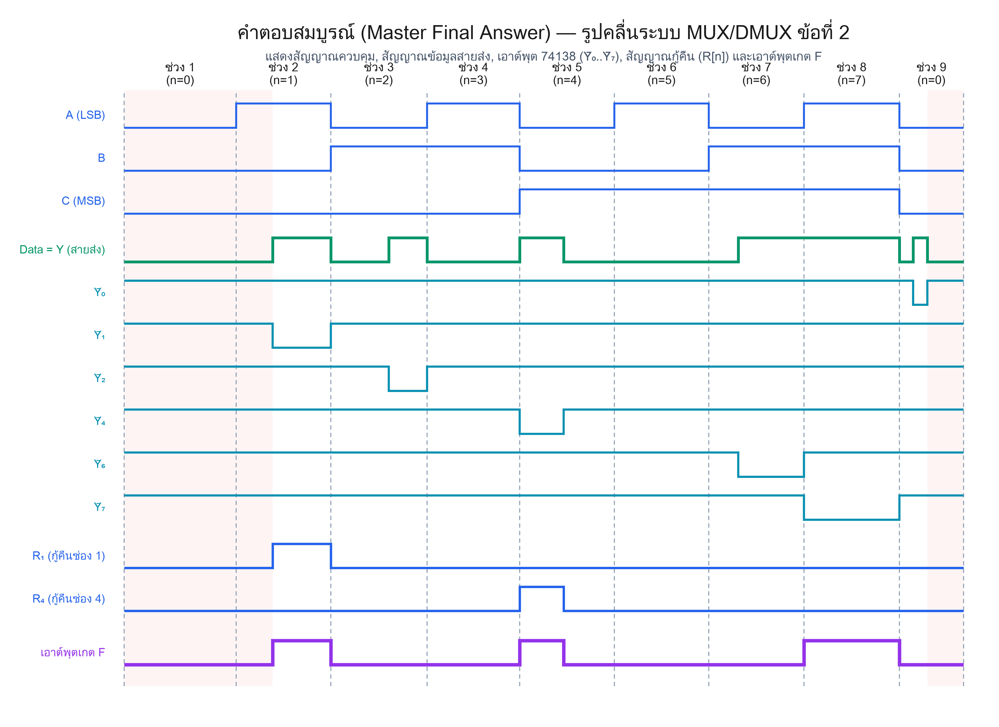
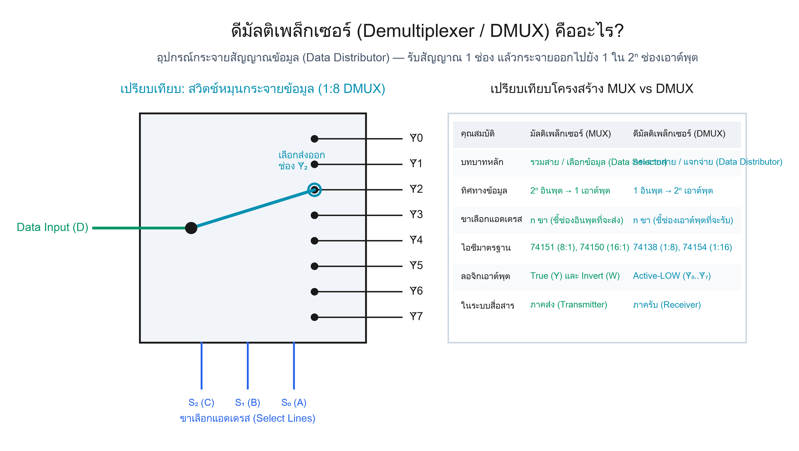
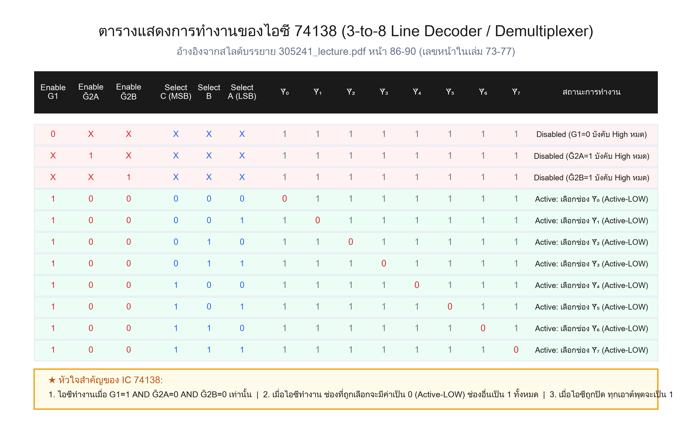
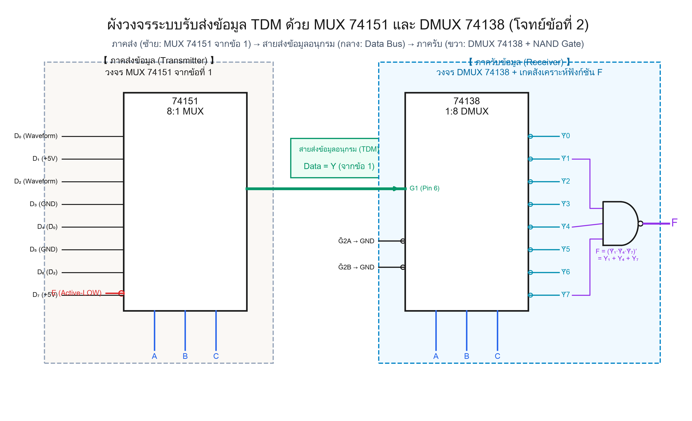
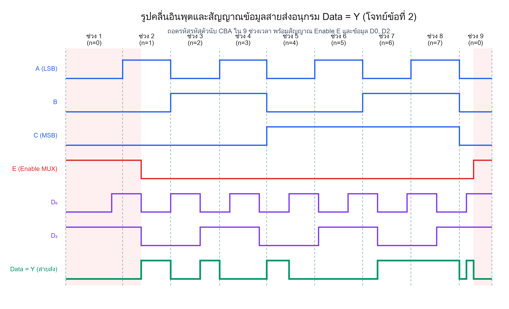
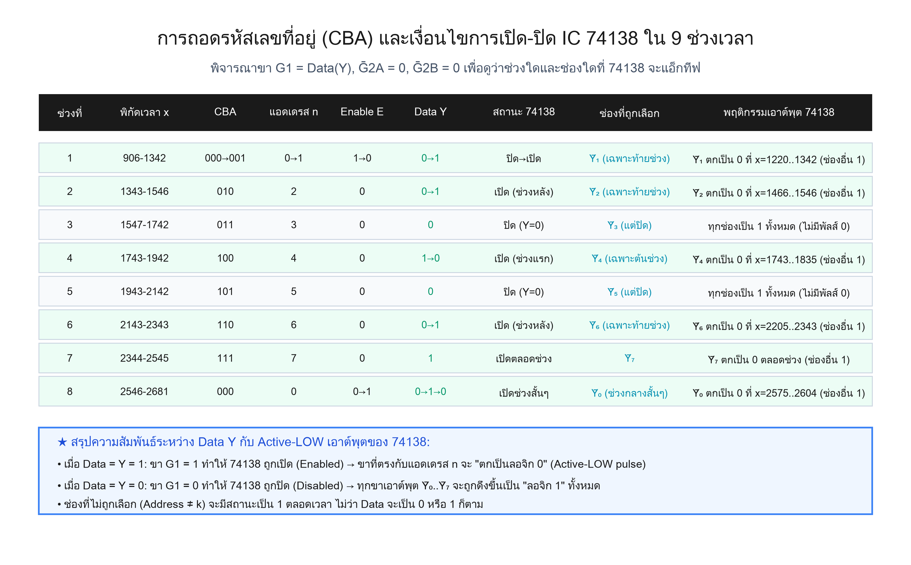
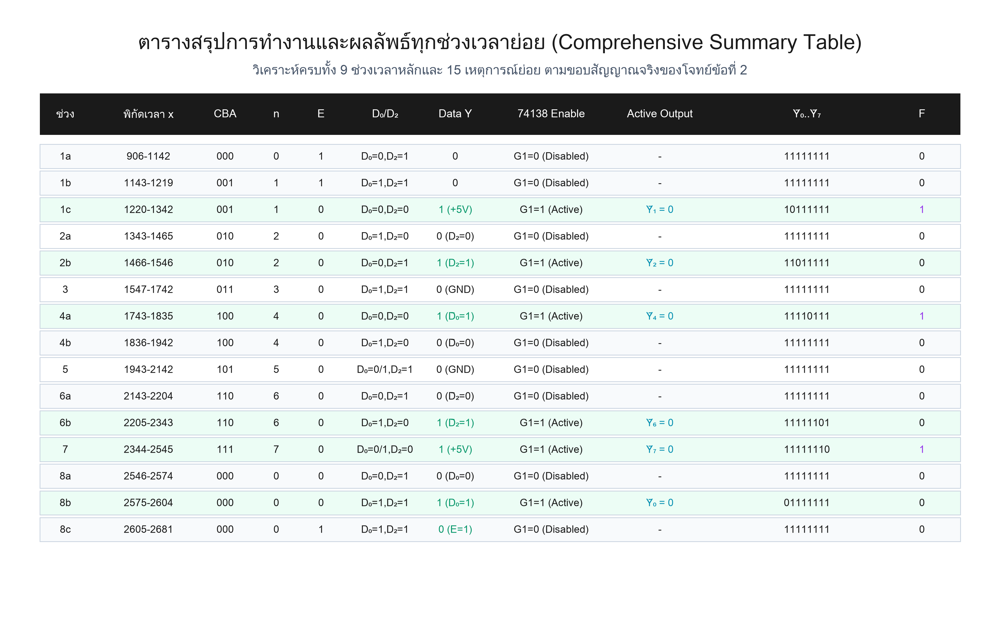
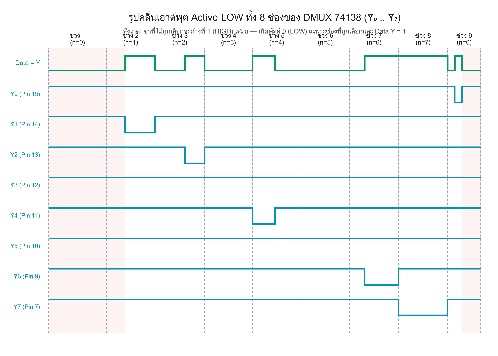
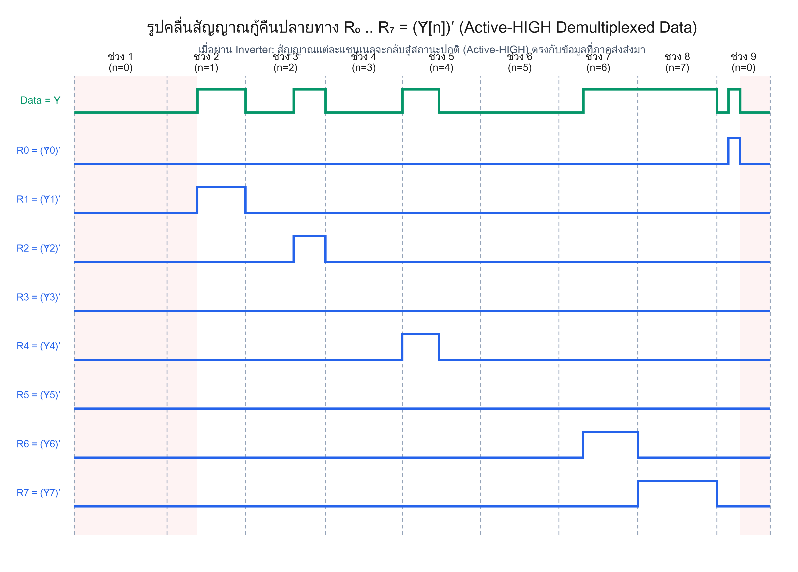
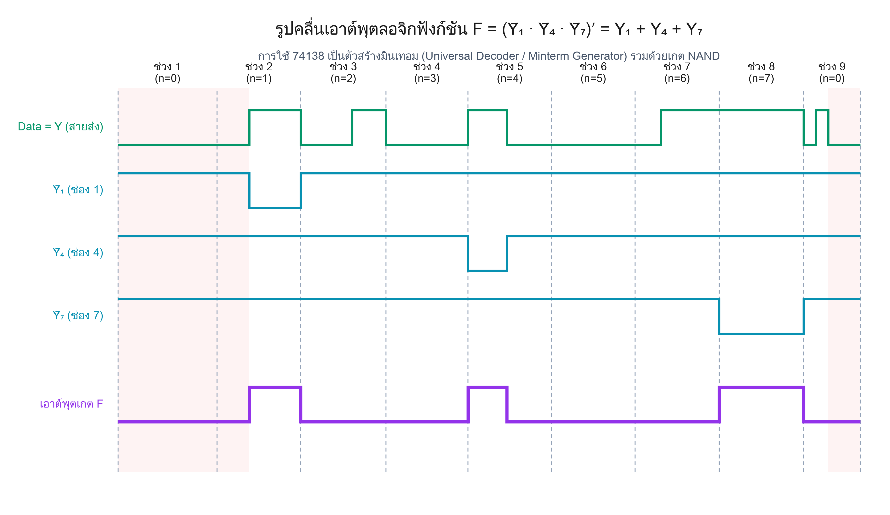

# 🔀 เฉลยละเอียด — ข้อสอบ MUX/DMUX ข้อที่ 2 (Special DEMUX Problem — IC 74138)

> **โจทย์:** จากระบบการรวมส่งสัญญาณและแยกรับสัญญาณแบบแบ่งเวลา (TDM System) ที่ภาคส่งใช้ IC 74151 จากข้อที่ 1 ส่งข้อมูลอนุกรม `Data = Y` ผ่านสายส่งร่วม มาเข้าที่ขา `G1` ของไอซีดีมัลติเพล็กเซอร์เบอร์ **74138 (1:8 Demultiplexer / 3-to-8 Line Decoder)** โดยมีขา `Ḡ2A` และ `Ḡ2B` ต่อลงกราวด์ (GND) และขาเลือกอินพุต `A, B, C` ของทั้งภาคส่งและภาครับเชื่อมต่อซิงโครไนซ์กันดังผังวงจร
> 
> 1. จงเขียนรูปคลื่นเอาต์พุต `Ȳ₀, Ȳ₁, Ȳ₂, Ȳ₃, Ȳ₄, Ȳ₅, Ȳ₆, Ȳ₇` ทั้ง 8 ช่องของไอซี 74138
> 2. จงเขียนรูปคลื่นสัญญาณกู้คืนปลายทาง `R₀, R₁, R₂, R₃, R₄, R₅, R₆, R₇` เมื่อผ่านอินเวอร์เตอร์ `Rₙ = (Ȳₙ)′`
> 3. หากนำเอาต์พุต `Ȳ₁, Ȳ₄, Ȳ₇` มาต่อเข้ากับเกต NAND ขนาด 3 อินพุต จงหารูปคลื่นเอาต์พุต `F = (Ȳ₁ · Ȳ₄ · Ȳ₇)′`
>
> — แบบฝึกหัดประยุกต์ MUX/DMUX อ้างอิงสไลด์บรรยาย `305241_lecture.pdf` หน้า 86–96 (เลขหน้าในเล่ม 73–83)

เอกสารนี้เฉลย **ทุกขั้นตอน ไม่ข้าม ไม่ลัด** พร้อมสอนทฤษฎีดีมัลติเพล็กเซอร์ 74138 ควบคู่กันไปอย่างละเอียดสมบูรณ์

> 🖥️ **ชอบอ่านแบบหน้าเว็บ?** เปิด [`solution.html`](solution.html) —
> ฉบับจัดหน้าแบบตำราเรียน มีสารบัญคลิกกระโดด ตารางสวย คลิกรูปขยายเต็มจอ
> และ **ห้องทดลอง 74138** ที่คลิกผังขา / หมุนโมเดล DIP-16 3D / เล่นลำดับโจทย์จริงทีละสเต็ปได้
> (ทำงานในไฟล์เดียว ไม่ต้องติดตั้งไลบรารีหรือเชื่อมต่ออินเทอร์เน็ต)

🔍 **หลักฐานการตรวจสอบความถูกต้อง:** [`VERIFICATION.md`](VERIFICATION.md)

---

## 📑 สารบัญ

| # | หัวข้อ | สิ่งที่จะได้ |
| :-: | :--- | :--- |
| [0](#0-สรุปคำตอบก่อน-สำหรับคนรีบ) | สรุปคำตอบก่อน | เห็นรูปคลื่นและลำดับลอจิกทันที |
| [1](#1-ปรับพื้นฐาน-demultiplexer-คืออะไร) | ปรับพื้นฐาน DMUX | เข้าใจหลักการกระจายข้อมูลและตัวถอดรหัส |
| [2](#2-กฎการทำงานของ-ic-74138-อ้างอิงจาก-lecture) | กฎของ 74138 | ตารางฟังก์ชันและเงื่อนไข Enable |
| [LAB](#lab-ห้องทดลอง-74138--จากขาไอซีสู่คำตอบข้อ-2) | ห้องทดลอง 74138 | คลิก pinout, หมุน 3D DIP-16 และเล่นโจทย์จริง |
| [3](#3-ขั้นที่-1--อ่านผังวงจรระบบ-tdm-และขาต่อของ-74138) | อ่านวงจร | แผนที่การต่อขาอินพุต/เอาต์พุต |
| [4](#4-ขั้นที่-2--ถอดรหัสขาเลือก-a-b-c-และขา-enable) | ถอดรหัส A, B, C | รู้ว่าช่วงไหนไอซีทำงานและเลือกช่องใด |
| [5](#5-ขั้นที่-3--วิเคราะห์พฤติกรรม-active-low-output) | พฤติกรรม Active-LOW | เข้าใจลอจิก 0 ที่เอาต์พุตและช่องที่ไม่ได้เลือก |
| [6](#6-ขั้นที่-4--ไล่คำตอบทีละช่วงเวลา-9-ช่วง-15-เหตุการณ์) | ไล่ทีละช่วงเวลา | ที่มาของรูปคลื่นทุกช่วงละเอียดยิบ |
| [7](#7-คำตอบ-รูปคลื่นเอาต์พุต-y0y7-และ-r0r7) | คำตอบรูปคลื่น | รูปคลื่นเอาต์พุตทั้ง 8 ช่องสมบูรณ์ |
| [8](#8-การวิเคราะห์เอาต์พุตเกต-nand-ฟังก์ชัน-f) | สังเคราะห์ฟังก์ชัน F | ถอดรหัสมินเทอมด้วย De Morgan |
| [9](#9-สมการบูลีนเชิงวิศวกรรมของระบบ) | สมการบูลีน | เขียนความสัมพันธ์ในรูปพีชคณิตบูลีน |
| [10](#10-จุดที่ข้อสอบตั้งใจดัก) | จุดที่ข้อสอบดัก | 4 จุดสำคัญกันพลาดในห้องสอบ |
| [11](#11-ตรวจคำตอบด้วยตัวเอง) | ตรวจคำตอบเอง | เช็กลิสต์ยืนยันความถูกต้อง 100% |

---

## 0. สรุปคำตอบก่อน (สำหรับคนรีบ)



### สรุปพฤติกรรมเอาต์พุต 74138 (`Ȳ₀ .. Ȳ₇`):
- **สภาวะปกติ (ไม่ได้ถูกเลือก หรือ `Data = 0`):** เอาต์พุตทุกช่องค้างที่ลอจิก `1` (HIGH)
- **สภาวะแอ็กทีฟ (ถูกเลือก และ `Data = 1`):** เอาต์พุตช่องนั้นจะ **ตกเป็นลอจิก `0` (Active-LOW Pulse)**
  - `Ȳ₀` : เกิดพัลส์ 0 ที่ช่วง 8b (`x = 2575..2604`)
  - `Ȳ₁` : เกิดพัลส์ 0 ที่ช่วง 1c (`x = 1220..1342`)
  - `Ȳ₂` : เกิดพัลส์ 0 ที่ช่วง 2b (`x = 1466..1546`)
  - `Ȳ₃` : เป็น 1 ตลอดทั้ง 9 ช่วง (ไม่มีพัลส์ 0 เลย)
  - `Ȳ₄` : เกิดพัลส์ 0 ที่ช่วง 4a (`x = 1743..1835`)
  - `Ȳ₅` : เป็น 1 ตลอดทั้ง 9 ช่วง (ไม่มีพัลส์ 0 เลย)
  - `Ȳ₆` : เกิดพัลส์ 0 ที่ช่วง 6b (`x = 2205..2343`)
  - `Ȳ₇` : เกิดพัลส์ 0 ตลอดทั้งช่วง 7 (`x = 2344..2545`)

### สรุปเอาต์พุตเกต `F = (Ȳ₁ · Ȳ₄ · Ȳ₇)′ = Y₁ + Y₄ + Y₇`:
```text
F = 1 เฉพาะ 3 ช่วงเวลา:
  1. ช่วง 1c (x = 1220..1342)  [เนื่องจาก Ȳ₁ = 0]
  2. ช่วง 4a (x = 1743..1835)  [เนื่องจาก Ȳ₄ = 0]
  3. ช่วง 7  (x = 2344..2545)  [เนื่องจาก Ȳ₇ = 0]
ช่วงเวลาอื่นทั้งหมด F = 0
```

---

## 1. ปรับพื้นฐาน: Demultiplexer คืออะไร?



**ดีมัลติเพล็กเซอร์ (Demultiplexer หรือ DMUX)** หรือ **อุปกรณ์กระจายสัญญาณข้อมูล (Data Distributor)** คือวงจรลอจิกที่มีการทำงาน **ตรงกันข้ามกับมัลติเพล็กเซอร์ (MUX)**

- มีอินพุตข้อมูลเพียงช่องเดียว = `Data Input (D)`
- มีเอาต์พุตหลายช่อง = `2ⁿ` ช่อง (`Y₀ .. Y_{2ⁿ-1}`)
- ใช้ **ขาเลือกอินพุต (Select Lines)** จำนวน `n` เส้น เป็นตัวกำหนดเลขที่อยู่ (Address) ว่าจะให้ข้อมูล `D` ไหลออกไปที่เอาต์พุตช่องใด

### 1.1 ความสัมพันธ์ระหว่าง Decoder และ Demultiplexer
ข้อความจาก `305241_lecture.pdf` หน้า 86–87 ระบุว่า:
> *"วงจรถอดรหัส (Decoder) ที่มีขาอีนาเบิล (Enable) สามารถนำมาใช้งานเป็นดีมัลติเพล็กเซอร์ได้โดยตรง โดยนำสัญญาณข้อมูลป้อนเข้าที่ขาอีนาเบิล และนำรหัสควบคุมป้อนเข้าที่ขาเลือกแอดเดรส"*

ดังนั้นไอซี **74138 (3-to-8 Line Decoder)** จึงเป็นไอซีมาตรฐานยอดนิยมในการทำหน้าที่เป็น 1:8 Demultiplexer

---

## 2. กฎการทำงานของ IC 74138 (อ้างอิงจาก Lecture)



ตารางแสดงการทำงานของไอซีเบอร์ 74138 คัดจาก `305241_lecture.pdf` หน้า 88 (เลขหน้าในเล่ม 75):

| `G1` | `Ḡ2A` | `Ḡ2B` | C | B | A | `Ȳ₀` | `Ȳ₁` | `Ȳ₂` | `Ȳ₃` | `Ȳ₄` | `Ȳ₅` | `Ȳ₆` | `Ȳ₇` | สถานะ |
| :-: | :-: | :-: | :-: | :-: | :-: | :-: | :-: | :-: | :-: | :-: | :-: | :-: | :-: | :--- |
| **0** | X | X | X | X | X | **1** | **1** | **1** | **1** | **1** | **1** | **1** | **1** | **Disabled (G1=0)** |
| X | **1** | X | X | X | X | **1** | **1** | **1** | **1** | **1** | **1** | **1** | **1** | **Disabled (Ḡ2A=1)** |
| X | X | **1** | X | X | X | **1** | **1** | **1** | **1** | **1** | **1** | **1** | **1** | **Disabled (Ḡ2B=1)** |
| 1 | 0 | 0 | 0 | 0 | 0 | **0** | 1 | 1 | 1 | 1 | 1 | 1 | 1 | **เลือกช่อง Ȳ₀** |
| 1 | 0 | 0 | 0 | 0 | 1 | 1 | **0** | 1 | 1 | 1 | 1 | 1 | 1 | **เลือกช่อง Ȳ₁** |
| 1 | 0 | 0 | 0 | 1 | 0 | 1 | 1 | **0** | 1 | 1 | 1 | 1 | 1 | **เลือกช่อง Ȳ₂** |
| 1 | 0 | 0 | 0 | 1 | 1 | 1 | 1 | 1 | **0** | 1 | 1 | 1 | 1 | **เลือกช่อง Ȳ₃** |
| 1 | 0 | 0 | 1 | 0 | 0 | 1 | 1 | 1 | 1 | **0** | 1 | 1 | 1 | **เลือกช่อง Ȳ₄** |
| 1 | 0 | 0 | 1 | 0 | 1 | 1 | 1 | 1 | 1 | 1 | **0** | 1 | 1 | **เลือกช่อง Ȳ₅** |
| 1 | 0 | 0 | 1 | 1 | 0 | 1 | 1 | 1 | 1 | 1 | 1 | **0** | 1 | **เลือกช่อง Ȳ₆** |
| 1 | 0 | 0 | 1 | 1 | 1 | 1 | 1 | 1 | 1 | 1 | 1 | 1 | **0** | **เลือกช่อง Ȳ₇** |

### 2.1 สรุปกฎเหล็ก 3 ข้อของ 74138
1. **เงื่อนไขเปิดใช้งาน (Enable Condition):** ไอซีจะทำงานเมื่อ `G1 = 1` AND `Ḡ2A = 0` AND `Ḡ2B = 0` เท่านั้น
2. **เอาต์พุตเป็นแบบ Active-LOW:** ช่องที่ถูกเลือกจะให้ค่าลอจิก `0` (LOW) ส่วนช่องที่ไม่ถูกเลือกจะคงค่าลอจิก `1` (HIGH)
3. **เมื่อไอซีถูกปิด (Disabled):** ทุกขาเอาต์พุต `Ȳ₀ .. Ȳ₇` จะถูกดึงขึ้นเป็น `1` ทั้งหมดทันที

---

## LAB. ห้องทดลอง 74138 — จากขาไอซีสู่คำตอบข้อ 2

เปิด [`solution.html#lab74138`](solution.html#lab74138) เพื่อใช้งานสื่อการสอนแบบ Interactive ประกอบด้วย:
1. **Interactive Pinout:** แผนผังขา 74138 คลิกเปลี่ยนสัญญาณ `A, B, C, G1, G2A, G2B` เพื่อดูไฟแสดงผลลอจิกบนขา `Ȳ₀..Ȳ₇`
2. **3D DIP-16 Model:** โมเดลจำลองตัวถัง IC 16 ขา หมุนได้ 360 องศา พร้อมตำแหน่งขาตามมาตรฐานอุตสาหกรรม
3. **Interactive Signal Player:** เล่นจำลองสัญญาณตามโจทย์ข้อ 2 ครบทั้ง 15 เหตุการณ์ย่อย

### ผังขา IC 74138 (DIP-16)

| ขา | สัญญาณ | บทบาทในโจทย์ | ขา | สัญญาณ | บทบาทในโจทย์ |
| :-: | :---: | :--- | :-: | :---: | :--- |
| 1 | A | Select บิตต่ำสุด (LSB) | 16 | VCC | ไฟเลี้ยง +5 V |
| 2 | B | Select บิตกลาง | 15 | `Ȳ₀` | เอาต์พุตช่อง 0 (Active-LOW) |
| 3 | C | Select บิตสูงสุด (MSB) | 14 | `Ȳ₁` | เอาต์พุตช่อง 1 (Active-LOW) |
| 4 | `Ḡ2A` | ต่อ GND (0) | 13 | `Ȳ₂` | เอาต์พุตช่อง 2 (Active-LOW) |
| 5 | `Ḡ2B` | ต่อ GND (0) | 12 | `Ȳ₃` | เอาต์พุตช่อง 3 (Active-LOW) |
| 6 | G1 | ต่อสายส่ง `Data = Y` | 11 | `Ȳ₄` | เอาต์พุตช่อง 4 (Active-LOW) |
| 7 | `Ȳ₇` | เอาต์พุตช่อง 7 (Active-LOW) | 10 | `Ȳ₅` | เอาต์พุตช่อง 5 (Active-LOW) |
| 8 | GND | กราวด์ 0 V | 9 | `Ȳ₆` | เอาต์พุตช่อง 6 (Active-LOW) |

---

## 3. ขั้นที่ 1 : อ่านผังวงจรระบบ TDM และขาต่อของ 74138



จากผังวงจร:
1. ข้อมูลสายส่งมาจากเอาต์พุต `Y` ของ MUX 74151 ในข้อที่ 1
2. ป้อนเข้าขา `G1` ของ DMUX 74138
3. ขา `Ḡ2A` และ `Ḡ2B` ต่อลงกราวด์ (`0`) ดังนั้นสถานะการทำงานของ 74138 ขึ้นอยู่กับ `G1 = Data` เพียงขาเดียว:
   - เมื่อ `Data = 1` → `G1 = 1` → 74138 เปิดทำงาน (Enabled)
   - เมื่อ `Data = 0` → `G1 = 0` → 74138 ปิดทำงาน (Disabled)

---

## 4. ขั้นที่ 2 : ถอดรหัสขาเลือก A, B, C และขา Enable



ขาเลือก `A, B, C` ทำหน้าที่นับเลขแอดเดรส `n = (4 × C) + (2 × B) + (1 × A)` ใน 9 ช่วงเวลา:

```text
ช่วง 1 : CBA = 000 → 001 (n = 0 → 1)
ช่วง 2 : CBA = 010 (n = 2)
ช่วง 3 : CBA = 011 (n = 3)
ช่วง 4 : CBA = 100 (n = 4)
ช่วง 5 : CBA = 101 (n = 5)
ช่วง 6 : CBA = 110 (n = 6)
ช่วง 7 : CBA = 111 (n = 7)
ช่วง 8 : CBA = 000 (n = 0)
```

---

## 5. ขั้นที่ 3 : วิเคราะห์พฤติกรรม Active-LOW Output



พิจารณาค่าเอาต์พุตช่อง `k` ใดๆ (`Ȳₖ`):
- ถ้า `แอดเดรส n ≠ k`: ขา `Ȳₖ` **ไม่ได้ถูกเลือก** → ค่าคงที่ที่ `1` เสมอ
- ถ้า `แอดเดรส n = k`: ขา `Ȳₖ` **ถูกเลือก**:
  - เมื่อ `Data Y = 1` → `G1 = 1` (เปิด) → `Ȳₖ = 0`
  - เมื่อ `Data Y = 0` → `G1 = 0` (ปิด) → `Ȳₖ = 1`
  - ดังนั้น `Ȳₖ = (Data Y)′` ในช่วงเวลาที่เลือกช่อง `k`

---

## 6. ขั้นที่ 4 : ไล่คำตอบทีละช่วงเวลา (9 ช่วง 15 เหตุการณ์)



### ช่วงที่ 1: `n = 0` และ `n = 1`
- **ช่วง 1a (`x = 906..1142`, `n=0`):** `E=1` (MUX ปิด) → `Data Y = 0` → `G1 = 0` → 74138 ปิด → ทุกช่อง `Ȳ = 1`
- **ช่วง 1b (`x = 1143..1219`, `n=1`):** `E=1` → `Data Y = 0` → 74138 ปิด → ทุกช่อง `Ȳ = 1`
- **ช่วง 1c (`x = 1220..1342`, `n=1`):** `E=0` → MUX ส่งช่อง 1 (`+5V`) → `Data Y = 1` → `G1 = 1` (เปิด) → **`Ȳ₁ = 0`**, ช่องอื่น `1`

### ช่วงที่ 2: `n = 2` (เลือกช่อง `D₂`)
- **ช่วง 2a (`x = 1343..1465`):** `D₂ = 0` → `Data Y = 0` → 74138 ปิด → ทุกช่อง `Ȳ = 1`
- **ช่วง 2b (`x = 1466..1546`):** `D₂ = 1` → `Data Y = 1` → 74138 เปิด → **`Ȳ₂ = 0`**, ช่องอื่น `1`

### ช่วงที่ 3: `n = 3` (เลือกช่อง GND)
- `Data Y = 0` ตลอดช่วง → 74138 ปิด → ทุกช่อง `Ȳ = 1`

### ช่วงที่ 4: `n = 4` (เลือกช่อง `D̄₀`)
- **ช่วง 4a (`x = 1743..1835`):** `D₀ = 0` → `D̄₀ = 1` → `Data Y = 1` → 74138 เปิด → **`Ȳ₄ = 0`**, ช่องอื่น `1`
- **ช่วง 4b (`x = 1836..1942`):** `D₀ = 1` → `D̄₀ = 0` → `Data Y = 0` → 74138 ปิด → ทุกช่อง `Ȳ = 1`

### ช่วงที่ 5: `n = 5` (เลือกช่อง GND)
- `Data Y = 0` ตลอดช่วง → 74138 ปิด → ทุกช่อง `Ȳ = 1`

### ช่วงที่ 6: `n = 6` (เลือกช่อง `D̄₂`)
- **ช่วง 6a (`x = 2143..2204`):** `D₂ = 1` → `D̄₂ = 0` → `Data Y = 0` → 74138 ปิด → ทุกช่อง `Ȳ = 1`
- **ช่วง 6b (`x = 2205..2343`):** `D₂ = 0` → `D̄₂ = 1` → `Data Y = 1` → 74138 เปิด → **`Ȳ₆ = 0`**, ช่องอื่น `1`

### ช่วงที่ 7: `n = 7` (เลือกช่อง `+5V`)
- `Data Y = 1` ตลอดช่วง → 74138 เปิดตลอดช่วง → **`Ȳ₇ = 0`**, ช่องอื่น `1`

### ช่วงที่ 8: `n = 0` (เลือกช่อง `D₀`)
- **ช่วง 8a (`x = 2546..2574`):** `D₀ = 0` → `Data Y = 0` → 74138 ปิด → ทุกช่อง `Ȳ = 1`
- **ช่วง 8b (`x = 2575..2604`):** `D₀ = 1` → `Data Y = 1` → 74138 เปิด → **`Ȳ₀ = 0`**, ช่องอื่น `1`
- **ช่วง 8c (`x = 2605..2681`):** `E = 1` (MUX ปิด) → `Data Y = 0` → 74138 ปิด → ทุกช่อง `Ȳ = 1`

---

## 7. คำตอบ: รูปคลื่นเอาต์พุต `Ȳ₀..Ȳ₇` และ `R₀..R₇`

### รูปคลื่นเอาต์พุต 74138 (`Ȳ₀ .. Ȳ₇`)


### รูปคลื่นสัญญาณกู้คืนปลายทาง (`R₀ .. R₇ = (Ȳₙ)′`)


---

## 8. การวิเคราะห์เอาต์พุตเกต NAND: ฟังก์ชัน F



จากสมการลอจิก:
```text
F = (Ȳ₁ · Ȳ₄ · Ȳ₇)′
```
ใช้กฎเดอมอร์แกน (De Morgan's Laws):
```text
F = (Ȳ₁)′ + (Ȳ₄)′ + (Ȳ₇)′ = Y₁ + Y₄ + Y₇
```
- เมื่อช่อง 1 แอ็กทีฟ (`Ȳ₁ = 0`) → `F = (0 · 1 · 1)′ = (0)′ = 1`
- เมื่อช่อง 4 แอ็กทีฟ (`Ȳ₄ = 0`) → `F = (1 · 0 · 1)′ = (0)′ = 1`
- เมื่อช่อง 7 แอ็กทีฟ (`Ȳ₇ = 0`) → `F = (1 · 1 · 0)′ = (0)′ = 1`
- ช่วงเวลาอื่นทั้งหมด `Ȳ₁ = 1, Ȳ₄ = 1, Ȳ₇ = 1` → `F = (1 · 1 · 1)′ = (1)′ = 0`

---

## 9. สมการบูลีนเชิงวิศวกรรมของระบบ

ความสัมพันธ์ของเอาต์พุตแต่ละช่องในรูปของมินเทอมและข้อมูล:
```text
Ȳₙ = (mₙ · Data)′ = m̄ₙ + Data′
Rₙ = (Ȳₙ)′ = mₙ · Data
F = R₁ + R₄ + R₇ = (m₁ + m₄ + m₇) · Data
```

---

## 10. จุดที่ข้อสอบตั้งใจดัก (Exam Pitfalls)

1. **ดักที่ 1 — สับสน Active-LOW Output:** ผู้สอบมักเผลอวาดว่าช่องที่ไม่ได้เลือกเป็น `0` (เหมือน MUX) แต่สำหรับ DMUX 74138 ช่องที่ไม่ได้เลือกต้องเป็น **`1` (HIGH)** เสมอ!
2. **ดักที่ 2 — ขา Enable ปิดวงจร:** เมื่อ `Data Y = 0` (หรือ `E = 1`) ไอซี 74138 จะถูกปิด ส่งผลให้ **ทุกช่องเป็น `1` ทั้งหมด** ไม่ใช่เกิดพัลส์ 0
3. **ดักที่ 3 — ขอบสลับสัญญาณกลางช่วง:** ในช่วงที่ 1, 2, 4, 6, 8 มีการเปลี่ยนระดับลอจิกกลางช่วงเวลา ต้องวาดพัลส์ให้ตรงกับพิกัดเวลาจริง ไม่ใช่วาดเต็มช่วง
4. **ดักที่ 4 — เกต NAND รับ Active-LOW:** การนำสัญญาณ Active-LOW เข้าเกต NAND จะทำหน้าที่เสมือนเกต **OR** รวมสัญญาณ (Active-LOW Input OR)

---

## 11. ตรวจคำตอบด้วยตัวเอง

- [x] ตรวจสอบว่า `Ȳ₀..Ȳ₇` เป็น 1 ในทุกช่วงที่ไม่ได้เลือก
- [x] ตรวจสอบว่าพัลส์ลอจิก 0 เกิดเฉพาะช่วงที่ `Data Y = 1`
- [x] ตรวจสอบว่าช่อง `Ȳ₃` และ `Ȳ₅` เป็น 1 ตลอดเวลา (เพราะต่อ GND ที่ภาคส่ง)
- [x] ตรวจสอบว่าเอาต์พุต `F` มีค่าเป็น 1 ตรงกับช่วงที่ `Ȳ₁=0`, `Ȳ₄=0`, หรือ `Ȳ₇=0` พอดี
